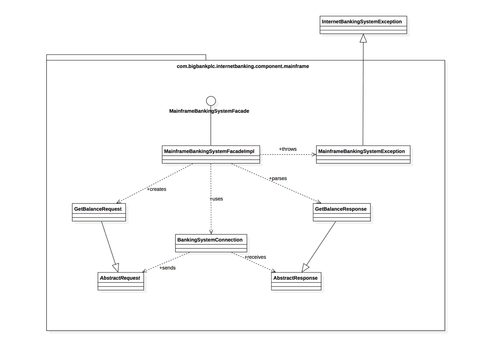

Title: C4 model for visualising software architecture
Date: 2021-12-21
Category: Programming
Author: Yoga

> C4: Context, Containers, Components, and Code

C4模型的创建是为了帮助软件开发团队在前期设计阶段和回顾性记录现有代码库时描述和交流软件体系结构。在不同的细节层次上高效地传达其软件架构，向不同类型的受众讲述不同的故事。

## Level 1: System Context diagram

系统上下文关系图是绘制和记录软件系统的良好起点，查看全局。绘制一张图表，将您的系统显示为中心的一个方框，周围环绕着它的用户和与之交互的其他系统

细节在这里并不重要，因为这是您的缩小视图，显示了系统环境的大图。重点应该放在人（actors, roles, personas, etc）和软件系统上，而不是技术、协议和其他低级细节上。这是一种可以向非技术人员展示的图表。

Scope: A single software system.

Primary elements: The software system in scope. 

Supporting elements: 直接连接到范围内软件系统的人员（e.g. users, actors, roles, or personas）和软件系统（external dependencies）。这些其他软件系统位于您自己的软件系统的范围或边界之外，您对它们没有责任或所有权。

目标受众：软件开发团队内外的所有人，包括技术人员和非技术人员。

## Level 2: Container diagram

“容器”类似于服务器端web应用程序、单页应用程序、桌面应用程序、移动应用程序、数据库模式、文件系统等。本质上，容器是一个单独的可运行/可部署单元（例如，单独的进程空间），用于执行代码或存储数据。

容器图显示了主要的技术选择以及容器之间的通信方式。这是一个简单的、高度关注技术的图表，对软件开发人员和支持/操作人员都很有用。

Scope: A single software system.

Primary elements: Containers within the software system in scope. 

Supporting elements: 直接连接到容器的人员和软件系统。

目标受众：软件开发团队内外的技术人员；包括软件架构师、开发人员和操作/支持人员。

## Level 3: Component diagram

组件图显示了容器是如何由多个“组件”组成的，每个组件是什么，它们的职责以及技术/实现细节。

Scope: A single container.

Primary elements: Components within the container in scope. 

Supporting elements: Container加上直接连接到组件的人员和软件系统。

目标受众：软件架构师和开发人员。

## Level 4: Code

最后，放大到每个组件，以显示它是如何作为代码实现的。

这是一个可选的详细级别，通常使用工具（例如IDE或UML建模工具）自动生成，并且你应该考虑只显示那些允许你说出你想讲述的故事的属性和方法。除了最重要或最复杂的组件外，不建议对任何组件使用此详细级别。

Scope: A single component.

主要元素：范围内组件内的代码元素（例如类、接口、对象、函数、数据库表等）。

目标受众：软件架构师和开发人员。

https://c4model.com/