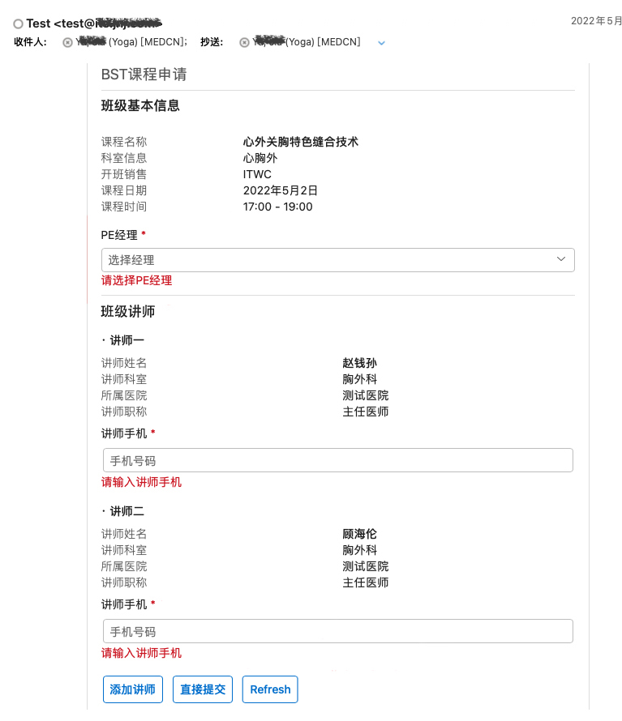

Title: Adaptive Card
Date: 2021-06-05
Category: Cloud
Tags: Microsoft
Author: Yoga

## Mailer

```
npm install @nestjs-modules/mailer
```
email.module.ts
```js
import { MailerModule } from '@nestjs-modules/mailer';
import { EjsAdapter } from '@nestjs-modules/mailer/dist/adapters/ejs.adapter';

@Module({
  imports: [
    MailerModule.forRoot({
      transport: {
        host: 'mx.xxx.xxx.com', // 需要在服务器上申请防火墙
        port: 25,
        ignoreTLS: true, // 踩坑：TLSSocket.SMTPConnection._onSocketTimeout
        secure: false,
      },
      preview: true,
      defaults: {
        from: '"Test" <test@xxx.com>',
      },
      template: {
        dir: process.cwd() + '/email-template',
        adapter: new EjsAdapter(),
        options: {
          strict: true,
        },
      },
    }),
  ],
})
export class EmailModule {}
```

email.service.ts

```js
import { MailerService } from '@nestjs-modules/mailer';
import * as ACData from 'adaptivecards-templating';
import * as approvalCard from './template/template.json';
import * as responseCard from './template/response.json';
import * as data from './template/data.json';

@Injectable()
export class EmailService {
  renderTemplate(courseData) {
    const tempCard =
      courseData.status === Status.Created ? approvalCard : responseCard;
    const template = new ACData.Template(tempCard);
    const cardData = {
      ...data,
    };

    const card = template.expand({
      $root: cardData,
    });
    return {
      card,
      cardData
    };
  }

  async sendEmailCode(courseData: mdmEventDto) {
    const { card, cardData } = this.renderTemplate(courseData);
    try {
      const sendMailOptions: SendMailOptions = {
        to: courseData.user_email,
        from: process.env.ADDRESSER_MAIL,
        cc: process.env.SEND_MAIL,
        subject: 'APPLY COURSE',
        template: 'template.code.ejs',
        context: {
          card,
          cardData,
        },
      };
      await this.mailerService.sendMail(sendMailOptions);
      return { code: 200, message: '发送成功' };
    } catch (error) {
      console.error('发送邮件出错:', error);
      return { error };
    }
  }
}
```

## Template

email-template/template.code.ejs

```html
<html>
  <head>
    <meta http-equiv="Content-Type" content="text/html; charset=utf-8" />
    <script type="application/adaptivecard+json">
      <%- JSON.stringify(locals.card) %>
    </script>
  </head>
  <body>
    <p>课程名称：<%- locals.cardData.course_name %></p>
  </body>
</html>
```

email/template/template.json

```json
{
  "hideOriginalBody": true,
  "type": "AdaptiveCard",
  "originator": "xxx", // generate in https://outlook.office.com/connectors/oam/publish
  "body": [
    {
      "type": "TextBlock",
      "verticalContentAlignment": "Center",
      "horizontalAlignment": "Left",
      "size": "Large",
      "text": "开班申请",
      "isSubtle": true
    },
    {
      "separator": true,
      "spacing": "Medium",
      "type": "Container",
      "items": [
        {
          "type": "TextBlock",
          "size": "Medium",
          "weight": "Bolder",
          "text": "班级基本信息"
        },
        {
          "type": "FactSet",
          "spacing": "Large",
          "facts": [
            {
              "title": "课程名称",
              "value": "**${course_name}**"
            },
            {
              "title": "科室信息",
              "value": "${department_name}"
            },
          ]
        }
      ]
    },
  ],
  "actions": [
    {
      "type": "Action.OpenUrl",
      "title": "完善信息",
      "url": "${form_url}"
    }
  ],
  "autoInvokeAction": {
    "method": "POST",
    "url": "https://xxx.jjmc.cn/iqvia/mdm/updateCard",
    "body": "{ \"id\": ${event_id} }",
    "type": "Action.Http",
    "headers": [
      { "name": "Content-Type", "value": "application/json" }
    ]
  },
  "$schema": "http://adaptivecards.io/schemas/adaptive-card.json",
  "version": "1.0"
}
```

email/template/data.json

```json
{
  "event_id": "",
  "course_name": "暂无课程名称",
}
```

