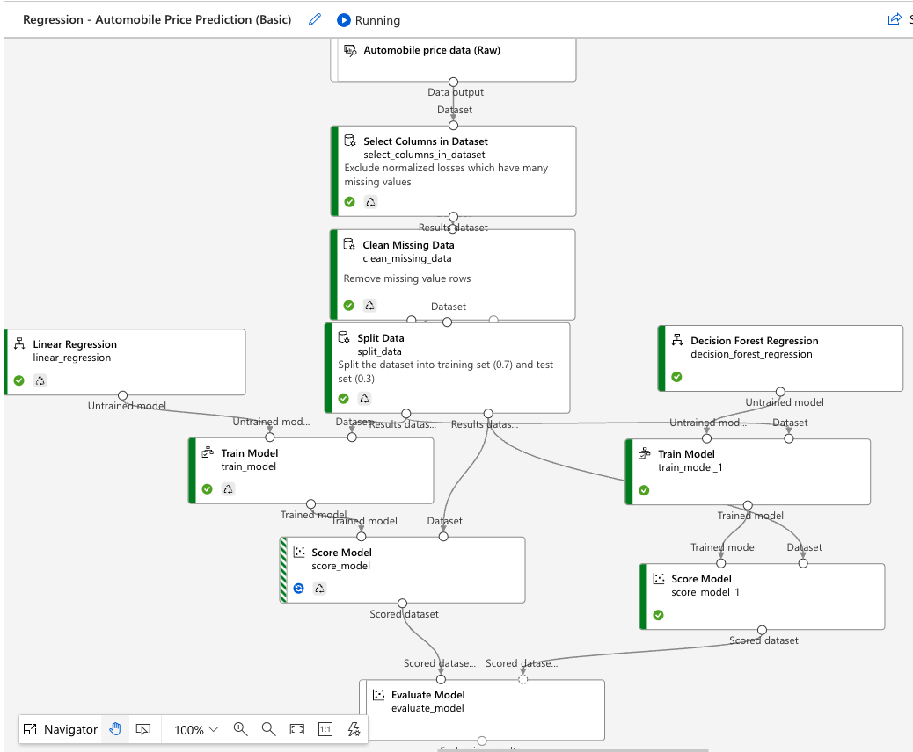

Title: Azure Machine Learning
Date: 2023-01-18
Category: Cloud
Author: Yoga
Tags: Azure, ML

### Data

* Observations (数据行)
* Features (数据列)
* Training data set 训练集 80%
* Testing data set 测试集 20%
* Validation data set 验证集

### Machine Learning 分类

按照模型训练方式：
* Supervised learning 监督学习: 从输入 -> 输出 学习统计规律 （分类，回归）
* Unsupervised learning 无监督学习：没有标注数据（聚类，降维/主成分分析，异常检测）
* Semi-Supervised learning 半监督学习（生成模型）
* Reinforcement learning 强化学习：累积奖励的最大化（AlphaGo）
* Deep learning 深度学习（生成对抗网络）

### Azure ML Learning Algorithms

* Regression 回归 （预测）
* Classification 分类
* Clustering 聚类
* Anomaly Detection 异常检测
* Reinforcement Learning 强化学习

### Azure ML Studio

* Web portal in Azure Machine Learning
* Low-code and no-code options for project authoring
* Authoring tools: Notebooks, AutoML and Designer.
* Set of SDKs and cloud services to scale, monitor, and deploy ML
models.

## Regression 回归

continuous numerical predicition 数值预测：气温，销量，房价

算法 | 特点
| - | - |
Linear Regression 线性回归 | 训练时间短、线性模型
Bayesian Linear Regression 贝叶斯线性回归 | 线性模型，训练数据量较少
Poisson Regression 泊松回归 |  预测事件次数
Fast Forest Quantile Regression 快速森林分位数回归 | 预测分布
Neural Network Regression 神经网络回归 | 精准度高、训练时间较长
Decision Forest Regression 决策森林回归 | 精准度高、训练时间短
Boosted Decision Tree Regression 提升决策树回归 | 精确度高、训练时间短、内存占用较大

评估指标 Metrics | desc
| - | - |
平均绝对误差 (MAE) | 预测值与真实值之间的平均绝对误差
均方根误差 (RMSE) | 模型在预测中会产生多大的误差，对于较大的误差权重较高
决定系数 (R2) | 0<=R2<=1，1说明模型无错误

## Classification 分类

通过已有数据集（训练集）的学习，得到一个目标函数f（模型），把每个属性集x映射到目标属性y（类），且y必须是离散的（若y为连续的，则属于回归算法）。

Binary Classification 二分类 / Multi-Class Classification 多分类

算法 | 特点
| - | - |
Logistic Regression 逻辑回归 | 训练时间短、线性模型
Support Vector Machines (SVM) 支持向量机 | 线性模型，under 100 features
Decision Forest 决策森林 | 精准度高，训练时间短
Boosted Decision Trees 提升决策树 | 精准度高，训练时间短
Neural Networks 神经网络 | 精准度高、训练时间较长

混淆矩阵 | Actual Positives | Actual Negatives
| - | - | - |
Predicted Postives | TP | FP
Predicted Negatives | FN | TN

Performance Metrics 性能评估 | Desc | Formula | 场景
| - | - | - | - |
Accuracy 准确率 | 所有样本中预测正确的样本占比 | (TP+TN)/(TP+TN+FP+FN) | 数据类别不均衡时不靠谱
Precision 精准率/查准率 | 在所有被预测为正的样本中实际为正的样本的概率 | TP/(TP+FP) | 预测升的股票里真的升了有多少
Recall/Sensitivity 召回率/查全率 | 在实际为正的样本中被预测为正样本的概率 | TP/(TP+FN) | 真的患病的病人中里预测正确的人

## Time Series Analysis 时间序列分析

一个时间序列 (表示为 Y = a + bX) 是一个在时间上具有相同间隔值的有序序列

目标：
1. 历史数据识别和建模 Identify patterns in the past
2. 预测未来的值 Forecast future values

Component | Desc
| - | - |
Level | Average value
Trend 趋势 | 指在时间序列中的长期移动，上升/降低的趋势
Seasonality 季节性变动 | 周期性波动（短期）
Cyclical component 周期性变动 | 不是固定的波动（长期 > 1年）
Random Noise 随机变动 | 噪声

四种变动与指标数值最终变动的关系:

* 加法模型 Additive

f(t)=Trend+Cycles+Seasonality+Noise

* 乘法模型 Multiplicative

f(t)=Trend*Cycles*Seasonality*Noise

如果随着时间的推移，序列的季节波动越来越大，则反映各种变动之间的关系发生变化，建议使用乘积模型；反之，如果时间序列图的波动保持恒定，则可以使用叠加模型。

Stationarity 平稳时间序列： 一个时间序列，如果均值没有系统的变化（无趋势）、方差没有系统变化，且严格消除了周期性变化，就称之是平稳的。

Autocorrelation 自相关：函数和自己的相似性

Autocorrelation Function (ACF) 自相关函数：关于自变量延迟(lag)的一个函数，描述了时间序列中不同时间间隔之间的值的相关性

时间序列的模型解析法：

* Auto-Regressive model (AR) 自回归模型：利用前期数值与后期数值的相关关系（自相关），建立包含前期数值和后期数值的回归方程，白噪声为时间序列数值的随机波动，这些随机波动的总和会等于0
* Moving Average model (ARMA) 滑动平均模型：某个时间点的指标数值等于白噪声序列的加权和
* Auto-Regressive Moving Average model (ARMA) 自回归滑动平均模型：自回归过程负责量化当前数据与前期数据之间的关系，移动平均过程负责解决随机变动项的求解问题
* Auto-Regressive Integrated Moving Average model (ARIMA) 差分自回归移动平均模型
Exponential Smoothing Model：前三项用于分析平稳时间序列，ARIMA通过差分可以用于处理非平稳时间序列

http://t.zoukankan.com/xinbaby829-p-7905873.html
## Clustering 聚类

聚类是一种无监督学习。聚类不需要标签，只要我们自己选择一个指标（如样本之间的距离）把数据集分割成不同的类或者簇，使类内元素的相似性尽可能的大，类间元素的相似性尽可能小，通过这样来对相似的数据进行归簇，从而达到聚类的效果。

K-means 聚类算法：

1. 随机选取K个中心点
2. 遍历数据集里面的每个点，看距离哪个中心点最近就分为哪一类，遍历完一共K类
3. 把属于一类的点取平均值，得到的平均值作为新的中心点
4. 然后不断重复步骤2，3，直到达到结束条件（当中心点不再变动或变动很小，当达到最大迭代次数）为止。

缺点：
* k值未知，需要人为设定
* 对于初始化中心点特别敏感，不同的初始化，结果可能不一样
* 容易受到噪声的影响，可能收敛于局部最小值，同时数据量大时收敛速度较慢
* 不太适合离散的数据，样本类别不均衡的数据的聚类
* 要求这些簇的模型必须是圆形

Model Performance：
* PCA Graph (Principal component analysis 主成分分析）
* 混淆矩阵 (labels are known)