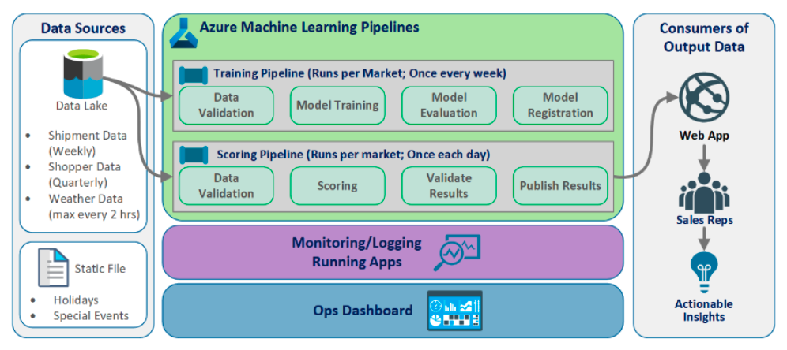

Title: Azure Machine Learning Service
Date: 2023-01-20
Category: Cloud
Author: Yoga
Tags: Azure, ML

## Azure Machine Learning Service
Azure Machine Learning Service: Combination of Azure cloud services and Python SDK.

Create environment -> Prepare data -> Build models -> Train models -> Test models -> Manage models -> Track experiments -> Deploy models

### Compute Target

Attached to your Azure Machine Learning Workspace. Can be used to run pipelines and host deployed models as real-time endpoints or pipeline endpoints.

* Azure Machine Learning Compute: Training
* Azure Kubernetes Service: Deployment

Compute Target | Automated ML | AML Pipelines | AML Designer
| - | - | - | - |
Local Computer | Yes |  | 
AML compute cluster | Yes | Yes | Yes
AML compute instance | Yes (through SDK) | Yes
Remote VM | Yes (SDK local mode only) | Yes
Azure Databricks | Yes | Yes

### 优势

* 支持开源算法：Scikit-learn, TensorFlow, CNTK, PyTorch
* Automated 数据处理，Automated 算法选择，Automated 超参数选择
* Pipeline：串联step（数据准备/模型训练测试/模型部署），rerunnning指定step，不同step不同执行环境，创建可复用模板
* Integration VS Code
* 部署模型 in ONNX format

### Build, Train and Deploy a Model步骤：
1. create Azure subscription -> resouce group -> workspace
2. import data -> prepare and clean data
3. train model -> test and tune model -> register model
4. compute target -> scoring file -> environment config file -> inference config 
5. deploy model -> test model (web service)

---

## Workspace

创建 Workspace：
* Workspace name
* Azure subscription ID
* Resource group name
* Location

每个Workspace配备：
* Key Vault
* Container Registry
* Storage Account
* Application Insights
 
Load Workspace
```python
from azureml.core.workspace import Workspace
ws.write_config() # save workspace config file
ws = Workspace.from_config() # load an existing workspace
```

---

## Build and Train a Model

### Prepare and Clean Data

Transformation functions:
* drop
* dropna
* rename
* concat
* transpose
* replace
* fillna
* sum 

### Train Model

split data
```python
from sklearn.model_selection import train_test_split
```

Steps to use Automated ML:
1. Determine problem type
2. Classification,Regression,TimeSeriesforecasting
3. Decide between using Python SDK or the studio web experience
4. Determine the source and format of training data
5. Configure compute target for model training
6. Local computer, Azure ML Computes, Azure Databricks, remote VMs
7. Configure AutoML parameters
8. Submit the run
9. Examine the outcome

### Save Model

Model 保存为 pickle 文件（.pkl）
* Can be loaded later for predictions
* Is the serialized version of the model.
* Provides an efficient way to save model and transfer over the network. 
* Can be loaded and un-serialized using the load() method.
* Can be used to load the model for further actions.

### Register Model

Model registeration allows you to store and version the model. A registered model can be downloaded and deployed.

---

## Deploy a Trained Model

### Scoring File

two functions in score.py:
* init() 加载模型
* run(input_data) 预测数据
```python
# score.py
from sklearn.externals import joblib
from sklearn.linear_model import <algorithm_name> from azureml.core.model import Model
def init():
  global model
  model_path = Model.get_model_path ('<pkl_file_name>')
  model = joblib.load(model_path)
def run(raw_data):
  data = json.loads(raw_data)['data']
  data = numpy.array(data)
  result = model.predict(data)
  return result.tolist()
```

### Environment Configuration File
* Used to specify model dependencies.
* Defines the conda environment for the model.
* Used to make sure all model dependencies are included in the container image. 
* Also called a conda-dependency file.
* Has yml extension.

```python
from azureml.core.conda_dependencies import CondaDependencies
env1 = CondaDependencies.create(conda_packages=['scikit-learn'])
with open("<yml_file_name>","w") as f: f.write(env1.serialize_to_string())
```
 
### inference configuration

describes how to set up the web-service containing your model.

```python
from azureml.core.model import InferenceConfig
inference_config = InferenceConfig(runtime= "python", entry_script="score.py",
conda_file="<yml_file_name>")
```

### Deploy to Compute Target 

```python
service = model.deploy( workspace=ws, name='<service_name>', deployment_config=aciconfig, models=[model],
inference_config = inference_config )
```

### Consume Deployed Model

Deploying as web service creates a REST API

```python
import json
test_input = json.dumps({'data':[[i1, i2, ...]]}) prediction = service.run(input_data = test_input) Print(prediction)
```

---

## Monitor AML

Azure monitor is a full stack monitoring service in Azure.

---

## AML Pipelines

1.Install AML SDK -> create workspace

2.Set up data store 
```python
MyDefault_Store = ws.get_default_datastore
```

3.Upload data to storage

4.Create Data Reference object
```python
from azureml.data.data_reference import DataReference
stored_data = DataReference(
  datastore = MyDefault_Store,
  data_reference_name = "FlightDelay_dataset", path_on_datastore = ("FlightDelay/part-00000")
)
```

5.run configuration (pip package dependencies / SDK version)

6.Create PipelineData object
```python
from azureml.pipeline.core import PipelineData
normalized_data = PipelineData(
  name = "normalized_flight_delay_data",
  data_store = default_store
)
```
7.Construct pipeline steps
```python
DataCleaningStep = PythonScriptStep(
  name="Clean Data", 
  script_name="cleanse_datasets.py",
  arguments=[<script_inputs>], 
  inputs=[<DataReference_or_PipelineData>], 
  outputs=[cleansed_data], compute_target=MyAml_Compute_Target, runconfig=MyAml_Run_Config, source_directory=<path_to_Python_script>, 
  allow_reuse=True
)
```

8.Build pipeline
```python
from azureml.pipeline.core import Pipeline
PPLines_Steps = [CleaningStep, NormalizingStep]
MyPipeline = Pipeline(workspace = ws, steps = PPLines_Steps)
```

9.Submit pipeline
```python
from azureml.core import Experiment
PPLine_Run = Experiment(ws, "exp_name").submit(MyPipeline,regenerate_outputs = True)
```

10.View progress
```python
from azureml.widgets import RunDetails
RunDetails(PPLine_Run).show()
PPLine_Run.wait_for_completion()
```
---

## MLOps

> Train Model -> Package Model -> Validate Model -> Deploy Model -> Monitor Model -> Retrain Model

7 Principles of MLOps
* Version control code, data, and experimentation outputs
* Use multiple environment
* Manage infrastructure and configurations-as-code
* Track and manage machine learning experiments
* Test code, validate data integrity, model quality
* Machine learning continuous integration and delivery
*  Monitor services, models, and data

MLOPs solution Architecture


---

## Azure Event Grid

AML events:

* Run completion
* Model registration
* Model deployment
* Data drift detection
* Run status change

Use cases:

* Send emails on run completion
* Use an azure function after a model is registered
* Trigger an ML pipeline when drift is detected