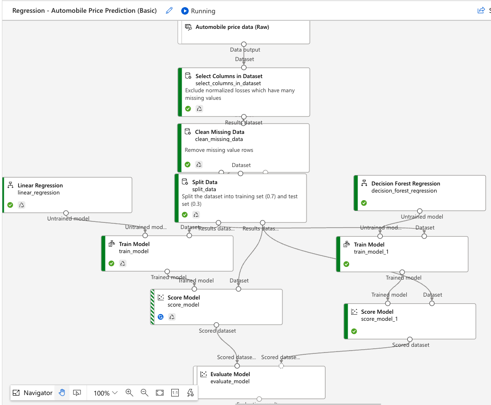

Title: Azure Machine Learning Studio - Designer
Date: 2023-01-19
Category: Cloud
Author: Yoga
Tags: Azure, ML

## Component

### Select Columns in Datasets 在数据集中选择列

* select columns: Column names / Column types

### Split Data 拆分数据

* Fraction of rows in the first dataset: 0.5-0.75
* Random seed 随机数生成器的种子

每颗种子能够生长为一组固定顺序的随机数序列，其通常和random.random()搭配使用以生成一个随机数。如果使用相同的x值，则每次生成的随即数序列都相同；对于同一x值，若多次执行random.seed(x)，将按照固定的序列顺序从头开始生成随机数。

### Join Data 联接数据

* Match case: True 大小写
* Join type: Inner join
* Keep right key columns in joined table: False

### Preprocess Text 文本预处理

* Text column to clean: 需要处理的字段
* Remove special characters: True 去除名字中*

### Edit Metadata 编辑元数据

* Data type: 更改数据集的值和数据类型 String -> Integer/Double
* Categorical: 将布尔值或数字列视为分类值。
* Fields: 将列标记为特征或标签。
* New column names: 重命名列

### Apply SQL Transformation 应用 SQL 转换

* SQL query script:
```sql
update t1 set Player = PreprocessedPlayer;
select * from t1 where Rank<>"Rk";
```

### Clip Values 剪切值

排除异常值后，预览数据Visualizations更符合正则分布

* Set of thresholds: ClipPeaksAndSubpeaks 同时指定上下限值
* Threshold: Constant
* Constant value for upper threshold 阈值上限（仅当选择了 ClipPeaks 时显示）
* Constant value for lower threshold 阈值下限（仅当选择了 ClipSubPeaks 时显示）
* Subsitute value for peaks 峰值替换值, 替换大于上限的值
* Subsitute value for subpeaks 子峰值替换值，替换小于下限的值
* Overwrite flag: Ture 覆盖原始列
* Add indicator columns: False 生成一个新列来指示是否向该行中的数据应用了指定的剪切操作

### Remove Duplicate Rows 删除重复行

* Key column selection filter expression: two rows are considered duplicates of each other only if they have the same values in these columns.
* Retain first duplicate row: True

### Clean Missing Data 清理缺失数据

* Cleaning mode: Remove entire row / Replace with mean

### Normalize Data 规范化数据

* Transformation method: ZScore 总体标准偏差 / MinMax [0, 1] / Logistic / LogNormal 对数范围 / TanH
* Use 0 for constant columns when checked: True

### Train Model 训练模型

左侧输入未训练的模型，右侧输入训练数据集。

* Label column：标签列
### Score Model 评分模型

* 对于分类模型，分数模型输出类的预测值，以及预测值的概率。
* 对于回归模型，评分模型仅生成预测数值。

评分的一个常见用途是在预测 Web 服务中返回输出
### Evaluate Model 评估模型

“评估模型”返回的指标 Metrics 取决于评估的模型类型：

* 分类模型：Accuracy, Precision, Recall, F1 score, AUC
* 回归模型: MAE, RMSE, RAE, RSE, R2
* 聚类分析模型: Average/Maximal Distance to Other/Cluster Center, Number of Points, Combined Evaluation

右侧添加另一个Score Model，可以在相同数据上轻松比较两个不同模型的结果。 两个输入算法应为同一算法类型。 也可以使用不同的参数对相同数据运行两次，然后比较两次运行的评分。

### Web Service Input/Output

在job中生成Real-time inference pipeline

* Web Service Input 作为 Score Model
的输入，Web Service Output 连接 Score Model
的输出

Batch inference piplie 批量预测管道，对大型数据集持续评分

https://learn.microsoft.com/en-us/azure/machine-learning/how-to-run-batch-predictions-designer


Deploy 后出现在 "endpoints" section，等待deployment state 变为"healthy"，"Test" 里点 "test"

Postman:

* Headers: 
    * Content-Type: application/json
    * Authorization: Bearer <api_key>
* Body (raw): { "inputs": { "input1": [...] } }

### Model

* Linear Regression 线性回归
* Neural Network Regression 神经网络回归
* Boosted Decistion Tree Regression 提升决策树回归
* Decision Forest Regression 决策林回归
* Poisson Regression 泊松回归
* Two-Class Decision Forest 双类决策林
* Two-Class Boosted Decision Tree module 双类提升决策树

## Datasets

Create dataset From local files

* Data type: Tabular 表格
* Data source: From local files
* Storage type: Azure Blob Storage
* File format: Delimited 带分隔符文件
* Delimiter: Comma
* Encoding: UTF-8
* Column headers: All files have same headers


