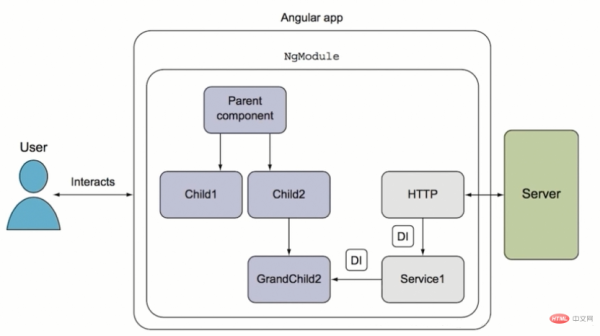

Title: 理解Angular
Date: 2021-11-29
Category: Angular
Tags: Angular
Author: Yoga

## AngularJS

Angular 1是Google发布的第一个MVVM框架，以JavaScript文件形式发布的。 (Angular Seed)

特点：

* 实现响应式网页、双向数据绑定的Web应用，模板功能强大丰富
* 双向绑定，脏检查，每次数据改变都会检查是否需要重新绑定

## Angular

Angular2+是一个基于 TypeScript构建的开发平台，是一个比较完善的MVC框架。（Angular Cli）

angular的核心是组件，react的核心是虚拟DOM

特点：

* 不默认进行脏检查
* 在服务器端渲染 SU
* 推崇的是 directive 和 controller, 通过对 component 组件的split（分割），从而实现代码的复用
* 移动和桌面的兼容：跨平台的手机应用的支持，面向 mobile app 的架构，为了达到APP 原生的效果， Angular 2 特有引入了 NativeScript 技术
* angular是一种组件架构，用户可以与组件交互，组件之间互相路由，组件和服务之间通过依赖注入调用，服务调用webSocket与服务器端发生http通信。

