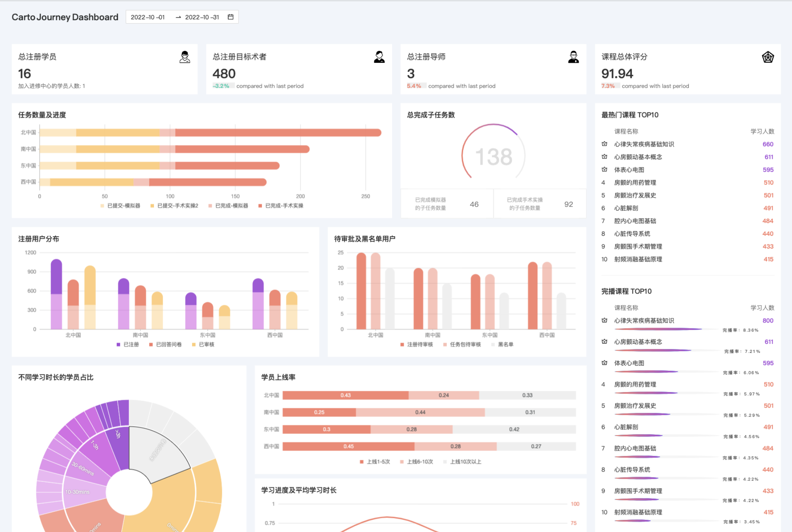

Title: AntV G2
Date: 2022-12-24
Category: Frontend
Tags: AntV
Author: Yoga

G2 主要用于制作基于网页的可视化

```
npm install @antv/g2
```

## React+G2 Template

```js
import { RefObject, useEffect, useRef } from "react";
import { Chart } from "@antv/g2";
import Router from "next/router";
import { refreshing } from "@/utils/common";

let storeChart: Chart;
let storeData: LearningBarData[];
const useCreateChart =
  (ref: RefObject<HTMLDivElement>, data: LearningBarData[]) => () => {
    let chart;
    if (!storeChart || storeChart.destroyed) {
      chart = new Chart({
        container: ref.current!,
        autoFit: true,
        height: 250,
        padding: [20, 30, 50, 40],
      });

      chart.scale(...);
      chart.axis(...);
      chart.tooltip(...);
      chart
        .line()
        .position("region*average")

      chart.interaction("active-region");
      storeChart = chart;
    } else {
      chart = storeChart;
    }

    chart.data(data);
    chart.render();
  };

const LearningBar = ({ data }: LearningBarProps) => {
  const ref = useRef<HTMLDivElement>(null);
  const createChart = useCreateChart(ref, data);

  useEffect(() => {
    if (ref.current && refreshing(storeData, data)) createChart();
  }, [ref, data, createChart]);

  useEffect(() => {
    return () => {
      if (Router.pathname !== "/") {
        storeChart.destroy();
        storeData = [];
      }
    };
  }, []);

  return (
    <Card>
      <div>学习进度及平均学习时长</div>
      <div ref={ref} />
    </Card>
  );
};

export default LearningBar;
```
判断是否需要刷新数据
```ts
export const refreshing = (oldData: any, newData: any[]) =>
  (newData.length || (!!oldData && oldData.length !== newData.length)) &&
  JSON.stringify(oldData) !== JSON.stringify(newData);
```

* Tooltip

```js
chart.tooltip({
  customItems: (items) =>
    items.map((r) => ({
      ...r,
      value: `${r.value}${r.name === "average" ? "mins" : "%"}`,
    })),
});
```

* Color

```js
chart.color("type", [color1, color2, color3]) // color arr

chart.color("type", (type: keyof typeof colorMap) => colorMap[type]?.color) // color map

chart.color(`l(90) 0:${color1} 1:${color2}`) // 渐变
```



## Transform 数据转换

```
import DataSet from "@antv/data-set";
```

```js
const ds = new DataSet();
const dv = ds.createView().source(data);

// filter
dv.transform({
  type: 'filter',
  callback(row) {
    return row.Run !== '1';
  },
});

// map
dv.transform({
  type: 'map',
  callback(row) {
    row.z = 'z';
    return row;
  },
});

// rename
dv.transform({
  type: 'rename',
  map: {
    a: 'x',
  },
});

// reverse
dv.transform({
  type: 'reverse',
});

// sort
dv.transform({
  type: 'sort',
  callback(a, b) {
    return a.year - b.year;
  },
});

// fill-rows 补全行
dv.transform({
  type: 'fill-rows',
  groupBy: ['a'],
  orderBy: ['b'],
  fillBy: 'group',
});

// fold 字段展开
dv.transform({
  type: 'fold',
  fields: ['gold', 'silver'], // 展开字段集
  key: 'key', // key字段
  value: 'value', // value字段
  retains: ['country'], // 保留字段集
});

// percent 总和百分比
dv.transform({
  type: "percent",
  field: "value", // 统计字段
  dimension: "type", // 每个种类的占比
  as: "percent", // 结果存储在 percent 字段
});

console.log(dv.rows);
```

```js
// 与 fold 相反
type StringKeyof<T> = Extract<keyof T, string>;
export const unfold = <T>(
  data: T[],
  key: StringKeyof<T>,
  field: StringKeyof<T>,
  value: StringKeyof<T>
) => {
  const obj: any = {};
  data.forEach((record) => {
    if (!obj[record[key]]) {
      obj[record[key]] = {};
    }
    obj[record[key]][record[field]] = record[value];
  });
  return addKeytoArr(obj, key);
};
```