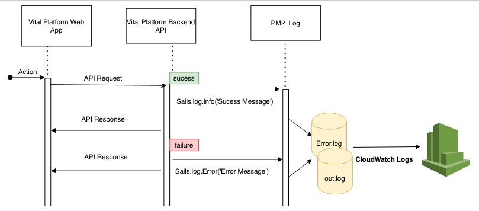

Title: Amazon CloudWatch
Date: 2021-09-03
Category: Cloud
Tags: AWS
Author: Yoga

Amazon CloudWatch monitors your Amazon Web Services (AWS) resources and the applications you run on AWS in real time.

End Goal: Keep an application log and a log of API calls made from Vital, so that I have a reference point.

## Installing cloudwatch agent

* Use the command line to install the CloudWatch agent on an Amazon EC2 instance
```
wget https://s3.amazonaws.com/amazoncloudwatch-agent/redhat/amd64/latest/amazon-cloudwatch-agent.rpm
```

* Install the package (Red hat)
```
rpm -U ./amazon-cloudwatch-agent.rpm
```

* Start the CloudWatch agent configuration wizard

```
/opt/aws/amazon-cloudwatch-agent/bin/amazon-cloudwatch-agent-config-wizard
```

## Setup wizard

* Log file path /home/finance/.pm2/logs/app-error-0.log
* Create log group name:  vital-platform-dev
* Log stream name : error
* Add additional log info 
* Log file path /home/finance/.pm2/logs/app-out-0.log
* Add another log stream name: output 
* To use the command line to start the CloudWatch agent on a server.
```
sudo /opt/aws/amazon-cloudwatch-agent/bin/amazon-cloudwatch-agent-ctl -a fetch-config -m ec2 -s -c file:configuration-file-path
```
* Replace configuration-file-path with the path to the agent configuration file.

## Steps to See Log groups

* go to https://console.aws.amazon.com/cloudwatch/home?region=us-east-1#logsV2:log-groups/log-group/vital-platform-dev
* Click 'Log Groups'



## Log level

Priority | Level | Log functions that produce visible output
- | - | -
0 | silent | N/A
1 | error | .error()
2 | warn | .warn(), .error()
3 | debug | .debug(), .warn(), .error()
4 | info | .info(), .debug(), .warn(), .error()
5 | verbose | .verbose(), .info(), .debug(), .warn(), .error()
6 | silly | .silly(), .verbose(), .info(), .debug(), .warn(), .error()
