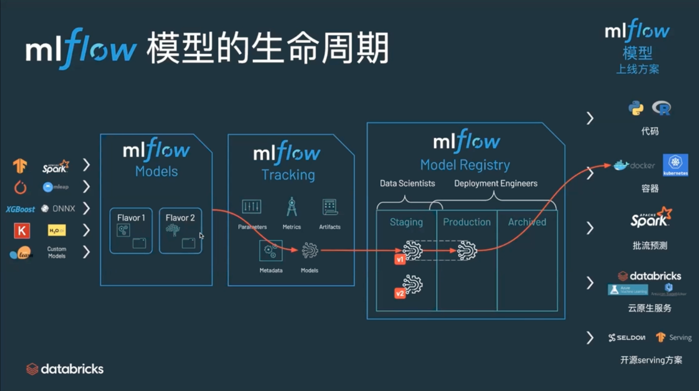
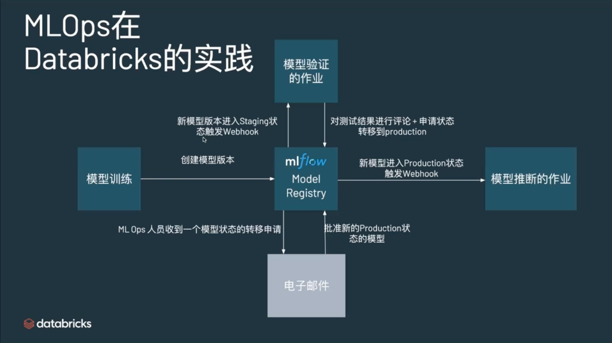

Title: Databricks Machine Learning
Date: 2023-05-17
Category: Cloud
Author: Yoga
Tags: Azure, ML

## Databricks 机器学习

湖仓 Lakehouse

数据使用成熟度：Clean Data → Reports → Ad Hoc Queries → Data Exploration → Predictive Modeling

湖仓一体：数据仓库做BI <-> 数据湖做AI

## AutoML

自动追踪：训练参数/标签/数据版本、模型表现KPI、模型依赖/环境/文件

```python
mlflow.autolog()
```

AutoML experiment:
* 自动创建 MLflow 追踪模型表现，一键部署到 Model Registry
* 自动生成一个包含描述性统计和分析的notbook
* 自动生成每一个模型的训练原代码

### Step1: Create cluster 

Compute -> Databricks Runtime Version: 12.2 LTS ML (includes Apache Spark 3.3.2, Scala 2.12)

### Step2: Create table

```python
white_wine = pd.read_csv("/dbfs/databricks-datasets/wine-quality/winequality-white.csv", sep=";")
data = pd.concat([red_wine, white_wine], axis=0)
high_quality = (data.quality >= 7).astype(int)
data.quality = high_quality
data.to_parquet("/dbfs/demo2023.parquet", index=False)
```

```sql
CREATE TABLE default.demo_table_ml AS
SELECT * FROM parquet.`/demo2023.parquet`
```

### Step3: Create AutoML experiment

New -> AutoML experiment

input training dataset: default.demo_table_ml

Prediction target: quality

Evaluation metric: ROC/AUC

### Step4: Register model

Experiments -> choose your experiment -> choose one run name -> Artifacts -> Register model

### Step5: Publish model

Models -> choose your model -> choose one version -> Stage: Transition to Staging

```python
from sklearn.metrics import roc_auc_score
import mlflow

model = mlflow.pyfunc.load_model(f'models:/wine_quality/Staging')
print (f'AUC: {roc_auc_score(y_test, model.predict (X_test))}')
```

## Model Registry & Model Serving



