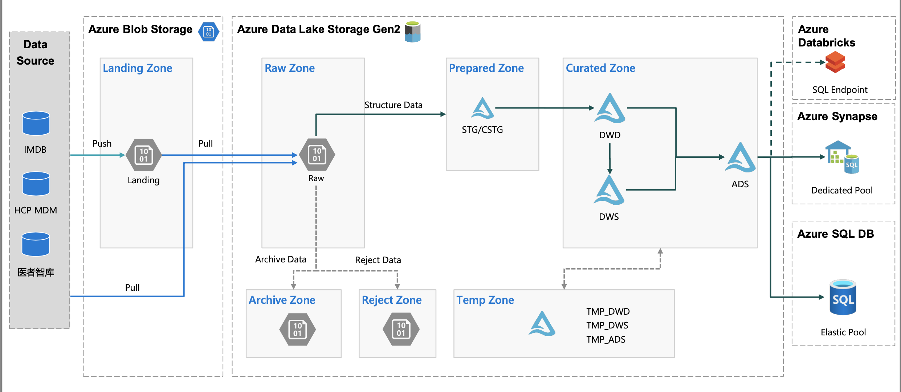

Title: DAYU -- Supply Chain Data Analytics
Date: 2022-11-22
Category: Project
Author: Yoga

### SCAN

SCAN stands for Supply Chain ANalytics. SCAN is an analytics program within Janssen Supply Chain. Our aim is to accelerate value delivery by providing analytics as a service. 

* Capability building (data and analytics training)
* Democratized data
* Dashboarding & visualisation support
* Advanced analytics

Objectives:

* Enable data value for business insight
* Data governance: Identify data ownership , establish data governance rules and process for data creation, using
and sharing internally & externally.
* Data protection: Meet the requirement from legal/quality/Cyber security of data protection
* FAIR principle
    * Build up data catalog to make sure data can be findable, and easier to understand
    * Data can be accessible by user,
    * build up integration function to make sure data Interoperable by other applications.
    * Store, combine and clean data to make the data reusable by user and other applications. 


数据来源：

* SAP (WinShuttle)
* IMDB (API / Parquet)
* Manual report (Azure Storage Explorer)

## Data flow



* Raw Zone: 数据通过source源接入湖raw层，原始数据格式（excel，CSV，json，txt），处理完后移入Archive

* Archive Zone: 历史所有全量文件，按时间戳分文件夹，原始数据格式

* Prepared Zone: 数据清洗和规范化，Parquet格式，STG保留全部增量（增加insert_time字段），CSTG根据不同更新方式（增量/容错性增量/全量更新）清洗得到全量数据

* Curated Zone: 数据逻辑处理

    * DWD: 数据细节层，采用雪花模型，维度表没有冗余
        * dw_: 事实表
        * dim_: 维度表(主数据)

    * DWS: 数据服务层，星型模型，维度表可有冗余，对通用业务逻辑进行统一处理，按年度、季度进行预汇总

    * ADS: 数据应用层，按需汇总成报表所需结果，可适当采用大宽表
        * dm_: 聚合为摸个主题的宽表

> 雪花模型：连接多，冗余低，性能低 <br/>星型模型：连接少，冗余高，性能高
## Data Modeling

* DCL (Data Control Language): 数据控制语句，用于控制访问级别，grant / deny
* DDL (Data Definition Languages): 建表语句 create / drop / alter
    * SCHEMA: raw/archive/prepared 以数据源命名，curated 以主题域命名
    * TABLE
* DML (Data Manipulation Language): 数据处理语句，添加、删除、更新和查询数据库记录 insert / delete / update / select

## Data Factory

### 作业编排

* 第一层 GrandParent：最高级别，触发业务流程，按业务分组
* 第二层 Parent：次高级别，支持和管理子活动的并行执行
* 第三层 Child：配合Parent的功能层，获取在父级别需要执行的对象，然后进行执行任务，若存在依赖检查依赖状态
* 第四层 Worker：实现具体抽取、转换、加载的任务层，该层根据实际的需要进行设计和开发，并用作并行调度

### 日志输出

```sql
create procedure dayu_ActivityStart 
@BatchRunId varchar(200), @PipelineCode varchar(200), @RunId varchar(200), @ActivityCode varchar(200)
as
insert into [dbo].[ADF_ActivityLogs] (BatchRunId, RunId, PipelineCode, ActivityCode, StartTime) 
VALUES (@BatchRunId, @RunId, @PipelineCode, @ActivityCode, DATEADD(HOUR, 8, getUTCdate()))

exec dayu_ActivityStart 'test01', 'ActivityName', 'test03', 'DIM_Table'

create procedure dayu_ActivityLog 
@BatchRunId varchar(200), @RunId varchar(200), @Result varchar(200), @ActivityOutput varchar(max)
as
update [dbo].[ADF_ActivityLogs] 
set EndTime = DATEADD(HOUR, 8, getUTCdate()), ActivityStatus = @Result, ActivityOutput = @ActivityOutput
where BatchRunId = @BatchRunId and RunId = @RunId

exec dayu_ActivityLog 'test01','test03', 'Success', 'exec Success'
```

ActivityOutput(Success): @string(activity('xxx').output)

ActivityOutput(Failed): @activity('xxx').output.errors[0].Message

