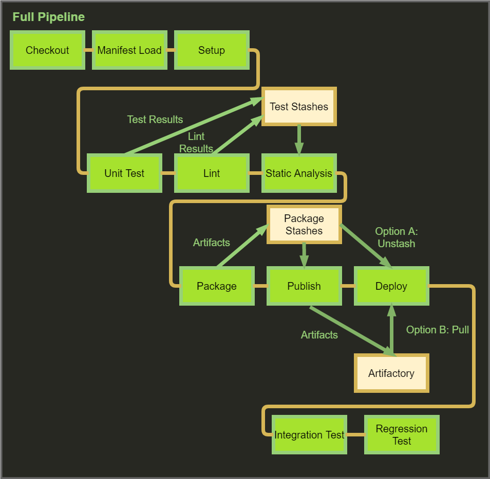

Title: XENA
Date: 2020-08-21
Category: Analytics
Tags: Docker
Author: Yoga

## Docker

```
git clone https://github.com/docker/getting-started.git

cd getting-started
docker build -t docker101tutorial

docker run -d -p 80:80 \ —name docker-tutorial docker101tutorial

docker tag docker101tutorial yogadock/docker101tutorial
docker push yogadock/docker101tutorial

```
Docker 安装phpmyadmin

https://hub.docker.com/_/phpmyadmin

```
docker run --name myadmin -d -e PMA_ARBITRARY=1 -p 4000:80 phpmyadmin

docker ps
```

CONTAINER ID | IMAGE | PORTS | NAMES
| - | - | - | -
0bfccc26fcfe | phpmyadmin | 0.0.0.0:4000 -> 80/tcp | myadmin

```
docker stop 0bfccc26fcfe
docker rm 0bfccc26fcfe
```
nginx
```
location /php/ {
  rewrite "^/php/(.*)$" /$1 break;
  proxy_set_header Host $host;
  proxy_set_header X-Real-IP $remote_addr;
  proxy_set_header X-Forwarded-For $proxy_add_x_forwarded_for;
  proxy_set_header X-Forwarded-Proto $scheme;
  proxy_buffering off;
  proxy_pass http://10.216.104.80:4000;
}
```

## XENA

username: TST-ITS-SCMStudent17

password: Scm$tudent17a

```js
docker ps
docker volumn ls
docker volume rm 文件名和
docker volume create xena-training-volume
docker volume inspect xena-training-volume

docker login xxx.artifactrepo.xxx.com
// username
// password
docker pull xxx.artifactrepo.xxx.com/xena/xena-training-toolbox
docker run -itd --name=xena-training-toolbox --mount source=xena-training-volume,target=/root/xena xxx.artifactrepo.xxx.com/xena/xena-training-toolbox
Copy to clipboard

// open docker extension screen
ll
// /root/xena 
kubectl
git config --global user.email "TST-ITS-SCMStudent#@its.xxx.com"
git config --global user.name student#
git clone https://sourcecode.xxx.com/scm/asx-ncnl/student#.git
```

JPM Application Development Pipeline



## 节省磁盘空间部署

### 法1. Monorepo

monorepo模式: 该模式将代码工件作为轻量级 monorepo 的一部分，可能更适合开发团队或多项目环境。

可以从一个标准模式结构开始，然后添加 project 

```
nest new my-project

cd my-project
nest generate app my-app
```

### 法2. pnpm

pnpm 会在全局的 store 目录里存储项目 node_modules 文件的 hard links 。因为这样一个机制，导致每次安装依赖的时候，如果是个相同的依赖，有好多项目都用到这个依赖，那么这个依赖实际上最优情况(即版本相同)只用安装一次。

```
npm i pnpm -g
pnpm install
```
硬链接 VS 软连接：

* 硬链接是同一个文件多个名字，软链接不是同一个文件
* 原始文件删掉，硬链接的文件可以访问，软链接的原始文件删掉，访问失效
* 软连接的指向文件大小是路径的大小，硬链接的大小就是文件的大小

du -sh 显示文件大小

### 法3. 用docker管理node_module

---

## peerDependency 对等依赖关系

```
APP
└---node_modules
    |---KeyPackage 核心依赖库（e.g React）
    |---Package_A
    |   └---node_modules
    |       └---KeyPackage 核心依赖库
    |---Package_B
    |   └---node_modules
    |       └---KeyPackage 核心依赖库
```

npm 从版本v7开始，install默认以peerDependencies的方式下载，避免核心依赖库被重复下载

_踩坑：
用户依赖的包版本与各个子项目依赖的包版本相互不兼容，那么就会报错：无法解析依赖树的问题（依赖冲突）Conflicting peer dependency: mssql@6.4.1_

```bash
npm install xxxx --legacy-peer-deps 
```
绕过peerDependency里依赖的自动安装，忽略项目中引入的各个依赖模块之间依赖相同但版本不同的问题，以npm v3-v6的方式去继续执行安装操作。
