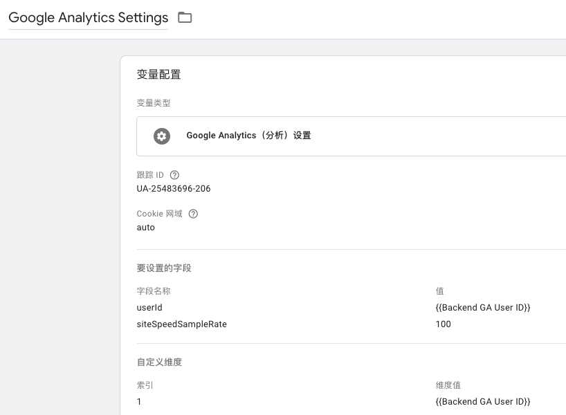
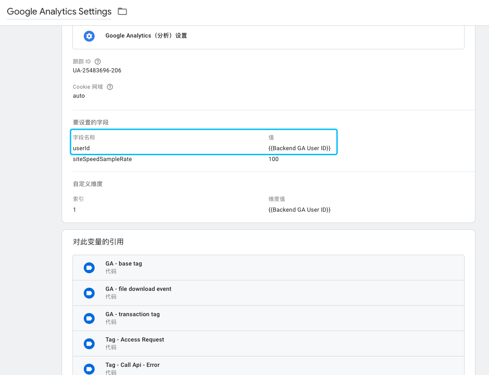
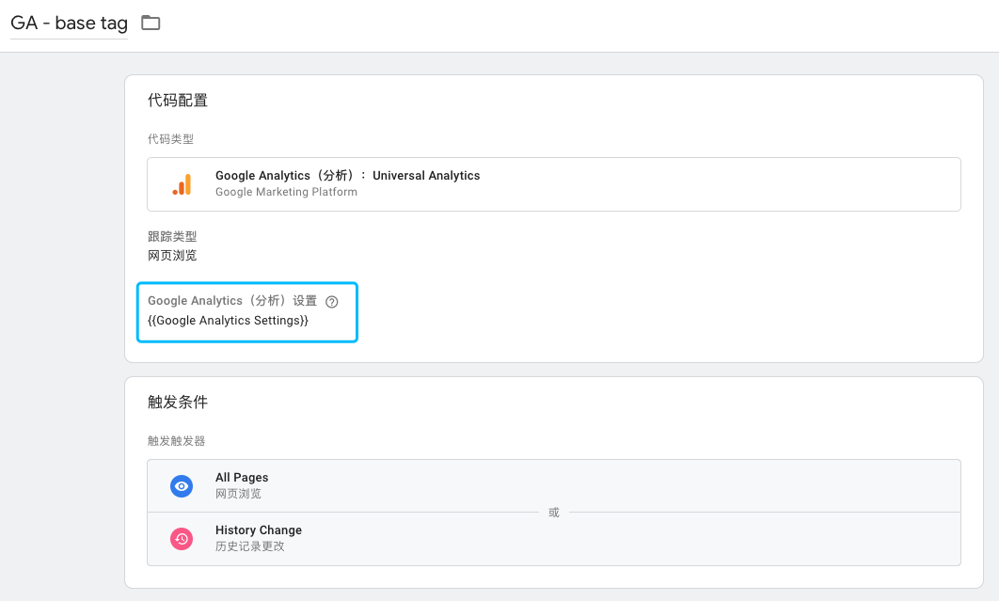
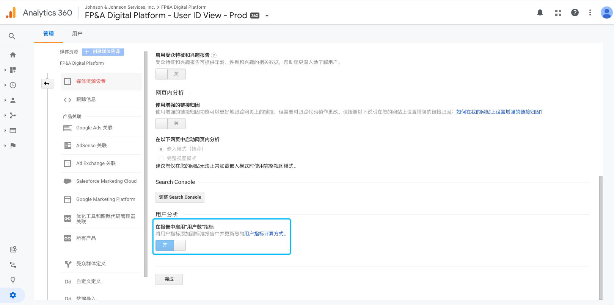
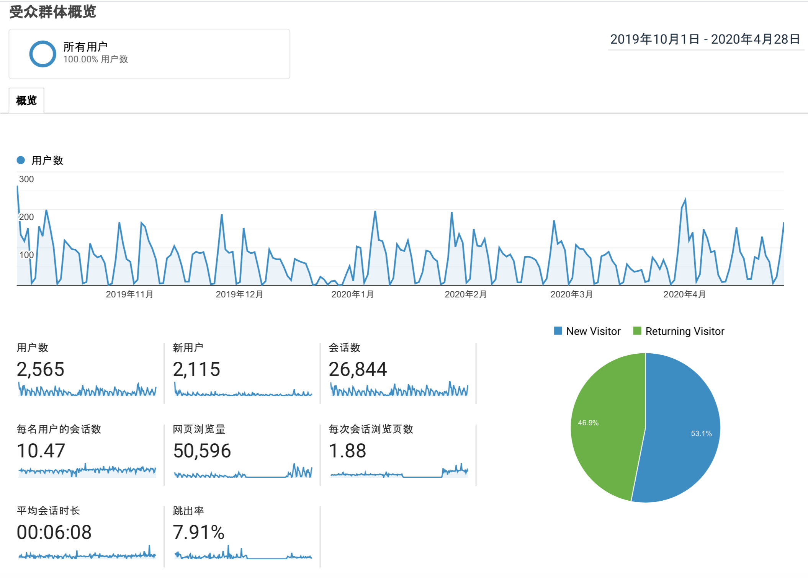

Title: GTM安装
Date: 2020-01-17
Category: Analytics
Tags: GTM
Author: Yoga

结果 https://analytics.google.com/

配置 https://tagmanager.google.com

## 安装

```javascript
function addGtm() {
  let gtmscript1 = `(function(w,d,s,l,i){w[l]=w[l]||[];w[l].push({'gtm.start':
      new Date().getTime(),event:'gtm.js'});var f=d.getElementsByTagName(s)[0],
      j=d.createElement(s),dl=l!='dataLayer'?'&l='+l:'';j.async=true;j.src=
      'https://www.googletagmanager.com/gtm.js?id='+i+dl;f.parentNode.insertBefore(j,f);
      })(window,document,'script','dataLayer','GTM-XXXXXXX')`;
  let gtmscript2 = `<iframe src=""https://www.googletagmanager.com/ns.html?id=GTM-XXXXXXX"
    height="0" width="0" style="display:none;visibility:hidden"></iframe>`;
  if (window.location.origin !== process.env.STAGE_ADDRESS_FRONT_E) {
    gtmscript1 = `(function(w,d,s,l,i){w[l]=w[l]||[];w[l].push({'gtm.start':
      new Date().getTime(),event:'gtm.js'});var f=d.getElementsByTagName(s)[0],
      j=d.createElement(s),dl=l!='dataLayer'?'&l='+l:'';j.async=true;j.src=
      'https://www.googletagmanager.com/gtm.js?id='+i+dl+ '&gtm_auth=C50yozlbjSv2u_j2wDptBw&gtm_preview=env-3&gtm_cookies_win=x';f.parentNode.insertBefore(j,f);
      })(window,document,'script','dataLayer','GTM-XXXXXXX')`;
    gtmscript2 = `<iframe src="https://www.googletagmanager.com/ns.html?id=GTM-XXXXXXX&gtm_auth=C50yozlbjSv2u_j2wDptBw&gtm_preview=env-3&gtm_cookies_win=x"
      height="0" width="0" style="display:none;visibility:hidden"></iframe>`;
  }
  const head = document.getElementsByTagName('head')[0];
  const script1 = document.createElement('script');
  script1.innerHTML = gtmscript1;
  prependChild(script1, head);
  const body = document.getElementsByTagName('body')[0];
  const script2 = document.createElement('noscript');
  script2.innerHTML = gtmscript2;
  prependChild(script2, body);
}
```

---

## 变量

```
document.cookie = `apiErrorCode=${error.status}`;
```
* 第一方Cookie

命名变量：Backend GA User ID


变量类型：第一方Cookie -> Cookie名称：sails.gaid

* 自定义Javascript

命名变量：Clicked Video Title

变量类型：自定义Javascript
```
function() {
  var clickedDOM = {{Click Element}}; // 内置变量
  return clickedDOM.parentElement.childNodes[0].innerText;
}
```
* 数据层变量

命名变量：Api Message

数据层变量名：apiErrorMessage

变量类型：数据层变量


## 触发器

```javascript
const app = dva({
  history: browserHistory(),
  onError(error) {
    if (error.status === 401) {
      if (error.sso_url) {
        window.location.href = error.sso_url;
      }
    } else {
      window.dataLayer.push({
        event: 'api-error',
        apiErrorCode: error.status,
        apiErrorMessage: error.statusText,
        apiErrorUrl: error.url
      }); 
      message.warning(
        error.statusText,
      );
    }
  },
});
```

命名触发器：Call Api Failed

触发器类型：自定义事件 -> 事件名称：api-error


## 代码

命名代码：Tag - Call Api - Error

代码类型：Google Analytics: Universal Analytics

跟踪类型：事件

类别：API

操作：Error

标签：{{Api Status}}; {{Api Url}}; {{Api Message}}; {{Backend GA User ID}}

值：{{Api Status}}

Google Analytics设置：{{Google Analytics Settings}}



触发条件：自定义事件 -> Call Api Failed

---

## 标识用户

Client ID: 会由于设备，浏览器等因素而不同，未启用User ID的数据视图中可用于计算唯一身份用户数

User ID: 用户唯一标识







