Title: Digitalizing Intelligence in Finance Reporting
Date: 2021-05-10
Category: Project
Tags: Tableau, SAP
Author: Yoga

## Background

The Digital Platform is a web application that hosts finance reports, training, access management, and incident management. When accessing reports, the Digital Platform provides users a personalized experience. The increasing number of users interacting with reports online creates a huge data set that gives us millions of potential insights into user experience, personalization, and finance report improvements. AI technologies such as Market basket analysis and collaboration filtering methods are deployed to learn users’ behaviors and recommend the relevant finance reports in real-time. Based on the user’s persona, different personalized announcements, training, and finance reports are prioritized.

The Digital Platform is an innovative solution for finance reports including a creative way to source the data, customizable machine learning algorithm to improve user experience. To source the data from different technologies servers, Google Analytics is deployed to track every users’ behavior. Machine learning Recommendation Engine is implemented to study the user’s behavior. Users are split into Cold and Hot User based on the view history.

link: https://yogagii.github.io/recommend-system.html

## Business Value

There are more than 600 finance users actively utilize the platform service every month. Because of the good customizable personal user experience, the utilization of the platform is to keep increasing. Every user uses 8.2 times of the Digital Platform every month. User's experiences are improved and users spend more than 700 hours per month on the Digital Platform. The digital platform is providing users the customized personalized experience also keeping improve the financial reporting based on feedback.

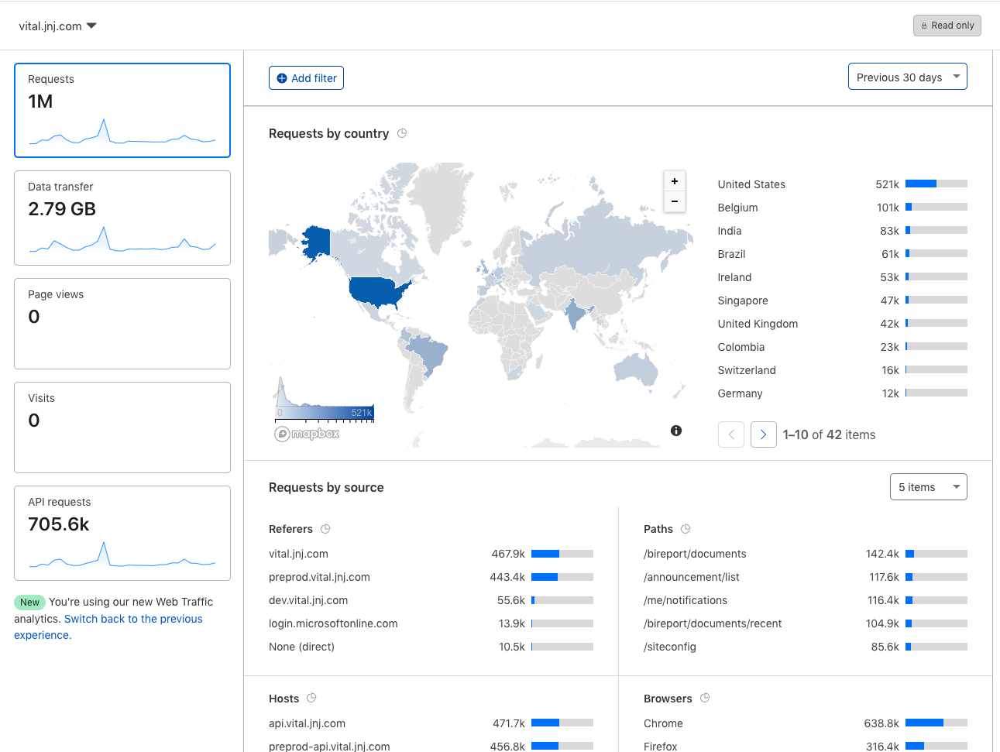


# Dashboard

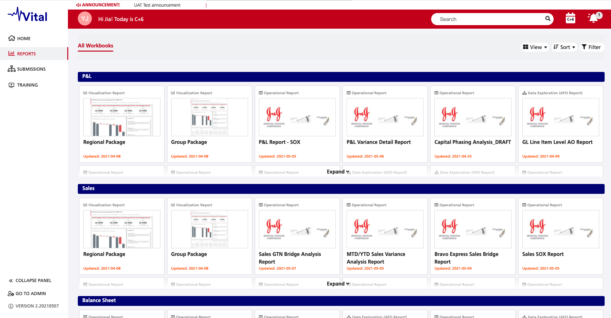
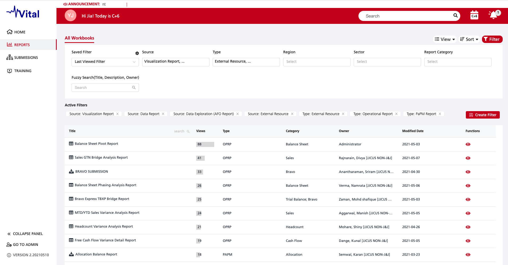

# Tableau Report

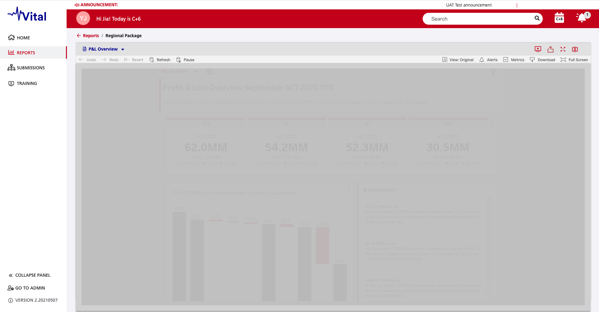

## Tableau REST API:

Description | API | Params
- | - | -
Get Users in Group | GET /api/api-version/sites/site-id/groups/group-id/users | pageSize
Get Users on Site	| GET /api/api-version/sites/site-id/users | pageSize, filter
Query Views for Site | GET /api/api-version/sites/site-id/views | includeUsageStatistics, fields, pageNumber
Query Views for Workbook | GET /api/api-version/sites/site-id/workbooks/workbook-id/views | 
Query Workbook | GET /api/api-version/sites/site-id/workbooks/workbook-id | 
Query Workbook Permissions | GET /api/api-version/sites/site-id/workbooks/workbook-id/permissions | 
Query Workbooks for User | GET /api/api-version/sites/site-id/users/user-id/workbooks | pageSize, pageNumber

link: https://help.tableau.com/current/api/rest_api/en-us/REST/rest_api_ref.htm

## Viz Option:

Key | Value
- | -
hideTabs | true
':toolbar' | 'top'
':showShareOptions' | false
':render' | false
width | '100%'

```js
const Workbook = () => {
  option = {
    hideTabs: true,
    ':toolbar': 'top',
    ':showShareOptions': false,
    ':linktarget': '_self',
    ':render': false,
    width: '100%',
  };

  useEffect(() => {
    viz && viz.dispose();
    const vizContainer = document.getElementById('vizContainer');
    viz = new window.tableau.Viz(iframeContent, url, option);
  }, [url]);

  return (
    <div className={styles.vizContainerWrapper}>
      <div
        id='vizContainer'
        ref={node => {
          iframeContent = node;
        }}
      />
    </div>
  );
};

export default Workbook;
```

## Viz API:

Class | Properties | Type | Description
- | - | - | -
Viz | getWorkbook() | Workbook | One Workbook is supported per visualization.
Workbook | getActiveSheet() | Sheet | Gets the currently active sheet (the active tab)
SheetInfo | getName() | string | Gets the name of the sheet.
SheetInfo | getUrl() | string	| Gets the URL for this sheet.
SheetInfo | getSheetType() | SheetType | Gets the type of the sheet. SheetType is an enum with the following values: WORKSHEET, DASHBOARD and STORY.
Dashboard | getWorksheets() | Worksheet[] | Gets the collection of worksheets contained in the dashboard.
Worksheet | getFiltersAsync() | Promise<Filter[]> | Fetches the collection of filters used on the sheet.
Workbook | getParametersAsync() | Promise<Parameter[]> | Fetches the parameters for this workbook.
Workbook | getCustomViewsAsync() | Promise<CustomView[]> | Gets the collection of CustomView objects associated with the workbook.
Filter | getFieldName() | string | Gets the name of the field being filtered.
CategoricalFilter | getAppliedValues() | DataValue[] | Gets the collection of values that are currently set on the filter.
Parameter | getCurrentValue() | DataValue | The current value of the parameter.

## Viz Event Classes:

Name | Event Class Passed in the Callback | Description
- | - | -
CUSTOM_VIEW_LOAD | CustomViewEvent | Raised when a custom view has finished loading.
PARAMETER_VALUE_CHANGE | ParameterEvent | Raised when any parameter has changed state.
FILTER_CHANGE | FilterEvent | Raised when any filter has changed state.
TAB_SWITCH | TabSwitchEvent | Raised after the tab switched.

link: https://help.tableau.com/v2018.2/api/js_api/en-us/JavaScriptAPI/js_api_ref.htm

### split report

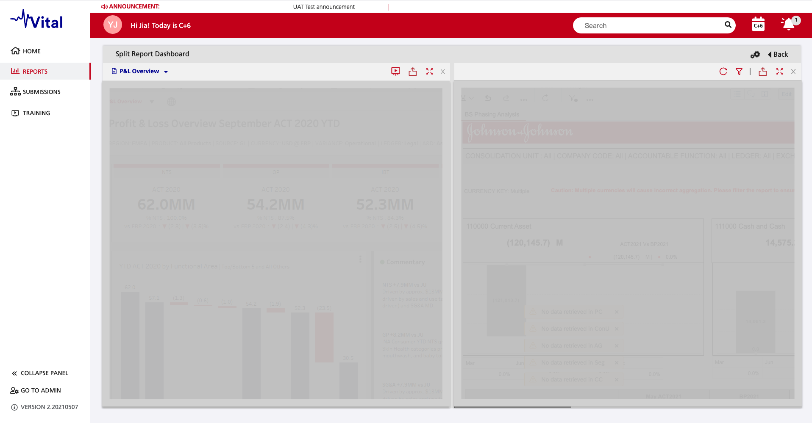
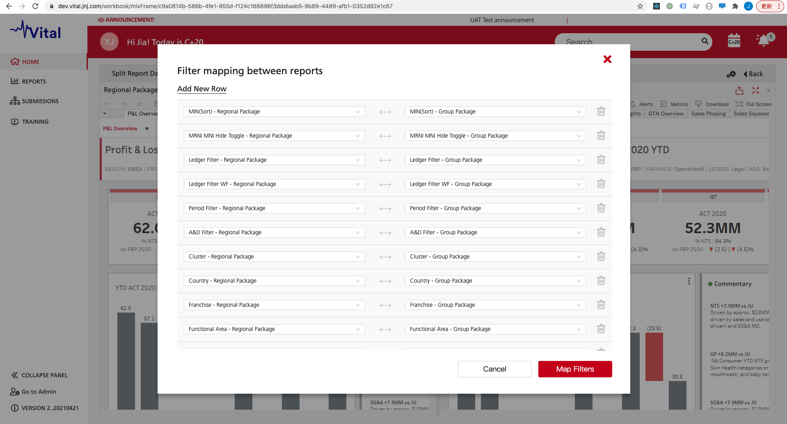

### interactive training

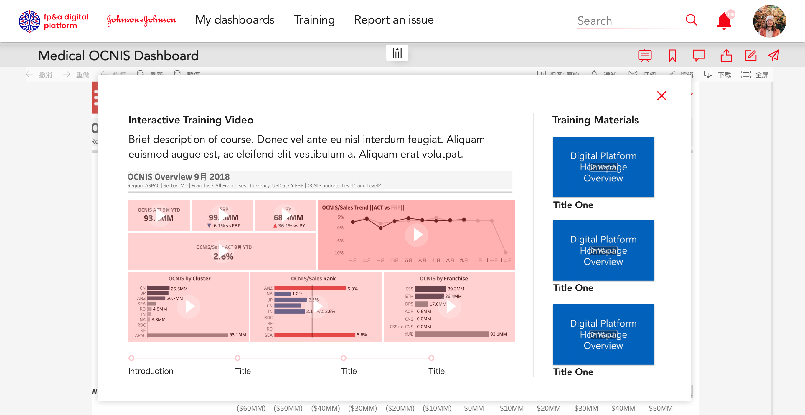

### share customized view

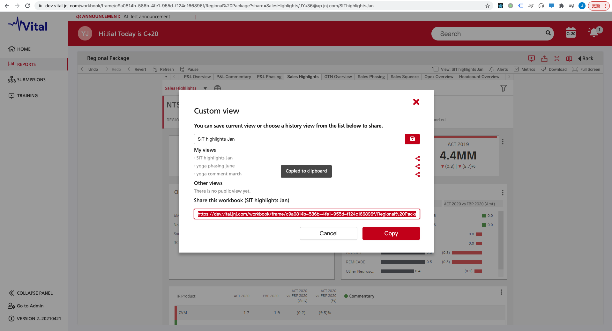

# SAP Report

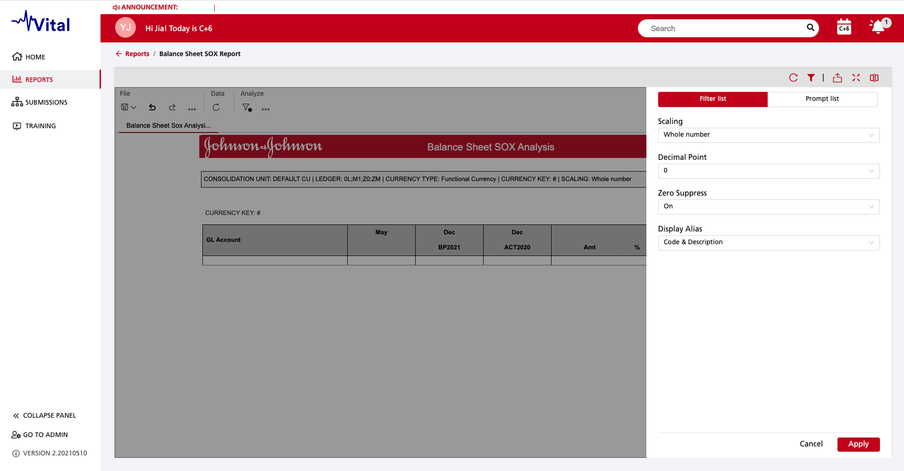

## FIlter for report:

Description | Store | Function | Action | Parameter
- | - | - | - | -
get report filter list | getReportStore | getInputControls | / | viewContext
get report filter detail | getReportInputControlStore | getInputControl | / | viewContext, inputControlId
get report filter options | getReportInputControlStore | getLov | / | viewContext, inputControlId
get report filter value | getReportInputControlStore | getSelection | / | viewContext, inputControlId
set report filter value | / | / | USER_SET_INPUT_CONTROL_SELECTION | viewContext, inputControlId, selection

## FIlter for document:

Description | Store | Function | Action | Parameter
- | - | - | - | -
get document filter list | getDocumentStore | getInputControls | / | viewContext
get document filter detail | getDocumentInputControlStore | getInputControl | / | viewContext, inputControlId
get document filter options | getDocumentInputControlStore | getLov | / | viewContext, inputControlId
get document filter value | getDocumentInputControlStore | getSelection | / | viewContext, inputControlId
set document filter value | / | / | USER_SET_INPUT_CONTROL_SELECTION | viewContext, inputControlId, selection

## SAP Prompt Function:

Description | Store | Function | Action | Parameter
- | - | - | - | -
activate prompt options | / | / | GET_PARAMETER_LOV | viewContext, parameterId, (prepare, data)
get prompt value | getDocumentStore | getParameters | / | viewContext
get prompt options | getParameterStore | getLov | / | viewContext, parameterId
set prompt value | / | / | USER_VALIDATE_PROMPTS | viewContext, inputControlId, selection

## SAP Driller Function:

Description | Store | Function | Action | Parameter
- | - | - | - | -
get driller current list | getReportStore | getDrillerElements | / | viewContext
get driller all list | getReportStore | getDrillerFilters | / | viewContext
get driller detail | getDrillerFilterStore | getDrillerFilter | / | viewContext, filterId

## Post Message:

Description | Type | Value | Interval
- | - | - | -
Code injection finished | string | 'SAP_WEBI_INJECTED' | false
Filter data | object | { type: 'filters-selection', data: filters, docId: getWebiViewerArgs().id } | true
Tab data | object | { type: 'tab-selection', data: tab, docId: getWebiViewerArgs().id } | true
Prompt data | object | { type: 'parameter-selection', data: parameters, docId: getWebiViewerArgs().id } | true
Click link event | object | { type: 'document-url', data: item.href, docId: getWebiViewerArgs().id } | false

## Code Injection:

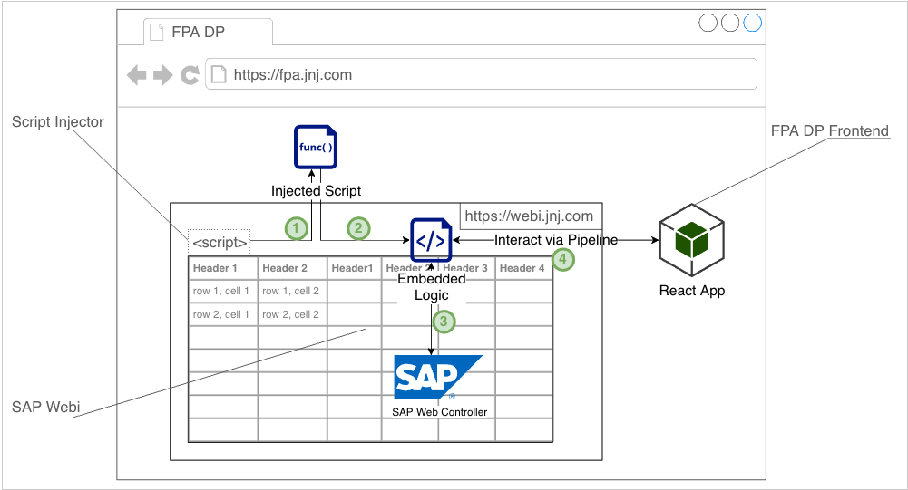

# Design of other page

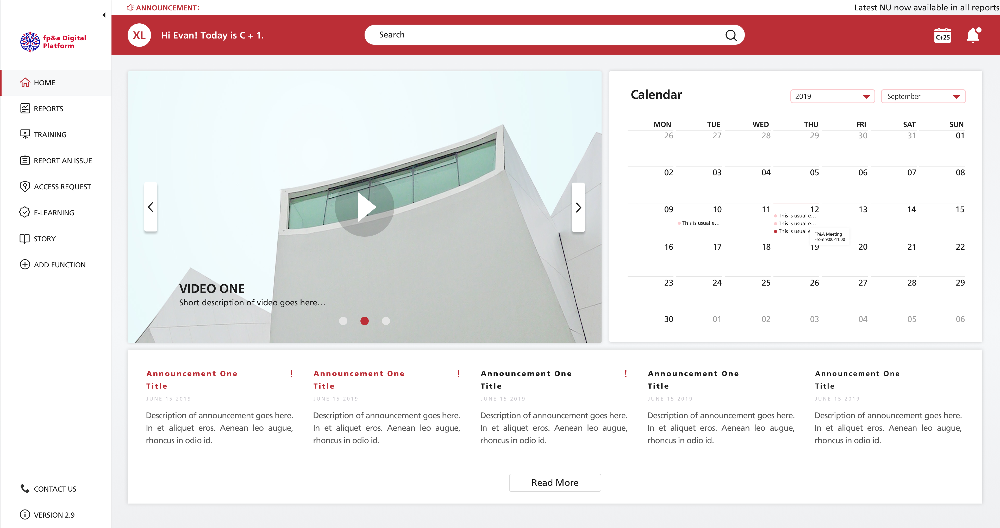
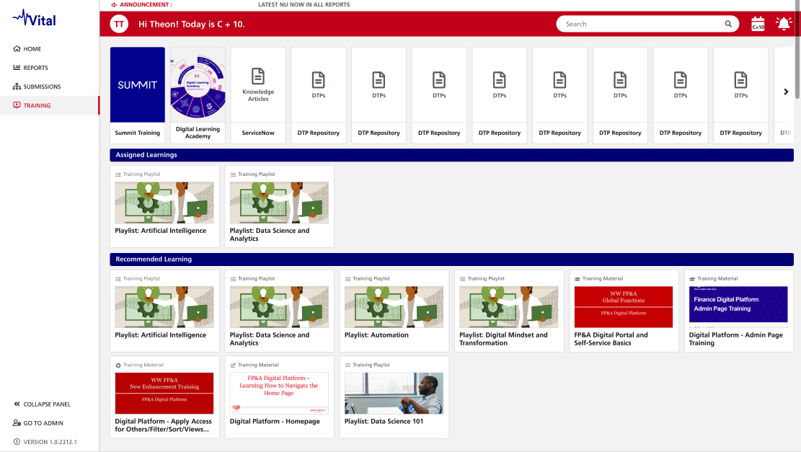
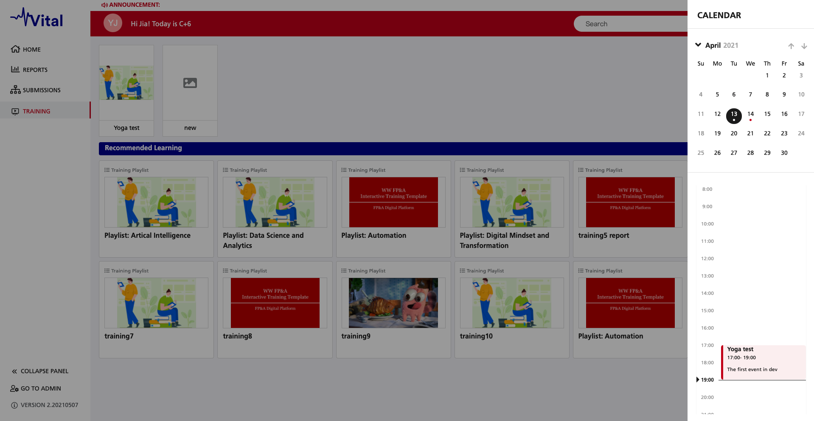
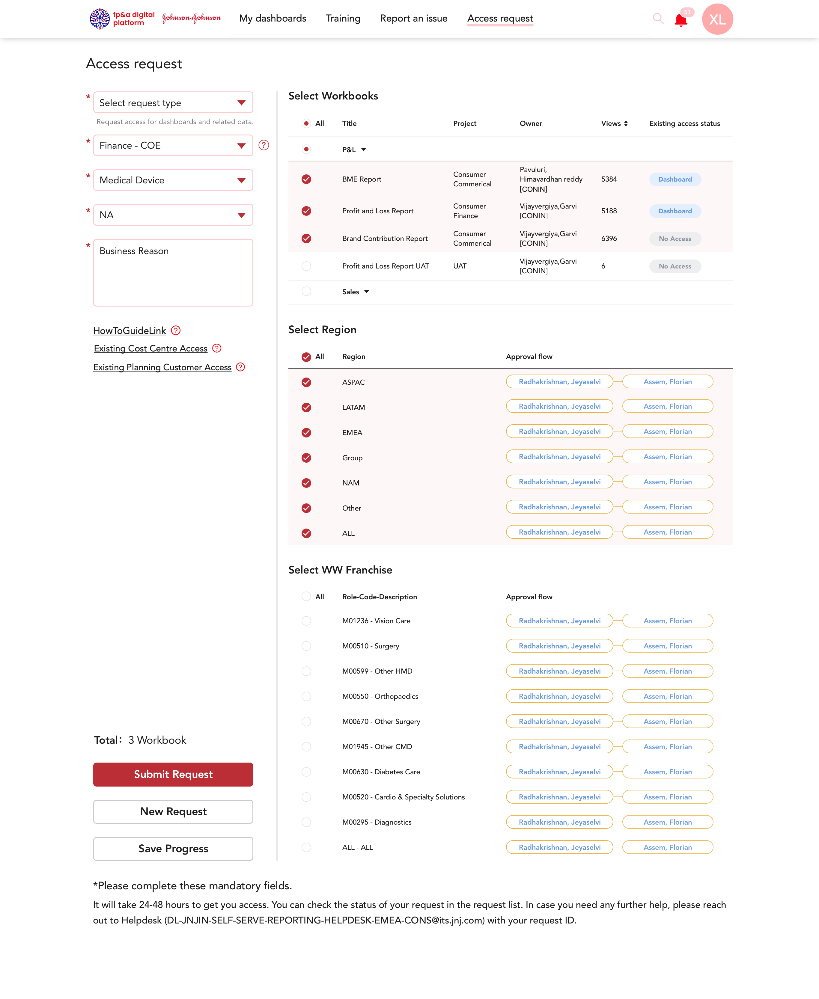
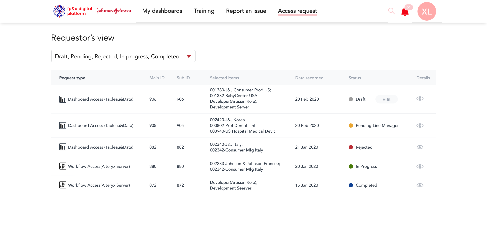
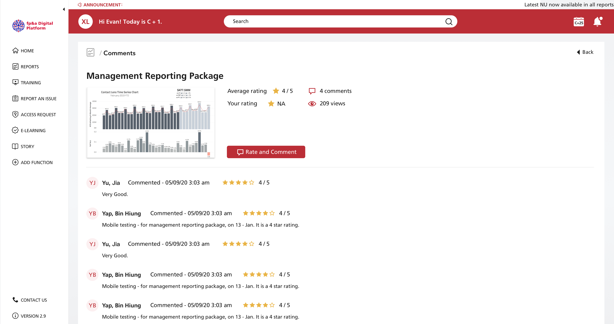
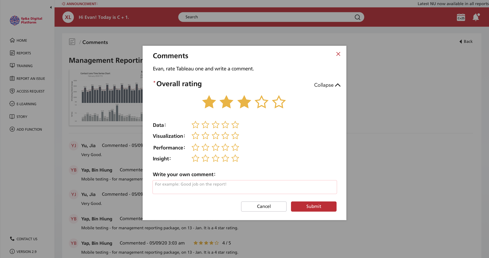
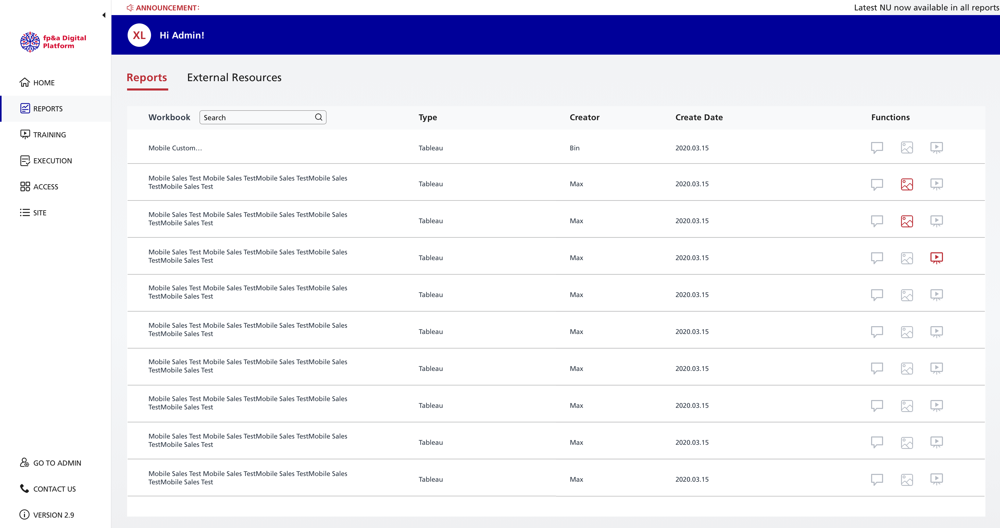
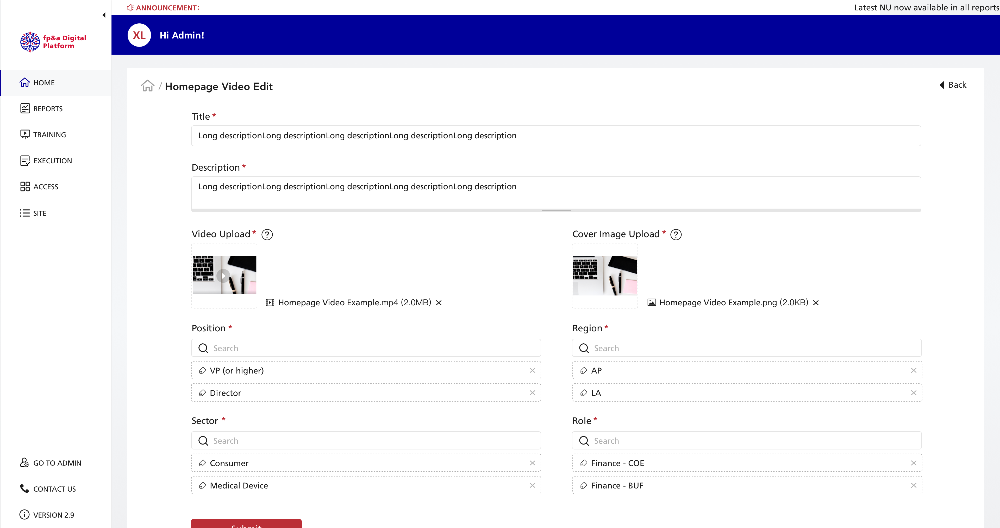