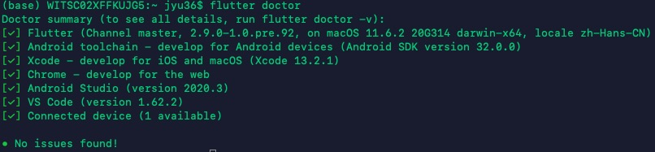

Title: Flutter Startup
Date: 2021-12-20
Category: IOS
Tags: Flutter
Author: Yoga

## 安装Flutter on macOS

* 升级 macOS to Big Sur

Xcode 12.3 includes Swift 5.3 and SDKs for iOS 14.3, iPadOS14.3, tvOS 14.3, watchOS 7.2, and macOS BigSur 11.1

* 升级 Xcode

Flutter requires a minimum Xcode version of 12.3.

* 下载 flutter安装包
```bash
git clone -b master https://github.com/flutter/flutter.git
```
* 运行 flutter doctor检查依赖项
```bash
flutter doctor
```
* 安装 Android sdk
* 安装 Android cmdline-tools
```bash
path/to/sdkmanager --install "cmdline-tools;latest"
```
* Android license
```bash
flutter doctor --android-licenses
```
* 更新 Cocoapods

  修改hosts
```bash
sudo vi /etc/hosts
// 199.232.68.133 raw.githubusercontent.com
// 199.232.68.133 user-images.githubusercontent.com
// 199.232.68.133 avatars2.githubusercontent.com
// 199.232.68.133 avatars1.githubusercontent.com
```
安装homebrew
```bash
/usr/bin/ruby -e "$(curl -fsSL https://raw.githubusercontent.com/Homebrew/install/master/install)"
brew -v
```
  安装Xcode的CommandLineTools工具
```
xcode-select --install
```
  安装RVM
```bash
curl -L https://get.rvm.io | bash -s stable
source /Users/jyu/.rvm/scripts/rvm
```
  安装Ruby
```
rvm list known
rvm install 3.0.0
ruby -v
```
  安装Cocoapods
```
sudo gem install -n /usr/local/bin cocoapods
pod --version
```



踩坑结束，安装完成

* Big Sur 之后，启动dbeaver报错Fail to create Java Virtual Machine

修改Info.plist文件，添加java目录

https://blog.csdn.net/BurningSilence/article/details/109804058

* 使用zsh终端，终端启动时~/.bash_profile将不会被加载。oh-my-zsh的配置文件是.zshrc，而默认shell(bash)的配置文件为.bash_profile。

vi ~/.bash_profile
```bash
export PUB_HOSTED_URL=https://pub.flutter-io.cn
export FLUTTER_STORAGE_BASE_URL=https://storage.flutter-io.cn
export PATH=/Users/jyu/flutter/bin:$PATH
```

vi ~/.zshrc
```bash
source ~/.bash_profile
```
source ~/.zshrc

## Flutter commend

* flutter doctor
* flutter run

flutter run --no-sound-null-safety

r // reload

* flutter packages get 

* flutter clean

## 调试

1.web调试

View -> Command Palette -> Dart: Open DevTools

2.手机调试

手机连接电脑

ios文件夹 -> open in Xcode

Runner>TARGETS下的Runner里的Signing & Capabilities：Team登录Apple账号

build success

* @import显示module not found:

```bash
cd ios
flutter clean
flutter pub get
pod install
```

* “不受信任的开发者”:

IPhone: 设置 -> 通用 -> VPN与设备管理：信任开发者