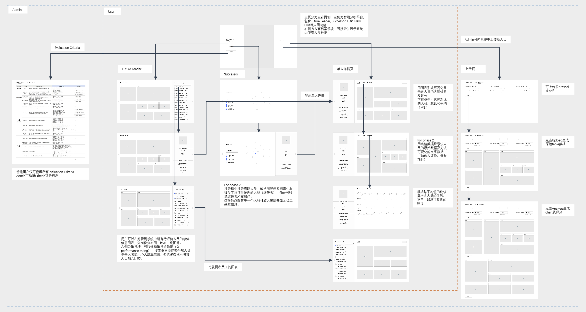
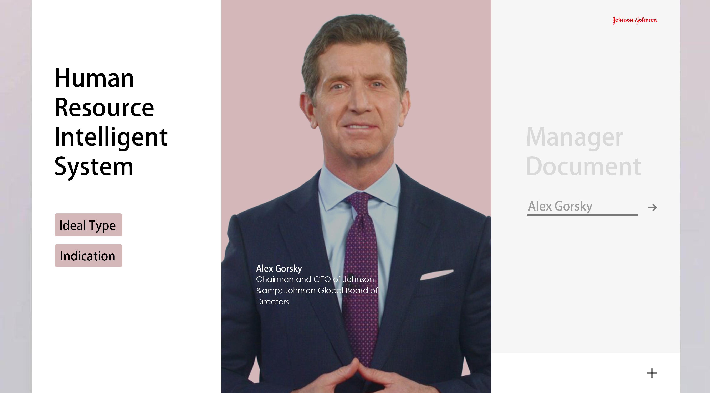
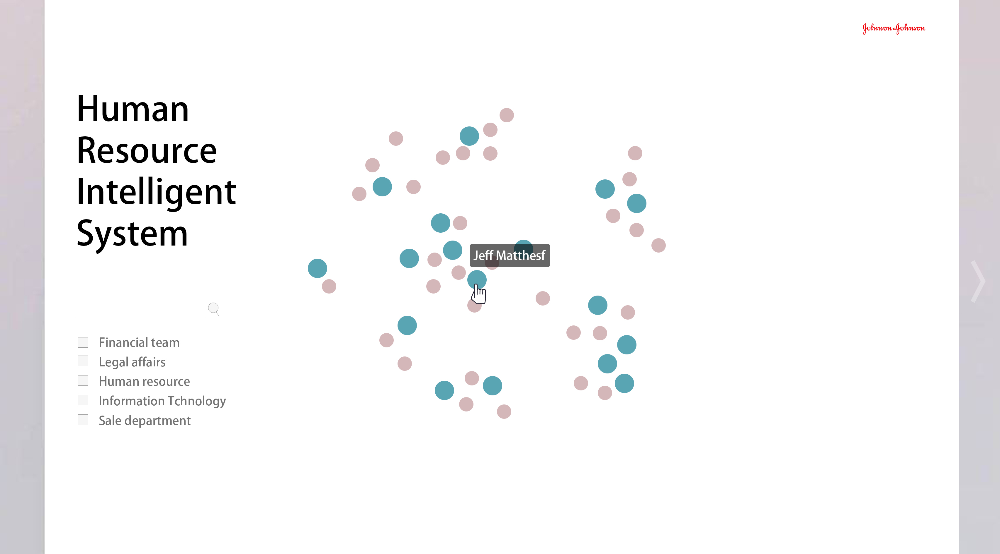
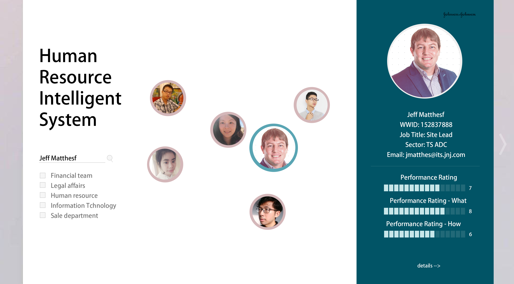
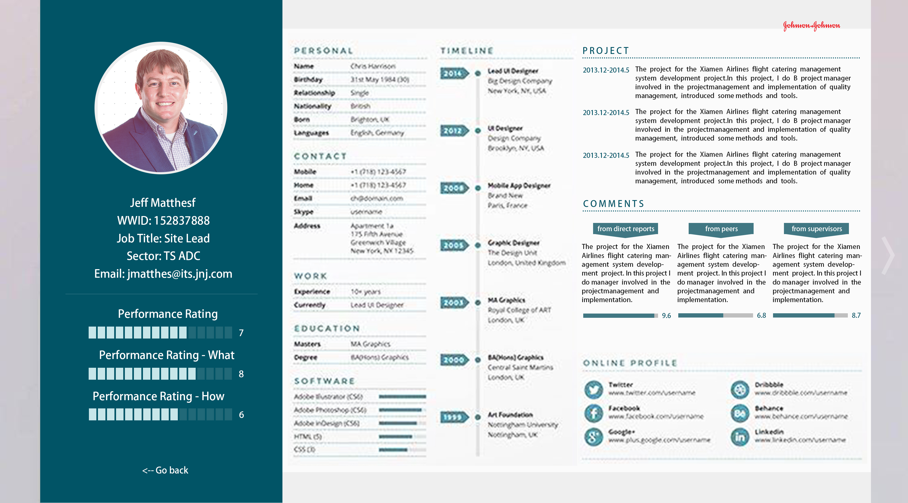
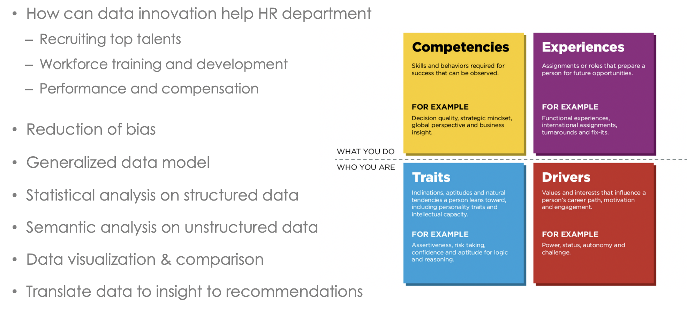
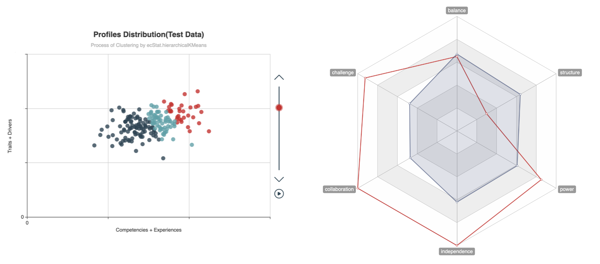
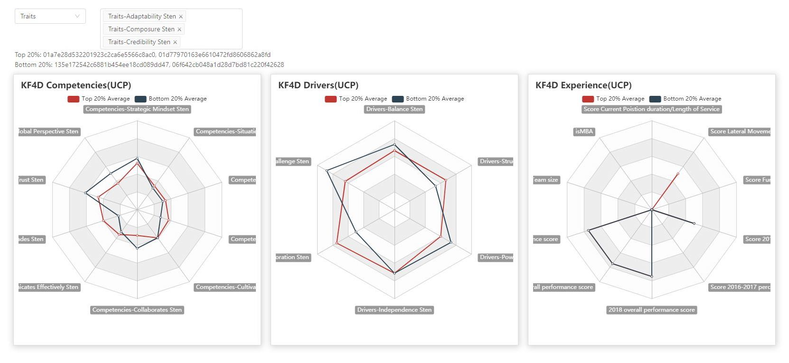
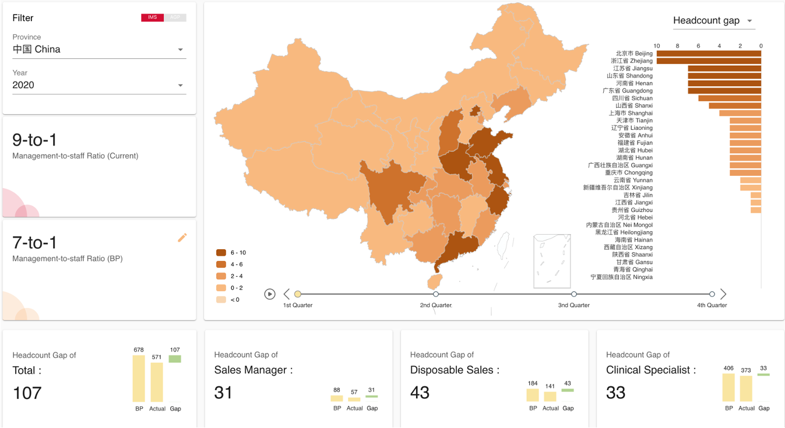
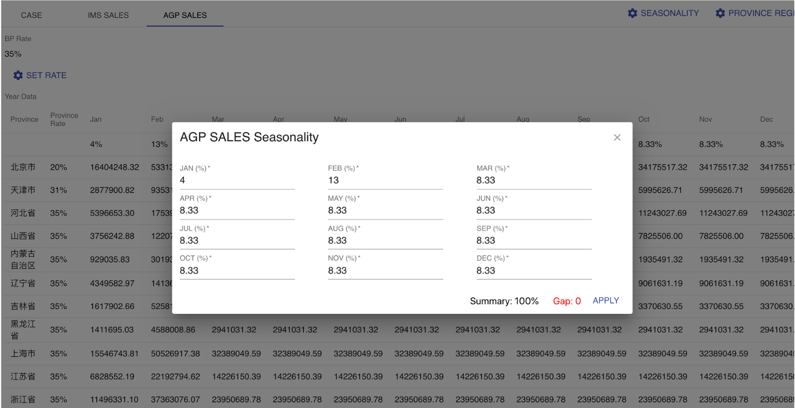

Title: HR Intelligent System
Date: 2019-11-20
Category: Project
Tags: Echarts
Author: Yoga

## Conduct Succession Planning

Effective human resource planning enables company to recruit, hire and develop employees who have skills and competencies to achieve strategic goals. HR planning must ensure that when employees leave, other employees can fill their roles. This project aims to run a platform that display all employees in relation map for seccession planning and also  provide opportunities for employees to take training classes and develop skills in critical areas. 

### ux & ui design

## Human Resource Evaluation

People analytics is defined as a data-driven approach to managing people at work (Gal, Jensen & Stein, 2017).

By implementing effective performance management systems, anticipating the types of roles needed to fulfill the strategic plan and responding to demographic changes in the workforce, HR keeps track of the organization’s capabilities and matches workers with the right tasks to achieve strategic goals.

### data visualization

## Strategic Workforce Planning

Strategic Workforce Planning is about making sure that the right person is in the right job at the right moment. This means that there are not too many people available (overstaffing) nor too few (understaffing).

Workforce planning thus solves staffing problems for today and for the future. According to Evers (2014), strategic workforce planning is becoming increasingly important for a number of reasons.

### data visualization

