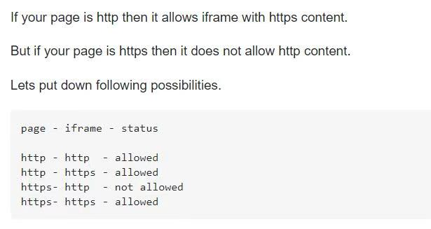

Title: iframe
Date: 2020-10-09
Category: Frontend
Author: Yoga

### 跨域




### sandbox 沙箱模式

* allow-same-orign 允许将内容作为普通来源对待，否则会被设为来自一个独立的源
* allow-top-navigation 允许包含文档导航内容
* allow-forms 允许表单提交
* allow-scripts 允许脚本执行
* allow-modals 允许模态窗口
* allow-orientation-lock 允许锁定父窗口屏幕方向
* allow-pointer-lock 允许使用指针锁API
* allow-popups 允许弹出窗口
* allow-popups-to-escape-sandbox 允许弹出沙箱窗口
* allow-presentation 允许控制session
* "" 允许上述所有规则，默认

原文链接：https://blog.csdn.net/asing1elife/article/details/83044752

```jsx
<iframe
  id={`webiContainer${documentId.replace(/\./g, '')}`}
  title={webiDetail.name}
  className={styles.iframeWrapper}
  src={webiDetail.document_url}
  width="100%"
  height="100%"
  frameBorder="0"
  sandbox='allow-scripts allow-forms allow-same-origin allow-top-navigation allow-downloads'
/>
```