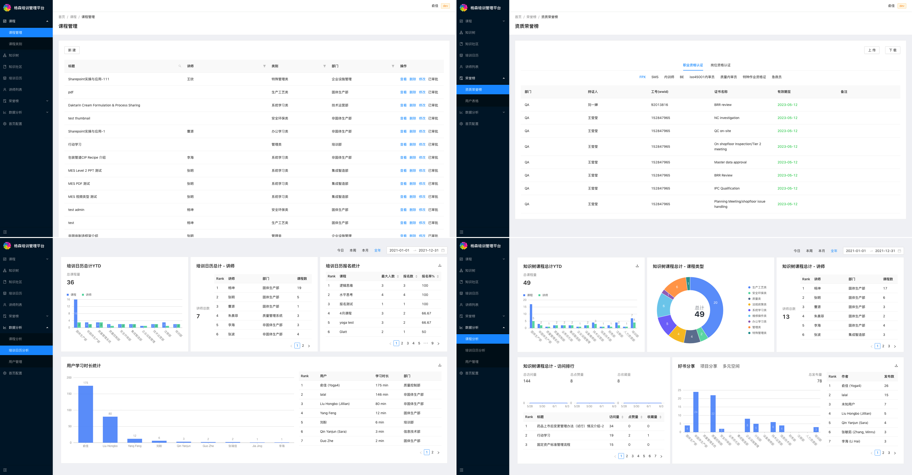
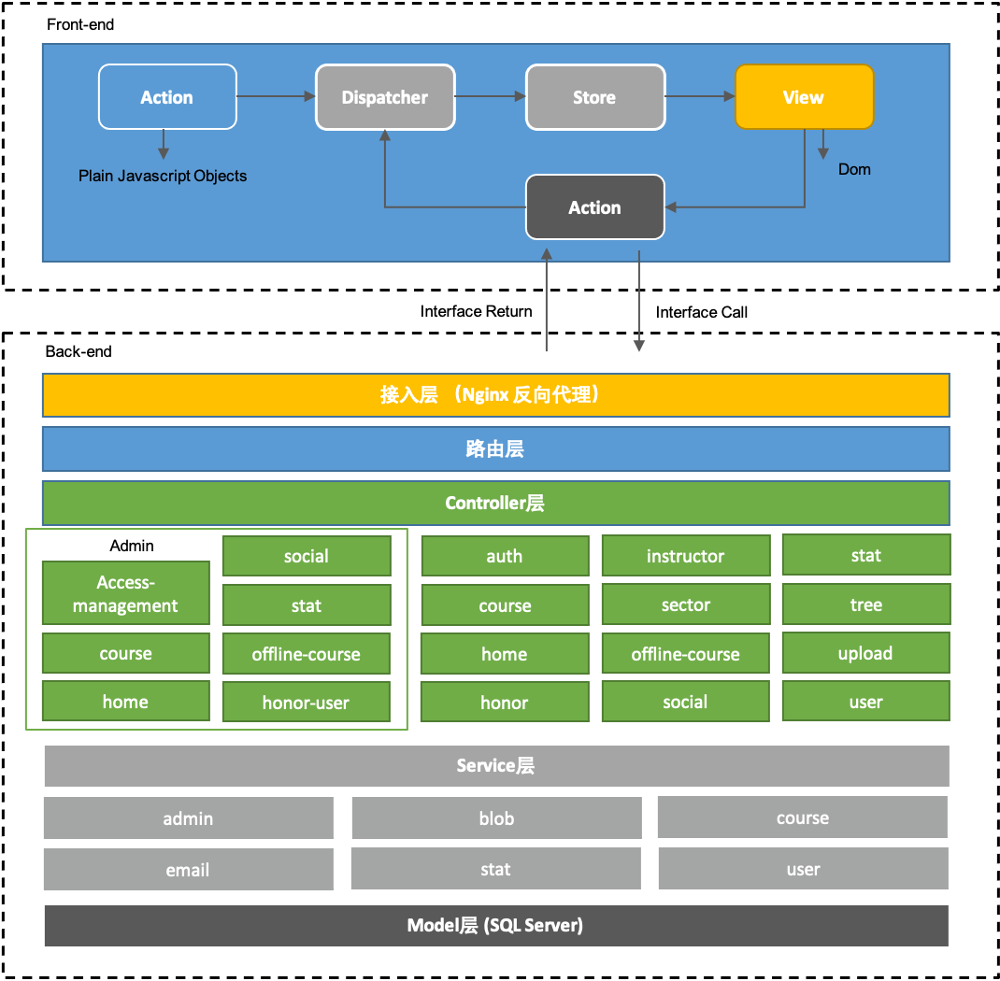
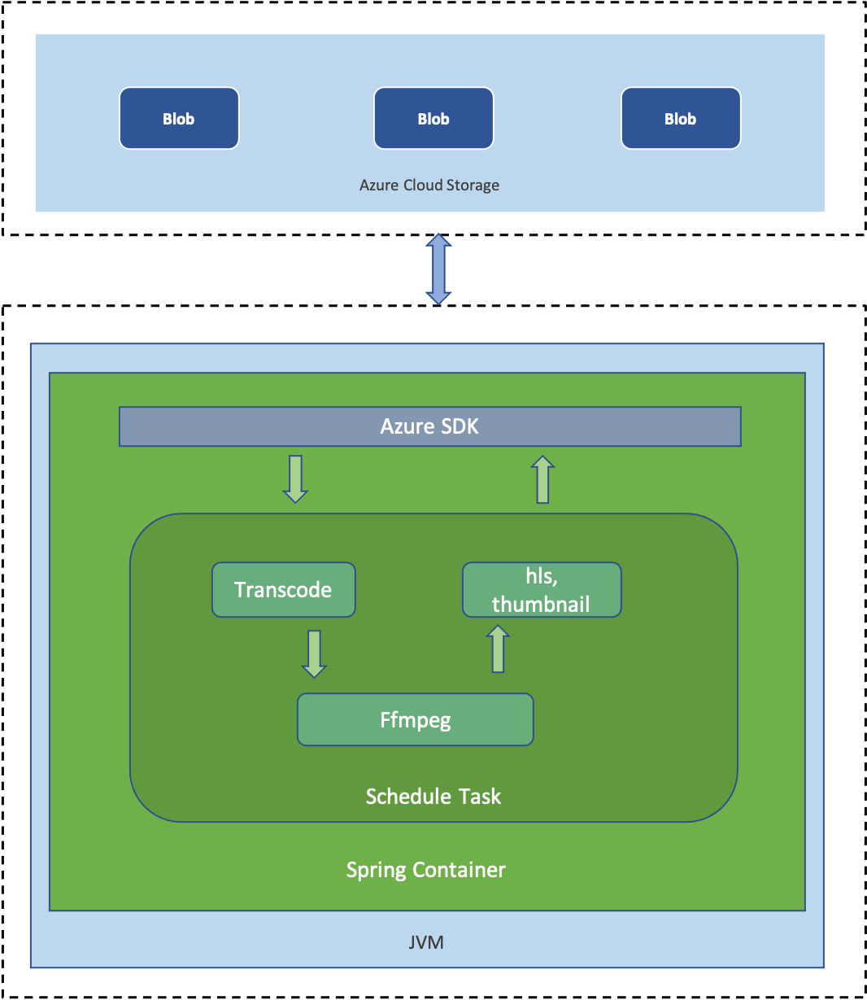

Title: Janssen Training Platform
Date: 2021-6-3
Category: Project
Tags: egg
Author: Yoga

Janssen Training Platform is a digital platform integrating online learning courses, registering offline courses, sharing learning feelings and establishing knowledge system. The platform is divided into mobile app, PC web page and PC management platform.

## pc platform


### 决策树

reference：https://g6.antv.vision/zh/docs/manual/getting-started

```js
import G6 from '@antv/g6';

if (graph) {
  graph.destroy();
}
graph = new G6.Graph({
  container: ReactDOM.findDOMNode(ref.current) as HTMLElement,
  modes: {
    default: ['drag-canvas', 'zoom-canvas'],
  },
  minZoom: 0.5,
  maxZoom: 2,
  defaultNode: {
    type: 'modelRect',
    ...
  },
  defaultEdge: {
    type: 'cubic-horizontal',
    ...
  },
});
graph.on('node:click', (ev: any) => {
  const node = ev.item;
  ...
});
graph.on('wheel', () => {
  ...
});
graph.on('canvas:mouseout', () => {
  ...
});
graph.data(rootNode);
```

### 中英切换

reference：https://umijs.org/plugins/plugin-locale#useintl

```js
import { useIntl } from 'umi'

export default function () {
  const intl = useIntl()
  return (
    <button type='primary'>
      {intl.formatMessage(
        {
          id: 'name',
          defaultMessage: 'Hello, traveler',
        },
        {
          name: 'Traveler',
        }
      )}
    </button>
  )
}
```

```js
import { setLocale, getLocale } from 'umi'

// refresh page
setLocale('zh-TW', true)

// Do not refresh the page
setLocale('zh-TW', false)

export default function () {
  return <div>{getLocale() === 'zh-CN' ? titleCh : titleEn}</div>
}
```

## mobile platform


### react-infinite-scroll-component

```js
import InfiniteScroll from 'react-infinite-scroll-component';

<InfiniteScroll
  next={getMore}
  hasMore={hasMore}
  dataLength={dataList.length}
  loader={<p style={{ textAlign: 'center' }}>Loading...</p>}
  scrollableTarget='scrollableDiv'
  endMessage={
    <p style={{ textAlign: 'center' }}>
      <span>到底啦~</span>
    </p>
  }
>
  {dataList.map((item, index) => {
    return (
      <InterestSubjectsMsg />
    )
  })}
</InfiniteScroll>
```

## admin platform



### Lodash

Lodash 是一个一致性、模块化、高性能的 JavaScript 实用工具库

```js
// 执行深比较来确定两者的值是否相等
import isEqual from 'lodash/isEqual'

if (!isEqual(nextProps, this.props)) {
  this.setRenderComponent(nextProps)
}
```

```js
// 创建一个对象，key 是 iteratee 遍历 collection(集合) 中的每个元素返回的结果
import groupBy from 'lodash/groupBy'

_.groupBy([6.1, 4.2, 6.3], Math.floor)
// => { '4': [4.2], '6': [6.1, 6.3] }

_.groupBy(['one', 'two', 'three'], 'length')
// => { '3': ['one', 'two'], '5': ['three'] }
```

```js
// 数组去重
const { uniq } = require('lodash')

_.uniq([2, 1, 2])
// => [2, 1]
```

```js
import { clone } from 'lodash'

var shallow = _.clone(objects) // 浅拷贝
var deep = _.cloneDeep(objects) // 深拷贝
```

### omit.js

Utility function to create a shallow copy of an object which had dropped some fields.

```js
import omit from 'omit.js'

omit({ name: 'Benjy', age: 18 }, ['name']) // => { age: 18 }
```

### react-helmet

React Helmet 是一个 HTML 文档 head 管理工具，管理对文档头的所有更改。

```js
import { Helmet } from 'react-helmet'

;<Helmet>
  <title>{title}</title>
  <meta name='description' content={title} />
</Helmet>
```

### SparkMD5

SparkMD5 is a fast md5 implementation of the MD5 algorithm.用 MD5 进行文件识别、文件秒传、文件安全性检查等

利用 input 选择文件 -> 对文件进行分片 -> 用 FileReader 方法读取文件 -> 交由 Spark-md5 进行处理

```js
onst customRequest = useCallback(
    async ({ file, onSuccess, onError, onProgress }: RcCustomRequestOptions) => {
      try {
        /** 文件后缀名 */
        const fileType = file.name.slice(file.name.lastIndexOf('.'));
        /** 切片总数 */
        const chunksSize = Math.ceil(file.size / chunkSize);
        /** 当前切片编号 */
        let currentChunk = 0;
        /**文件的Hash */
        let fileHash: string;
        /** 切片hash数组 */
        const blockIdList: string[] = [];

        const fileReader = new FileReader();
        fileReader.readAsArrayBuffer(file);
        fileReader.onloadend = async (e) => {
          spark.append(e.target?.result as ArrayBuffer);
          fileHash = spark.end() + fileType;
          /** 已上传成功对切片数 */
          let currentUploadChunk = 0;

          let ap = new AsyncSerial();

          while (currentChunk < chunksSize) {
            ap.tap((cb: () => void, index: number) => {
              const sliceData = file.slice(index * chunkSize, (index + 1) * chunkSize);
              const sliceReader = new FileReader();

              sliceReader.readAsArrayBuffer(sliceData);
              sliceReader.onloadend = async (e) => {
                spark.append(e.target?.result as ArrayBuffer);
                let form = new FormData();
                let sliceHash = btoa(encodeURI(spark.end()));
                blockIdList.push(sliceHash);
                form.append('file', sliceData, sliceHash + fileType);
                await axios
                  .post(
                    `/upload/video/block?fileName=${fileHash}&blockId=${encodeURIComponent(
                      sliceHash,
                    )}`,
                    form,
                  )
                  .then(async () => {
                    currentUploadChunk += 1;
                    if (currentUploadChunk === chunksSize) {
                      setTimeout(
                        async () =>
                          await axios
                            .post(
                              `/upload/video/block/merge`,
                              {
                                blockIdList,
                                fileName: fileHash,
                              },
                              { headers: { 'Content-Type': 'application/json' } },
                            )
                            .then((res) => {
                              onSuccess(res.data, file);
                            })
                            .catch((error) => {
                              onError(error);
                            }),
                        500,
                      );
                    }
                    onProgress({ percent: (currentUploadChunk * 100) / chunksSize }, file);
                    cb();
                  })
                  .catch((error) => {
                    onError(error);
                  });
              };
            });
            currentChunk += 1;
          }
          ap.call(() => {});
        };
      } catch (err) {
        onError(err);
      }
    },
    [axios, spark],
  );
```

## Layered Architecture

### Application



### Encoder


