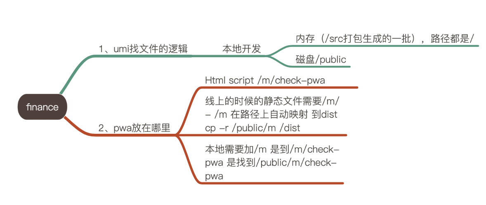

Title: Jenkins部署
Date: 2020-04-30
Category: Programming
Tags: Jenkins, AWS
Author: Yoga

Repository URL: https://sourcecode.xxx.com/scm/asx-nbbg/fpa_mobile.git

Branch Specifier: */develop

Build Triggers: 轮询 SCM

Build: 执行shell
```
npm i
npm install aws-sdk &
export NODE_OPTIONS=--max_old_space_size=4096
npm run build-dev
aws s3 rm s3://xxx-fpa-dev/mobileFrontend/m --recursive --only-show-errors
aws s3 cp dist s3://xxx-fpa-dev/mobileFrontend/m --recursive --sse --only-show-errors
```

Umi配置:

```javascript
export default {
  define: {
    'process.env.backendUrl': 'https://api.fpa.xxx.com',
  },
  base: '/m/index.html#/',
  publicPath: '/m/',
};
```


---

1. 安装 NodeJS:

Dashboard -> Manage Jenkins -> Global Tool Configuration

NodeJS -> ADD NODEJS:

Name: NODEJS

Version: NodeJS 10.24.0 (服务器上 node --version)

2. 安装 Publish over SSH 插件:

Dashboard -> Manage Jenkins -> Manage Plugins -> Available

勾选 Publish over SSH

Dashboard -> Manage Jenkins -> Configure System

Publish over SSH -> SSH Server:

Name: JCRD-DEV

Hostname: 10.xxx.xxx.xxx

Username: user

Remote Directory: /app

Advanced: 勾选 Use password authentication, or use a different key

登录方式三选一：

Passphrase：user的密码

Path to key：SSH私钥的文件路径

Key：私钥 (cat id_rsa)

3. 新建 Job:

Dashboard -> New Item -> 文件夹 (JCRD-Deployment)

JCRD-Deployment -> New Item -> Freestyle project (DEV-JCRD-Frontend)

DEV-JCRD-Frontend -> configure:

__Source Code Management:__ 

Repository URL: https://sourcecode.xxx.com/scm/xxx.git

Credentials: sa-itsus-jbge-devuser

Branch Specifier (blank for 'any'): */dev

__Build Triggers:__ 

Poll SCM: H/3 * * * * 每三分钟轮询一次

__Build Environment:__

Provide Node & npm bin/ folder to PATH:

NodeJS Installation: NODEJS

__Build:__

Execute shell:

```
npm i
npm run build
```

__Post-build Actions:__

Send build artifacts over SSH -> SSH Server: 

Name: JCRD-DEV

Transfers -> Transfer Set

Source files: dist/js/*.js, dist/index.html, dist/img/*, dist/fonts/*, dist/favicon.ico

Remove prefix: dist

Remote directory: /jcrd-dist