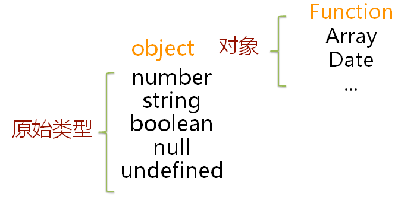

Title: 数据类型
Date: 2019-01-01
Category: Javascript
Author: Yoga

值类型(基本类型)：字符串（String）、数字(Number)、布尔(Boolean)、对空（Null）、未定义（Undefined）、Symbol。

引用数据类型：对象(Object)、数组(Array)、函数(Function)。



_JavaScript 拥有动态类型_,相同的变量可用作不同的类型

```
var x;               // x 为 undefined
var x = 5;           // 现在 x 为数字
var x = "John";      // 现在 x 为字符串
```

JavaScript 变量均为对象。当声明一个变量时，就创建了一个新的对象。

```js
var carname = new String()
var x = new Number()
var y = new Boolean()
var cars = new Array()
var person = new Object()
```

## Number

```js
NaN !== NaN
```
不同类型比较会转number
```js
1 == '1.0'
1 == true
```

## String

```js
new String('hi') == 'hi'
new String('hi') !== 'hi'
```

## Null

```js
null === null
```

## Undefined

```js
undefined === undefined
null == undefined
null !== undefined
```

## Symbol

Symbol 是 ES6 引入了一种新的原始数据类型，表示独一无二的值。

## Object

```js
{} !== {}
new Object !== new Object

arr = [NaN, {}]
arr.indexof(NaN) // -1
arr.indexof({}) // -1
```
