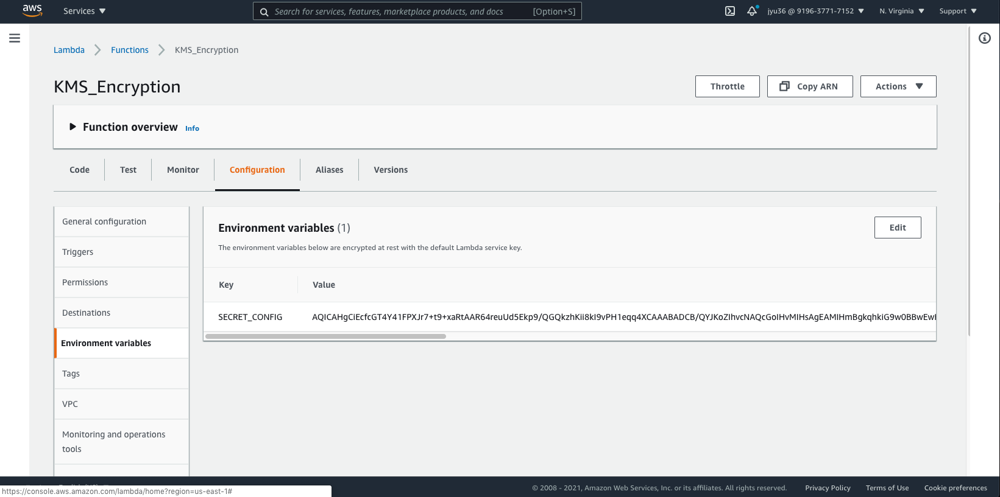
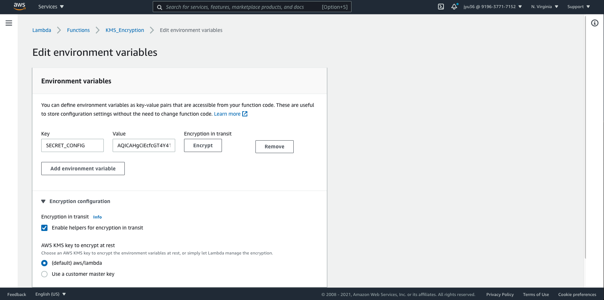

Title: AWS KMS
Date: 2021-08-17
Category: Backend
Tags: AWS
Author: Yoga

AWS Key Management Service (AWS KMS) 是一个密钥管理服务，可以用来创建和管理您的主密钥，AWS KMS使用信封加密的方式实现数据的保护。简单来说，信封加密就是用数据密钥对明文数据进行加密，然后再使用其他数据密钥对这个数据密钥进行加密，但是您的最后一个数据密必须以明文的形式存在，以便您对其他的数据密钥进行加密和解密操作。这个最顶层的明文密钥称为主密钥，AWS KMS可以帮我们安全地存储和管理这个主密钥。

### Background

Set up AWS KMS to manage and secure Backend Local Configs.

### End Goal

Encrypt all credentials and secrets in config/local.js
Automate deployment of credentials into EC2 instances


### Solution:

local.js will be split into two parts, credentials will be saved in AWS KMS, while other configs except for credentials will be moved to config/env file.


## Credential part

credential config 为指定data structure的json
```json
{
  "AWS": {
    "accessKeyId": "string",
    "secretAccessKey": "string"
  },
  "azureAD": {
    "clientId": "string",
    "clientSecret": "string"
  }
}
```

### Steps to update encryption config:
1. Create new kms key
2. Create new lambda function
3. Add credential config in Environment variables
4. encrypt with kms
5. copy and paste 生成的乱码 into env/development.js




Decrypt function:
```js
// api/helpers/get-config.js
const AWS = require('aws-sdk');

AWS.config.update({ region: 'us-east-1' });

module.exports = {

  friendlyName: 'Get KMS config',

  description: '',

  inputs: {
    key: {
      type: 'string',
      description: 'The key of the config',
      required: true,
    },
  },

  exits: {
  },

  async fn(inputs) {
    const { key } = inputs;
    const kms = new AWS.KMS();
    if (!process.env.NODE_ENV || process.env.NODE_ENV === 'test' || !sails.config.custom.kms) {
      if (key === 'datastores') {
        return sails.config.datastores.default;
      }
      return sails.config.custom[key];
    }
    const functionName = sails.config.custom.kms.AWS_LAMBDA_FUNCTION_NAME;
    const encrypted = sails.config.custom.kms.SECRET_CONFIG;
    try {
      const req = {
        CiphertextBlob: Buffer.from(encrypted, 'base64'),
        EncryptionContext: { LambdaFunctionName: functionName },
      };
      const data = await kms.decrypt(req).promise();
      if (data.Plaintext) {
        const temp = data.Plaintext.toString('ascii');
        return JSON.parse(temp)[key];
      }
      throw new Error('Secret Decrypt fail');
    } catch (err) {
      sails.log.error('Decrypt error:', err);
      throw err;
    }
  },

};
```

Usage of decrypted config:
```js
const decryptedConfig = await sails.helpers.getConfig(key);
```

## Env part

Environment | Config file
- | -
dev | config/env/development.js
stage | config/env/staging.js
production | config/env/production.js

```js
module.exports = {
  datastores: {
    default: {
      adapter: "string",
      host: "string",
      port: number,
      database: "string",
    },
  },
 
  models: {
    migrate: "string",
  },
 
  blueprints: {
    shortcuts: boolean,
  },
 
  security: {
    cors: {
      allowOrigins: ["string"],
      allowRequestHeaders: "string",
    },
  },
 
  session: {
    db: number,
    port: number,
    host: "string",
    cookie: {
      maxAge: number,
    },
  },
 
  sockets: {},
 
  log: {
    level: "info",
  },
 
  http: {
    cache: number,
    trustProxy: true,
  },
 
  port: number,
 
  ssl: {
    disableCertificateValidation: boolean,
  },
 
  custom: {
    AWS: {
      bucket: "string",
      cdn: "string",
    },
    azureAD: {
      redirectUri: "string",
    },
    tableau: {
      baseUrl: "string",
      endpoint: "string",
      contentUrl: "string",
    },
    sap: {
      endpoint: "string",
      injectFolder: number,
    },
    serviceNow: {
      endpoint: "string",
      kb: "string",
    },
    frontHost: "string",
    host: "string",
    kms: {
      AWS_LAMBDA_FUNCTION_NAME: "string",
      SECRET_CONFIG: "string",
    },
  },
};
```
