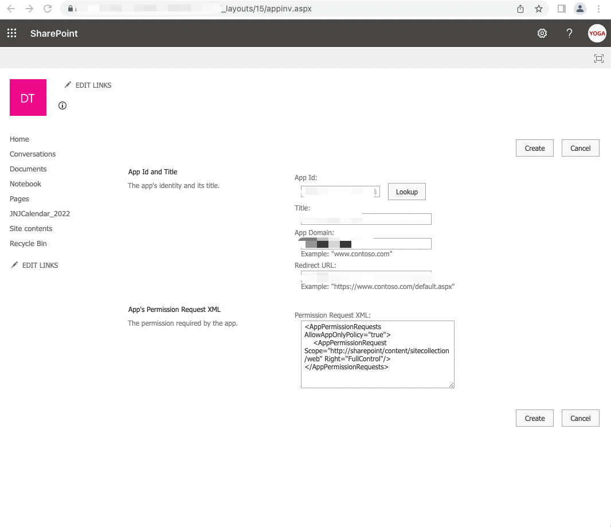

Title: MS Graph API
Date: 2021-6-4
Category: Cloud
Tags: Microsoft
Author: Yoga

## Authentication and Authorization
The basic steps required to use the OAuth 2.0 authorization code grant flow to get an access token from the Microsoft identity platform endpoint are:

1. Register your app with Azure AD.
2. Get authorization.
3. Get an access token.
4. Call Microsoft Graph with the access token.
5. Use a refresh token to get a new access token.

To configure an app to use the OAuth 2.0 authorization code grant flow, you'll need to save the following values when registering the app:

1. The Application (client) ID assigned by the app registration portal.
2. A Client (application) Secret
3. A Redirect URI (or reply URL) for your app to receive responses from Azure AD.

The first step to getting an access token for OAuth 2.0 flow is to redirect the user to the Microsoft identity platform /authorize endpoint. Azure AD will sign the user in and ensure their consent for the permissions your app requests. In the authorization code grant flow, after consent is obtained, Azure AD will return an authorization_code to your app that it can use at the Microsoft identity platform /token endpoint for an access token.

### grant_type: authorization_code

```js
// callback.js
const tokenReq = {
  client_id: sails.config.custom.azureAD.clientId,
  scope: sails.config.custom.azureAD.scope,
  code: req.query.code,
  redirect_uri: sails.config.custom.azureAD.redirectUri,
  grant_type: 'authorization_code',
  client_secret: sails.config.custom.azureAD.clientSecret,
}

const tokenRes = await axios.post(
  'https://login.microsoftonline.com/xxx.onmicrosoft.com/oauth2/v2.0/token',
  qs.stringify(tokenReq),
  {
    headers: {
      'Content-Type': 'application/x-www-form-urlencoded',
    },
  }
)

req.session.aadAccessToken = tokenRes.data.access_token
req.session.aadRefreshToken = tokenRes.data.refresh_token
req.session.aadExpiresAt = Date.now() + tokenRes.data.expires_in * 1000

const infoRes = await axios.get('https://graph.microsoft.com/v1.0/me/', {
  headers: {
    Authorization: `Bearer ${tokenRes.data.access_token}`,
  },
  params: {
    $select: fields.join(),
  },
})
```

```js
// isLoggedIn.js
module.exports = async function isLoggedIn(req, res, proceed) {
  if (req.session && req.session.uid && req.session.aadRefreshToken) {
    return proceed()
  }

  const params = {
    client_id: sails.config.custom.azureAD.clientId,
    response_type: 'code',
    redirect_uri: sails.config.custom.azureAD.redirectUri,
    response_mode: 'query',
    scope: sails.config.custom.azureAD.scope,
    state: req.headers.referer,
  }
  return res.status(401).json({
    message: 'Unauthorized',
    sso_url: `https://login.microsoftonline.com/#########/oauth2/v2.0/authorize?${qs.stringify(
      params
    )}`,
  })
}
```

### grant_type: client_credentials

```js
const tokenEndpoint = 'https://login.microsoftonline.com/#########/oauth2/v2.0/token'

const tokenReq = {
  client_id: sails.config.custom.azureAD.clientId,
  scope: 'https://graph.microsoft.com/.default',
  client_secret: sails.config.custom.azureAD.clientSecret,
  grant_type: 'client_credentials',
}

async function retriveToken() {
  const tokenRes = await axios.post(tokenEndpoint, qs.stringify(tokenReq), {
    headers: {
      'Content-Type': 'application/x-www-form-urlencoded',
    },
  })
  token = tokenRes.data.access_token
  setTimeout(retriveToken, 3300 * 1000)
}
```

### grant_type: refresh_token

```js
// azureTokenRefresher.js
module.exports = async function isLoggedIn(req, res, next) {
  if (req.session && typeof req.session.aadExpiresAt === 'number' && req.session.aadExpiresAt < Date.now() + 300000) {
    // Refresh the AD access token if it expires in 300s
    const tokenReq = {
      client_id: sails.config.custom.azureAD.clientId,
      scope: sails.config.custom.azureAD.scope,
      refresh_token: req.session.aadRefreshToken,
      redirect_uri: sails.config.custom.azureAD.redirectUri,
      grant_type: 'refresh_token',
      client_secret: sails.config.custom.azureAD.clientSecret,
    }
    const tokenRes = await axios.post(
      'https://login.microsoftonline.com/xxx.onmicrosoft.com/oauth2/v2.0/token',
      qs.stringify(tokenReq),
      {
        headers: {
          'Content-Type': 'application/x-www-form-urlencoded',
        },
      }
    )

    req.session.aadAccessToken = tokenRes.data.access_token
    req.session.aadExpiresAt = Date.now() + tokenRes.data.expires_in * 1000
  }
  return next()
}
```

## SharePoint

### Get docSiteId

API | params | response  
- | - | -
GET https://graph.microsoft.com/v1.0/sites/xxx.sharepoint.com:/teams/#siteName# | siteName: string | "sites": [ { "@odata.type": "microsoft.graph.site"} ]

### Get document lists

Get the collection of lists for a site.

API | params | response  
| - | - | -
GET https://graph.microsoft.com/v1.0/sites/#site-id#/lists | docSiteId: string | "lists": [ { "@odata.type": "microsoft.graph.list" }]

### Get document from each list

Returns the metadata for an item in a list.

API | params | response  
| - | - | -
GET https://graph.microsoft.com/v1.0/sites/#site-id#/lists/#list-id#/items/ | docSiteId: string, list.id: string, expand: fields(select) | "items": [ { "@odata.type": "microsoft.graph.baseItem" }]


microsoft.graph.baseItem:

Property name | Type | Description
| - | - | -
id | string | The unique identifier of the item. Read-only.
createdBy | identitySet | Identity of the creator of this item. Read-only.
createdDateTime | DateTimeOffset | The date and time the item was created. Read-only.
eTag | string | ETag for the item. Read-only.
lastModifiedBy | identitySet | Identity of the last modifier of this item. Read-only.
lastModifiedDateTime | DateTimeOffset | The date and time the item was last modified. Read-only.
parentReference | itemReference | Parent information, if the item has a parent. Read-write.
webUrl | string (url) | URL that displays the item in the browser. Read-only.

additional item:

Property name | Type | Description | Value
| - | - | - | -
pageUrl | string | URL that display item in browser | https://xxx.sharepoint.com/:w:/r/teams/#siteName#/_layouts/15/Doc.aspx?sourcedoc=%7B${item.eTag.slice(1, 37)}%7D&file=${encodeURI(item.fields.LinkFilename)}&action=default&mobileredirect=true

---

## Sharepoint API

Step1. 在 portal.azure.com 新建app (App registrations) 并生成client secret

Step2. 在 teams 里 create a team, Apps -> Sharepoint -> Copy link

Step3. Grant permission to your app go to https://[YourSharePointCollectionURL]/_layouts/15/appinv.aspx



### Authentication Token

__POST__ https://accounts.accesscontrol.windows.net/{{tenantId}}/tokens/OAuth/2/

Headers: Content-Type = application/x-www-form-urlencoded

Body:

Key | Value
| - | -
client_id | {{clientId}}@{{tenantId}}
resource | 00000003-0000-0ff1-ce00-000000000000/jnj.sharepoint.com@{{tenantId}}
client_secret | {{secret_value}}
grant_type | client_credentials

### Get List by title

__GET__ https://[YourSharePointCollectionURL]/_api/web/lists/GetByTitle('[list name]')/items

Headers: Authorization = Bearer {{token}}

### Get Files by folder

__GET__ https://[YourSharePointCollectionURL]/_api/web/GetFolderByServerRelativeUrl('Shared Documents/General')/Files

Headers: Authorization = Bearer {{token}}

### Get List by title

__GET__ https://[YourSharePointCollectionURL]/_api/web/GetFileByServerRelativeUrl('/teams/{{sitename}}/Shared Documents/General/{{filename}}')/$value

Headers: Authorization = Bearer {{token}}

https://www.c-sharpcorner.com/article/how-to-test-sharepoint-online-rest-apis-using-postman-tool/

https://learn.microsoft.com/zh-cn/sharepoint/dev/sp-add-ins/complete-basic-operations-using-sharepoint-rest-endpoints

