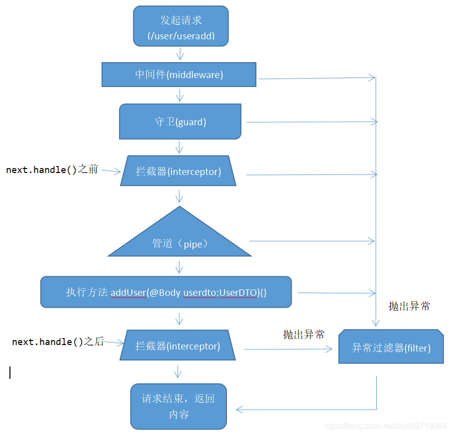

Title: NestJS
Date: 2022-01-18
Category: Backend
Tags: nest
Author: Yoga

## Overview

1. Nest深受Angular的影响，借鉴了NG的一些列前端设计思路，特别是其代码结构。让Angular易于开发大型前端的优势也发挥在Node服务器端。
2. 模块化：高度可测试，可扩展，松散耦合且易于维护
3. nestjs直接对接ts类型系统
4. 解析数据库schema，产出swagger，对typeORM的整合的非常不错

A nestjs template that contains basic functions (typeorm, task, email, unit test): 
https://github.com/yogagii/nest_startup

```
$ npm i -g @nestjs/cli
$ nest new project-name
```

## Structure

```
my-project
  │── src
  │   │── common
  │   │  │── decorators
  │   │  │── pipe
  │   │  └── utils
  │   │── custom
  │   │  │── dto
  │   │  │── entities
  │   │  │── custom.controller.ts
  │   │  │── custom.service.ts
  │   │  │── custom.module.ts
  │   │  │── custom.controller.spec.ts
  │   │  └── custom.service.spec.ts
  │   │── app.module.ts
  │   └── main.ts
  │── nest-cli.json
  │── package.json
  │── tslint.json
  │── test
  │   │── app.e2e-spec.ts
  └── tsconfig.json
```

## Controllers 控制器

控制器的目的是接收应用的特定请求。路由机制控制哪个控制器接收哪些请求。通常，每个控制器有多个路由，不同的路由可以执行不同的操作。

> $ nest g controller cats

__Request:__

* @All() 用于处理所有 HTTP 请求方法的处理程序
* @Get()
* @Post()
* @Put()
* @Patch()
* @Delete()
* @Options()
* @Header('Cache-Control', 'none') 指定自定义响应头
* @Redirect('https://nestjs.com', 301) 重定向

Param decorators:
* @Request(), @Req()：@Req() 只是 @Request() 的别名
* @Param(key?: string)
* @Body(key?: string)
* @Query(key?: string)

```js
import { Controller, Get, Req, Param } from '@nestjs/common';
@Get(':id')
findOne(@Param() params): string { //@Param('id') id
  return `This action returns a #${params.id} cat`;
}

@Post()
async create(@Body() createCatDto: CreateCatDto) {
  return 'This action adds a new cat';
}
```

DTO（数据传输对象）模式。DTO是一个对象，它定义了如何通过网络发送数据。

```ts
export class CreateCatDto {
  readonly name: string;
  readonly age: number;
  readonly breed: string;
}
```

__Response:__

返回object or array，自动序列化为JSON

返回string，number，boolean，只发送值

```js
import { Response } from 'express';

findAll(@Res() response){
  response.status(200).send()
})
```
* @Response()，@Res()必须通过调用 response 对象（res.json(…) 或 res.send(…)）发出某种响应，否则 HTTP 服务器将挂起。

* @HttpCode() 响应的状态码总是默认为 200，除了 POST 请求（默认响应状态码为 201）

异步
```js
async findAll(): Promise<any[]> {
  return [];
}
```

## Providers 提供者

Provider 只是一个用 @Injectable() 装饰器注释的类。

> $ nest g service cats

__依赖注入__

Nest 将 catsService 通过创建并返回一个实例来解析 CatsService，解析此依赖关系并将其传递给控制器的构造函数，实现数据共享

```ts
constructor(private readonly catsService: CatsService) {}
```

Provider 通常具有与应用程序生命周期同步的生命周期（“作用域”）。在启动应用程序时，必须解析每个依赖项，因此必须实例化每个提供程序。同样，当应用程序关闭时，每个 provider 都将被销毁。

```ts
import { Injectable, Inject } from '@nestjs/common';

@Injectable() // 类装饰器：基于构造函数的注入
export class HttpService<T> {
  @Inject('HTTP_OPTIONS') // 属性装饰器：基于属性的注入
  private readonly httpClient: T;
}
```

```ts
// app.module.ts
@Module({
  controllers: [CatsController], // 服务的使用者
  providers: [CatsService], // 服务的提供者
})
```

## Modules 模块

模块是具有 @Module() 装饰器的类。 @Module() 装饰器提供了元数据，Nest 用它来组织应用程序结构。

每个 Nest 应用程序至少有一个模块，即根模块。根模块是 Nest 开始安排应用程序树的地方，根模块可能是应用程序中唯一的模块.

```ts
// app.module.ts
@Module({
  controllers: [AppController, CatsController],
  providers: [AppService, CatsService],
})
export class AppModule {}
```

> $ nest g module cats

```ts
// cats.module.ts
// @Global() // 全局模块，不需要在 imports 数组中导入
@Module({
  controllers: [CatsController],
  providers: [CatsService],
  // exports: [CatsService], // 每个导入CatsModule的模块都可以访问CatsService，共享相同的CatsService实例
})
export class CatsModule {}

// app.module.ts
@Module({
  imports: [CatsModule],
  controllers: [AppController],
  providers: [AppService],
})
export class AppModule {}
```



## Middleware 中间件

Nest 中间件等价于 express 中间件

* 对请求和响应对象进行更改。
* 调用堆栈中的下一个中间件函数。
* 如果当前的中间件函数没有结束请求-响应周期, 它必须调用 next() 将控制传递给下一个中间件函数。否则, 请求将被挂起。

```ts
// app.module.ts
export class AppModule implements NestModule {
  configure(consumer: MiddlewareConsumer) {
    consumer.apply(LoggerMiddleware)
    .exclude(
      { path: 'cats', method: RequestMethod.GET },
      'cats/(.*)',
    )
    .forRoutes(CatsController);
  }
}
```

forRoutes() 可接受一个字符串、多个字符串、对象、一个控制器类甚至多个控制器类(逗号分隔)。

```ts
// main.ts
app.use(logger); // 绑定到每个注册路由
```

## Exception filters 异常过滤器

```ts
import { ForbiddenException } from '@nestjs/common';

throw new ForbiddenException(); // 内置异常
throw new HttpException('Forbidden', HttpStatus.FORBIDDEN); // 基础异常类
throw new HttpException({
  status: HttpStatus.FORBIDDEN,  // 403
  error: 'This is a custom message',
}, HttpStatus.FORBIDDEN);

try {
	return await this.usersRepository.save(userToUpdate);
} catch (error) {
  throw new HttpException(error.sqlMessage, HttpStatus.BAD_REQUEST);
}
```
绑定过滤器
```ts
@UseFilters(new HttpExceptionFilter())  // 实例
@UseFilters(HttpExceptionFilter) // 类
```
> 尽可能使用类而不是实例。由于 Nest 可以轻松地在整个模块中重复使用同一类的实例，因此可以减少内存使用。

```ts
// main.ts
app.useGlobalFilters(new HttpExceptionFilter()); // 全局范围的过滤器
```
若已经设置了useGlobalFilters，在单个接口上加UseFilters会覆盖掉全局的useGlobalFilters

## Pipes 管道

管道有两个类型:

* 转换：管道将输入数据转换为所需的数据输出
* 验证：对输入数据进行验证，如果验证成功继续传递; 验证失败则抛出异常;

Nest 自带八个开箱即用的管道:

* ValidationPipe
* ParseIntPipe
* ParseBoolPipe
* ParseArrayPipe
* ParseUUIDPipe
* DefaultValuePipe
* ParseEnumPipe
* ParseFloatPipe

验证字符串是否是 UUID
```ts
@Get('/users/:id')
getUserDetail(
  @Param('id', new ParseUUIDPipe()) id: string,
): Promise<UserDto> {
  return this.userService.findOne(id);
}
```
Pagination 分页 法一：
```ts
import { ParseIntPipe, DefaultValuePipe } from '@nestjs/common';
@Get('/users')
  getUserList(
    @Query('page', new DefaultValuePipe(1), ParseIntPipe) page?: number,
    @Query('limit', new DefaultValuePipe(10), ParseIntPipe) limit?: number,
  ): Promise<UserDto[]> {
    return this.userService.findAll({ page, limit });
  }
```
Pagination 分页 法二：

npm i --save class-validator class-transformer
```ts
// pagination.dto.ts
import { ApiPropertyOptional } from '@nestjs/swagger';
import { IsOptional, IsPositive, IsInt, Max } from 'class-validator';
import { Type, Expose } from 'class-transformer';

export class PaginationDto {
  @IsOptional()
  @IsInt()
  @IsPositive()
  @Type(() => Number)
  @Expose()
  @ApiPropertyOptional({
    default: 1,
  })
  readonly page: number = 1;

  @IsOptional()
  @IsInt()
  @IsPositive()
  @Type(() => Number)
  @Expose()
  @Max(100)
  @ApiPropertyOptional({
    default: 50,
  })
  readonly limit: number = 50; // 加:number才会显示在swagger中

  get skip(): number {
    return (this.page - 1) * this.limit;
  }
  get take(): number {
    return this.limit;
  }
}
```
```ts
// controller
import { UsePipes, ValidationPipe } from '@nestjs/common';
import { PaginationDto } from 'src/core/pagination.dto';
@Get('/users')
@UsePipes(
    new ValidationPipe({
      transform: true,
      transformOptions: {
        excludeExtraneousValues: true, // 排除dto中没有定义的query，当有其他filter时不能为true
        exposeDefaultValues: true, // 没有query时使用默认值
      },
    }),
  )
  getUserList(
    @Query() dto: PaginationDto,
  ): Promise<UserDto[]> {
    return this.userService.findAll(dto);
  }

// service
findAll(ListUserDto): Promise<UserDto[]> {
  return this.usersRepository.find({
    skip: ListUserDto.skip,
    take: ListUserDto.take,
  });
}
```

query 转string为float
(url /solutions/:id?boMin=xxx 中的query直接拿到都是string)

```ts
import { Transform } from 'class-transformer';

export class DetailMdSolutionDto {
  @ApiPropertyOptional()
  @Transform(({ value }) => parseFloat(value))
  boMin?: number;
}
```
```ts
  @Get('/solutions/:id')
  @UsePipes(
    new ValidationPipe({
      transform: true,
    }),
  )
  getSolution(
    @Query() detailSolutionDto: DetailMdSolutionDto,
  ) {...}
```

## Guards 守卫

守卫的责任：授权 -- 根据运行时出现的某些条件（例如权限，角色，访问控制列表等）来确定给定的请求是否由路由处理程序处理。

在 Express 中通常由中间件处理授权、验证身份。中间件不知道调用 next() 函数后会执行哪个处理程序。然而守卫可以访问 ExecutionContext 实例，因此确切地知道接下来要执行什么。

> 守卫在每个中间件之后执行，但在任何拦截器或管道之前执行。

每个守卫必须实现一个canActivate()函数。此函数应该返回一个布尔值，指示是否允许当前请求。

```ts
@Controller('cats')
@UseGuards(RolesGuard)
export class CatsController {
  @Post()
  @Roles('admin')
  create(@Body() createCatDto: CreateCatDto) {
    this.catsService.create(createCatDto);
  }
}
```
Nest提供了通过 @SetMetadata() 装饰器将定制元数据附加到路由处理程序的能力。
```ts
// roles.decorator.ts
@SetMetadata('roles', ['admin'])
```

创建一个RolesGuard类来比较当前用户拥有的角色和当前路径需要的角色

```ts
// roles.guard.ts
import { Injectable, CanActivate, ExecutionContext } from '@nestjs/common';

@Injectable()
export class RolesGuard implements CanActivate {
  constructor(private reflector: Reflector) {}

  canActivate(context: ExecutionContext): boolean {
    const requiredRoles = this.reflector.getAllAndOverride<UserRole[]>(
      ROLES_KEY,
      [context.getHandler(), context.getClass()],
    );
    if (!requiredRoles) { // 没有@Roles()的接口直接返回true
      return true;
    }
    const request = context.switchToHttp().getRequest();
    const { user_role } = request.session;
    return !requiredRoles.some((role) => role > user_role); // 判断用户权限是否大于接口所需权限
  }
}
```
全局注册RolesGuard
```ts
// app.module.ts
providers: [
  {
    provide: APP_GUARD,
    useClass: process.env.NODE_ENV ? SSOAuthGuard : LocalAuthGuard,
  },
  {
    provide: APP_GUARD,
    useClass: process.env.NODE_ENV ? RolesGuard : LocalAuthGuard,
  },
],
```
SSOAuthGuard 会在 RolesGuard 之前执行，SSOAuthGuard 返回 true 才会执行到 RolesGuard。所以可以在 SSOAuthGuard 中在session里存下用户权限 user_role。

## Interceptor 拦截器

拦截器是使用 @Injectable() 装饰器注解的类。拦截器应该实现 NestInterceptor 接口。

功能：在函数执行之前/之后绑定额外的逻辑；转换从函数返回的结果；转换从函数抛出的异常

* 在接口相应前后记录时间
* 包装返回的数据
* 缓存拦截器

```ts
@Injectable()
export class TransformInterceptor<T> implements NestInterceptor<T, Response<T>> {
  intercept(context: ExecutionContext, next: CallHandler): Observable<Response<T>> {
    console.log('Before...')
    return next.handle().pipe(map(data => ({ data, code: 200, message: '请求成功', }))); // After
  }
}
```

全局拦截器用于整个应用程序、每个控制器和每个路由处理程序。在依赖注入方面, 从任何模块外部注册的全局拦截器 无法插入依赖项, 因为它们不属于任何模块。

刷新 Token
```ts
@Injectable()
export class RefreshTokenInterceptor implements NestInterceptor {
  constructor(private readonly authService: AuthService) {}
  async intercept(
    context: ExecutionContext,
    next: CallHandler,
  ): Promise<Observable<any>> {
    const request = context.switchToHttp().getRequest();
    const token = request.session.token;
    await this.authService // 若没有await，先执行next.handle()，then中更新session不会生效
      .refreshToken(token.refresh_token)
      .then((result) => {
        request.session.token = {
          ...result,
          expires_at: new Date().getTime() + result.expires_in * 1000,
        };
      });
    return next.handle();
  }
}
```

```ts
// main.ts
app.useGlobalInterceptors(
  new RefreshTokenInterceptor(
    new AuthService(new HttpService(), new UserManagementService()), 
  ), // 只能传入实例，不能传入类，当传入的实例又调用其他类时会嵌套多层
);
```

从模块(app.module)中设置拦截器可以传入类

```ts
// app.module
import { Module } from '@nestjs/common';
import { APP_INTERCEPTOR } from '@nestjs/core';

@Module({
  providers: [
    {
      provide: APP_INTERCEPTOR,
      useClass: RefreshTokenInterceptor,
    },
  ],
})
```

## Task Scheduling 定时任务

npm install --save @nestjs/schedule

* 计时工作(cron job)

```ts
@Cron('45 * * * * *') // 该方法每分钟执行一次，在第 45 秒执行。
handleCron() {
  this.logger.debug('Called when the current second is 45');
}
```

```bash
* * * * * *
| | | | | |
| | | | | day of week
| | | | month
| | | day of month
| | hour
| minute
second (optional)
```

stop()-停止一个按调度运行的任务

start()-重启一个停止的任务

setTime(time:CronTime)-停止一个任务，为它设置一个新的时间，然后再启动它

lastDate()-返回一个表示工作最后执行日期的字符串

```ts
const job = this.schedulerRegistry.getCronJob('notifications');

job.stop();
console.log(job.lastDate());
```

* 间隔（Interval）
```ts
@Interval(10000)
handleInterval() {
  this.logger.debug('Called every 10 seconds');
}
```

* 延时任务（Timeout）
```ts
@Timeout(5000)
handleTimeout() {
  this.logger.debug('Called once after 5 seconds');
}
```

## 跨域

```ts
// main.ts
async function bootstrap() {
  const app = await NestFactory.create(AppModule, {
    cors: process.env.ENABLE_CORS === 'true',
  });
  app.enableCors({
    origin: ['http://localhost:3008'],
  });
  await app.listen(3007);
}
bootstrap();
```

## Test 测试

Nest 提供Jest和SuperTest开箱即用的集成。

https://github.com/yogagii/bst_data

__Unit test__:

* xxx.controller.spec.ts: 模拟service的方法，测试controller是否调用service方法
* xxx.service.spec.ts: 模拟Repository方法，不连接数据库，mock假数据，验证业务逻辑

__e2e测试__:

* app.e2e-spec.ts: 模拟app module，连接测试数据库，验证各路由

踩坑：需在beforeAll中createTestingModule，beforeEach中import AppModule会导致数据库重复连接（AlreadyHasActiveConnectionError）

## Event 监听事件

使用 try catch 无法处理异步代码块内出现的异常

```js
// 异常捕获成功
try {
  throw new Error('error');
} catch(e) {
  console.log('异常捕获');
}

// 异常捕获失败
try {
  setTimeout(() => {
    throw new Error('error');
  })
} catch(e) {
  console.log('异常捕获');
}
```

使用event方式来处理异常

```bash
npm i --save @nestjs/event-emitter
```

事件监听
```ts
import { Injectable } from '@nestjs/common';
import { OnEvent } from '@nestjs/event-emitter';

@Injectable()
export class UpdateStatusListener {
  constructor(private readonly mdmService: MdmService) {}

  @OnEvent('updateStatus.sendFormFailed')
  handleOrderCreatedEvent(event) {
    console.log('sendFormFailed: ', event);
  }
}
```

```ts
@Module({
  providers: [UpdateStatusListener],
})
```

事件触发
```ts
import { EventEmitter2 } from '@nestjs/event-emitter';
@Injectable()
export class EmailService {
  constructor(
    private eventEmitter: EventEmitter2,
  ) {}

  async sendEmailCode() {
    try {
      await this.mailerService.sendMail(sendMailOptions);
    } catch (error) {
      this.eventEmitter.emit('updateStatus.sendFormFailed', {
        event_id: courseData.event_id,
      });
    }
  }
}
```

## Authentication 身份验证

Passport是 node.js 身份验证库，Passport 执行步骤：

1. 验证用户的credentials (username/password, JSON Web Token (JWT), or identity token
2. 给经过身份验证的状态签发token（JWT），或创建一个 Express 会话
3. 将经过身份验证的用户的信息附加到请求对象以便进一步使用

```js
import { Injectable } from '@nestjs/common';
import { JwtService } from '@nestjs/jwt';
import { CipherService } from '../common/cipher';
import { jwtConstants } from './constants';

@Injectable()
export class AuthService {
  constructor(
    private readonly jwtService: JwtService,
    private cipherService: CipherService,
  ) {}

  async validateUser(username: string, pass: string): Promise<any> {
    if (
      username === process.env.ADMIN_USERNAME &&
      pass === process.env.ADMIN_PASSWORD
    ) {
      return { username, pass };
    }
    return null;
  }

  async login(user: any) {
    console.log('login: ', user);
    const payload = {
      sub: this.cipherService.encryptAES128ECB(
        'xxx',
        jwtConstants.cipherKey,
      ),
    };
    return {
      access_token: this.jwtService.sign(payload),
    };
  }
}

```
Passport JWT
```ts
import { ExtractJwt, Strategy } from 'passport-jwt';
import { PassportStrategy } from '@nestjs/passport';
import { Injectable } from '@nestjs/common';
import { jwtConstants } from './constants';

@Injectable()
export class JwtStrategy extends PassportStrategy(Strategy) {
  constructor() {
    super({
      jwtFromRequest: ExtractJwt.fromAuthHeaderAsBearerToken(),
      ignoreExpiration: false,
      secretOrKey: jwtConstants.secret,
    });
  }

  async validate(payload: any) {
    return { userId: payload.sub, username: payload.username };
  }
}

```

Node.js提供了一个内置的crypto模块可用于加密和解密字符串

```js
import { Injectable } from '@nestjs/common';
import { createCipheriv, createDecipheriv } from 'crypto';

@Injectable()
export class CipherService {
  encryptAES128ECB(data: string, key: string) {
    const cipher = createCipheriv('aes-128-ecb', key, null);
    cipher.setAutoPadding(true);
    const encrypted = cipher.update(data, 'utf8', 'base64');
    return encrypted + cipher.final('base64');
  }

  decryptAES128ECB(data: string, key: string) {
    const cipher = createDecipheriv('aes-128-ecb', key, null);
    cipher.setAutoPadding(true);
    const receivedPlaintext = cipher.update(data, 'base64', 'utf8');
    return receivedPlaintext + cipher.final('utf8');
  }
}

```

自定义CustomStrategy
```ts
import { PassportStrategy } from '@nestjs/passport';
import { Strategy } from 'passport';

@Injectable()
export class CustomStrategy extends PassportStrategy(Strategy, 'custom') { // 自定义Strategy名字

}
```

aadAuthGuard

https://www.npmjs.com/package/passport-azure-ad
```ts
import { OIDCStrategy } from 'passport-azure-ad';

@Injectable()
export class AADStrategy extends PassportStrategy(OIDCStrategy, 'aad') {
  constructor() {
    super(
      {
        identityMetadata: 'https://login.microsoftonline.com/common/v2.0/.well-known/openid-configuration',
        clientID: 'xxx',
        clientSecret: 'xxx',
        responseType: 'id_token',
        responseMode: 'form_post',
        redirectUrl: 'xxx/callback',
      },
      (iss, sub, profile, accessToken, refreshToken, done) => {},
    );
  }
}
```
跳转到aad登录界面

## Swagger 接口文档

配置
```ts
// main.ts
import { NestFactory } from '@nestjs/core';
import { SwaggerModule, DocumentBuilder } from '@nestjs/swagger';
import { ApplicationModule } from './app.module';

async function bootstrap() {
  const app = await NestFactory.create(ApplicationModule);

  const options = new DocumentBuilder()
    .setTitle('Project API')
    .setDescription('The Project API description')
    .setVersion('1.0')
    .addTag('project')
    .build();
  const document = SwaggerModule.createDocument(app, options);
  SwaggerModule.setup('api', app, document);

  await app.listen(3000);
}
bootstrap();
```

在DTO中添加request schema
```ts
import { ApiPropertyOptional, ApiProperty, IntersectionType } from '@nestjs/swagger';

export enum UserRole {
  'READER',
  'DESIGNER',
  'APPROVER',
  'ADMIN',
}

export class UserDto {
  @ApiProperty()  // 必填项
  email: string;

  @ApiPropertyOptional() // 非必填
  last_name?: string;
}

export class ListUserDto extends IntersectionType(PaginationDto, SortDto) {
  @ApiPropertyOptional({
    description: 'filter: role',
    enum: UserRole, // 枚举
    isArray: true, // ?role=0,1
  })
  role?: string;
}
```
Mapped types:

* IntersectionType: 可以将两个类型中所有属性组合在一起生成一个新类型，但是继承不到pagination的getter
* PartialType: 把所有字段变为optional
* PickType: 选择部分字段
* OmitType: 排除部分字段

https://docs.nestjs.com/openapi/mapped-types#composition

在controller中添加response schema
```ts
import { ApiCreatedResponse } from '@nestjs/swagger';
import { UserDto, ListUserDto } from './dto/user';

@Controller()
export class UserController {
  @Get('/users')
  @ApiCreatedResponse({
    type: UserDto,
    isArray: true,
  })
  getUserList(@Query() listUserDto: ListUserDto): Promise<Pagination<UserDto>> {
    ...
  }
```

## Session 会话

$ npm i express-session

$ npm i -D @types/express-session

```ts
// main.ts
import * as session from 'express-session';

app.use(
  session({
    secret: process.env.SESSION_SECRET,
    resave: false,
    saveUninitialized: false,
  }),
);
```

从路径处理程序中读取session

```ts
@Get('callback')
async ssoCallback(@Session() session: Record<string, any>): Promise<any> {
  session.token = {
    ...result,
    expires_at: new Date().getTime() + result.expires_in * 1000,
  };
}
```

_踩坑：Warning: connect.session() MemoryStore is not
designed for a production environment, as it will leak
memory, and will not scale past a single process._

The default MemoryStore for express-session will lead to a memory leak due to it haven't a suitable way to make them expire.

$ npm install memorystore

```ts
// main.ts
import session from 'express-session';
import createMemoryStore from 'memorystore';

const MemoryStore = createMemoryStore(session);

app.use(
  session({
    secret: process.env.SESSION_SECRET,
    resave: false,
    saveUninitialized: false,
    store: new MemoryStore({
      checkPeriod: 86400000, // prune expired entries every 24h
    }),
  }),
);

// tsconfig.json
"esModuleInterop": true
```

https://www.npmjs.com/package/memorystore
