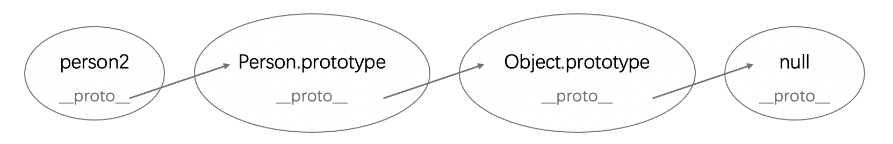

Title: 原型链
Date: 2019-01-01
Category: Javascript
Tags: Javascript
Author: Yoga

原型链：JS 万物皆对象，对象都有*proto *属性，*proto *连起来的链条，最终为 null。

## 创建对象

1.工厂模式

```js
function createPerson(name) {
  var o = new Object()
  o.name = name
  return o
}
var person1 = createPerson('Yoga')
person1.constructor == Object // yes
person1 instanceof Object // yes
```

2.构造函数模式

```js
function Person(name) {
  // Person首字母大写
  this.name = name
  this.sayName = function () {
    // 每次调用都要重新创建
    alert(this.name)
  }
}
```

3.原型模式

```js
Person.prototype.age = 20
Person.prototype.sayName = function () {
  alert(this.name)
}
var person2 = new Person('Tom')
person2.constructor === Person // yes
person2 instanceof Person // yes
person2 instanceof Object // yes
```

A instanceof B 检测 A 是否是 B new 出来的实例

A 的原型链上是否存在 B 的原型

## prototype 和 _proto _

> prototype 是函数才有的属性，*proto *是每个对象都有的属性

_proto _([[Prototype]])“构造器的原型”: _proto _ === constructor.prototype

```js
Person.prototype.constructor == Person
person2.constructor == Person
```



```js
person2: {
  name: "Tom",
  sayName: ƒ (),
  __proto__: Object
}
person2.__proto__: {
  age: 20,
  sayName: f(),
  __proto__: Object,
  constructor: f Person(name)
}
```

## 继承

```js
function Student() {
  this.school = 'SJTU';
}
Student.prototype = new Person('Yoga') // 继承，重写原型
Student.prototype.major = 'design' // 一定要写在继承之后 person2.major: undefined
var student1 = new Student();

student1: {
  school: 'SJTU',
  __proto__: Person
}
student1.__proto__: {
  major: 'design',
  name: 'Yoga',
  sayName: f(),
  __proto__: Object
}
student1.__proto__.__proto__: {
  age: 20,
  sayName: f(),
  constructor: f Person(name),
  __proto__: Object
}
```

## 返回实例属性

查找对象属性时，先查找对象本身是否存在该属性，如果不存在会在原型链上找

1.Object.keys 可枚举，自身属性

```js
Object.keys(person2) // ['name', 'sayName']
Object.keys(student1) // ['school']
```

2.for-in 所有可枚举属性，包括原型链

```js
for (var key in person2) {
  // 包括原型方法和属性 ['name', 'sayName', 'age']
  if (Object.hasOwnProperty(key)) {
    // 判断是否是自身属性 'name'
  }
}
for (var key in student1) {
  // ['school', 'name', 'sayName', 'major', 'age']
  if (Object.hasOwnProperty(key)) {
    // 判断是否是自身属性 'name'
  }
}
```

- for in 遍历对象的键名
- for of 遍历的是数组元素值，适用遍历数/数组对象/字符串/map/set 等拥有迭代器对象的集合.但是不能遍历对象

```js
for (var key of Object.keys(someObject)) {
  console.log(key + ': ' + someObject[key])
}
for (var [key, value] of someObject) {
  //遍历map对象时适合用解构
  console.log(key + ': ' + value)
}
```

3.Object.getOwnPropertyNames 自身可/不可枚举属性

```js
Object.getOwnPropertyNames(person2) // ['name', 'sayName']
Object.getOwnPropertyNames(student1) // ['school']
```

可枚举属性是指那些内部 “可枚举 enumerable” 标志设置为 true 的属性。对于通过直接的赋值和属性初始化的属性，该标识值默认为即为 true。但是对于通过 Object.defineProperty 等定义的属性，该标识值默认为 false。

对象的数据属性：

```js
var person = {}
Object.defineProperty(person, 'name', {
  configurable: false, //能否使用delete、能否需改属性特性、或能否修改访问器属性、，false为不可重新定义，默认值为true
  enumerable: false, //对象属性是否可通过for-in循环，flase为不可循环，默认值为true
  writable: false, //对象属性是否可修改,flase为不可修改，默认值为true
  value: 'Yoga', //对象属性的默认值，默认值为undefined
})

// value
console.log(person.name) // Yoga

// writable
person.name = 'Tom'
console.log(person.name) // Yoga

// enumerable
for (var i in person) {
  console.log(person[i]) // undefined
}

// configurable
delete person.name
console.log(person.name) // Yoga

Object.defineProperty(person, 'name', {
  configurable: true, // 不可修改，将抛出错误Cannot redefine property: name
})
```

对象的访问器属性

```js
var book = {
  _year: 2004, //属性前面加_，代表属性只能通过对象方法访问
  edition: 0,
}
Object.defineProperty(book, 'year', {
  get: function () {
    return this._year
  },
  set: function (newValue) {
    if (newValue > 2004) {
      this._year = newValue
      this.edition += newValue - 2004
    }
  },
})
```

原文链接：https://blog.csdn.net/qq_17335153/article/details/52584727
