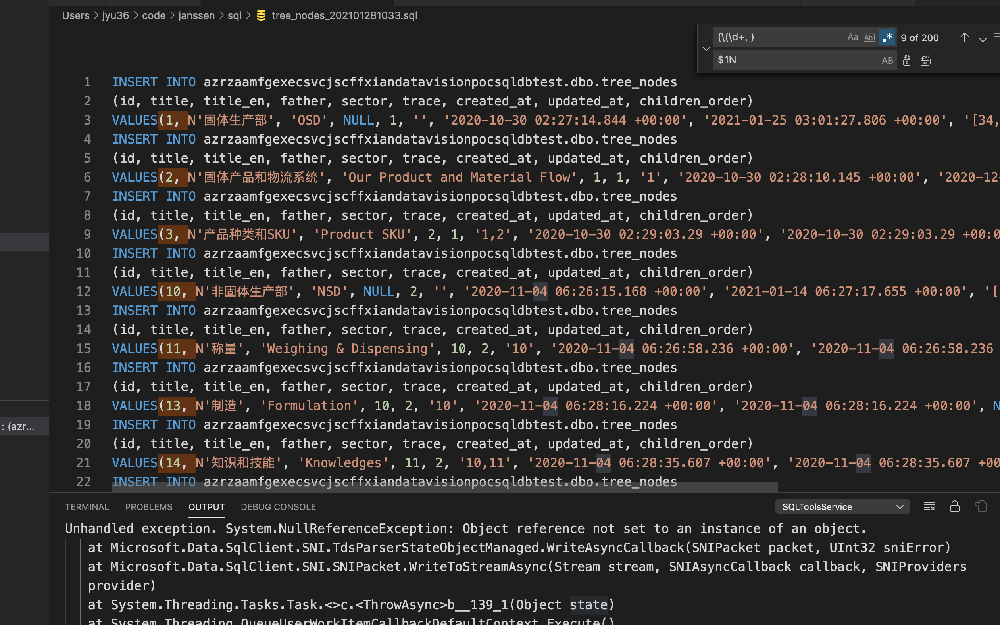

Title: Regular Expression
Date: 2020-12-14
Category: Javascript
Tags: Regexp
Author: Yoga

* *：匹配前面的子表达式零次或多次。例如，zo 能匹配 "z" 以及 "zoo"。 等价于{0,}。

* +：匹配前面的子表达式一次或多次。例如，'zo+' 能匹配 "zo" 以及 "zoo"，但不能匹配 "z"。+ 等价于 {1,}。

* ?：匹配前面的子表达式零次或一次

url最后一个params
```js
const url = 'xx.xx.xx/xx/aa/bb/cc';
url.match(/([^\/]*)\/*$/)[1]; // 'cc'
```

VScode搜索正则匹配




