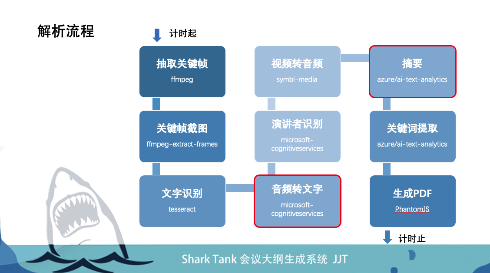

Title: Video Analysis based on Azure cognitive-services
Date: 2021-05-31
Category: Project
Tags: Azure
Author: Yoga
Password: project

会议大纲生成系统

这是一套系统能为线上会议或视频课程在会后提供一份会议摘要，让参会人员一目十行地用最短时间回顾整体会议的主要内容，快速定位会议重点，节省员工或课程学员回看会议录屏的时间。

项目的主题是视频分析，将视频的音频和图像部分分别解析出文字大纲和画面截屏，最终产出一个图文结合的总结性大纲。



## Azure Indexer

https://www.videoindexer.ai/

## Azure Summarization

https://docs.microsoft.com/zh-cn/azure/cognitive-services/language-service/summarization/quickstart?tabs=document-summarization&pivots=programming-language-java

```js
import { TextAnalyticsClient, AzureKeyCredential } from '@azure/ai-text-analytics';
const client = new TextAnalyticsClient(endpoint, new AzureKeyCredential(key));

async summarization() {
  const actions = {
    extractSummaryActions: [
      { modelVersion: 'latest', orderBy: 'Rank', maxSentenceCount: 15 },
    ],
  };
  const poller = await client.beginAnalyzeActions(documents, actions, 'en');
  const resultPages = await poller.pollUntilDone();

  for await (const page of resultPages) {
    const extractSummaryAction = page.extractSummaryResults[0];
    if (!extractSummaryAction.error) {
      for (const doc of (extractSummaryAction as any).results) {
        if (!doc.error) {
          console.log('\tSummary:', doc.sentences);
        } else {
          console.error('\tError:', doc.error);
        }
      }
    }
  }
}
```

## Azure Translate

https://docs.microsoft.com/zh-cn/azure/cognitive-services/translator/quickstart-translator?tabs=nodejs

```js
import { v4 as uuidv4 } from 'uuid';

async translate(text: string, lan = 'zh'): Promise<string> {
  return axios({
    baseURL: endpoint,
    url: '/translate',
    method: 'post',
    headers: {
      'Ocp-Apim-Subscription-Key': key,
      'Ocp-Apim-Subscription-Region': region,
      'Content-type': 'application/json',
      'X-ClientTraceId': uuidv4().toString(),
    },
    params: {
      'api-version': '3.0',
      from: lan === 'en' ? 'zh' : 'en',
      to: [lan],
    },
    data: [
      {
        text,
      },
    ],
    data,
    responseType: 'json',
  })
    .then(function (response) {
      return response.data
        .map((item) => item.translations[0].text)
        .reduce((d, p) => d.concat(p), '');
    })
    .catch(function (error) {
      console.error(error);
      return 'error';
    });
}
```

## Azure KeyPhrases

https://docs.microsoft.com/zh-cn/azure/cognitive-services/language-service/key-phrase-extraction/quickstart?pivots=programming-language-javascript

```js
const client = new TextAnalyticsClient(endpoint, new AzureKeyCredential(key));

async keyPhrases(text: string) {
  const keyPhrasesInput = [text];
  const keyPhraseResult = await client.extractKeyPhrases(keyPhrasesInput);

  keyPhraseResult.forEach((document: ExtractKeyPhrasesSuccessResult) => {
    console.log(`ID: ${document.id}`);
    console.log(`\tDocument Key Phrases: ${document.keyPhrases}`);
  });
}
```

code: 'InvalidDocument',
message: 'A document within the request was too large to be processed. Limit document size to: 5120 text elements. For additional details on the data limitations see https://aka.ms/text-analytics-data-limits',

## Azure SpeechToText

https://docs.microsoft.com/zh-cn/azure/cognitive-services/speech-service/get-started-speech-to-text?tabs=terminal&pivots=programming-language-javascript

```js
import * as sdk from 'microsoft-cognitiveservices-speech-sdk';

const speechConfig = sdk.SpeechConfig.fromSubscription(key3, region2);
speechConfig.speechRecognitionLanguage = 'zh-CN';

async speechRecognition() {
  const audioConfig = sdk.AudioConfig.fromWavFileInput(
    readFileSync(process.cwd() + '/wav/song.wav'),
  );
  const speechRecognizer = new sdk.SpeechRecognizer(
    speechConfig,
    audioConfig,
  );

  speechRecognizer.recognizeOnceAsync((result) => {
    switch (result.reason) {
      case sdk.ResultReason.RecognizedSpeech:
        console.log(`RECOGNIZED: Text=${result.text}`);
        break;
    }
    speechRecognizer.close();
  });
}
```
AudioStreamContainerFormat有AMR但是azure文档中支持的音频格式没有amr，只有MP3,flac,wav,mp4. 
Utilize an external conversion tool or library (like FFmpeg) to convert the data into a supported format (WAV, PCM).

前面的示例使用单步识别，可识别单个言语。 单个言语的结束是通过在结束时倾听静音或处理最长 15 秒音频时确定的。

使用连续识别
```js
function fromFileCon() {
  let result = '';
  speechRecognizer.recognized = (s, e) => {
    if (e.result.reason == sdk.ResultReason.RecognizedSpeech) {
        console.log(`RECOGNIZED: Text=${e.result.text}`);
        result+=e.result.text;
    }
  };
  speechRecognizer.sessionStopped = (s, e) => {
    speechRecognizer.stopContinuousRecognitionAsync();
  };
  speechRecognizer.startContinuousRecognitionAsync();
}
```

## Azure Speakers Identification

https://docs.microsoft.com/en-us/azure/cognitive-services/speech-service/how-to-use-conversation-transcription?pivots=programming-language-javascript

```js
const recognization = new Promise((resolve, reject) => {
  const conversation = sdk.Conversation.createConversationAsync(
    speechTranslationConfig,
    'myConversation',
  );
  const audioConfig = sdk.AudioConfig.fromWavFileInput(
    readFileSync(`${process.cwd()}/wav/${file}.wav`),
  );
  const transcriber = new sdk.ConversationTranscriber(audioConfig);

  transcriber.joinConversationAsync(conversation, function () {
    transcriber.transcribed = function (s, e) {
      const { text, speakerId, offset } = e.result;
      if (speakerId && speakerId.includes('Guest')) {
        console.log(
          '(transcribed) text: ' + text,
          '(transcribed) speakerId: ' + speakerId,
        );
      }
    };
    transcriber.startTranscribingAsync(
      function () {
        console.log('starting transcription');
      },
      function (err) {
        console.trace('err - starting transcription: ' + err);
      },
    );
  });
});
```

## FFmpeg -- video to audio

1.ffmpeg-nodejs

https://ffmpeg.org/ffmpeg.html

https://www.npmjs.com/package/ffmpeg-nodejs

```
npm i cmake-js -g
brew install cmake
npm i ffmpeg-nodejs
```
报错：Policy CMP0042 is not set: MACOSX_RPATH is enabled by default.

```
npm cache ls ffmpeg-nodejs
```
下载 https://registry.npmjs.org/ffmpeg-nodejs/-/ffmpeg-nodejs-0.4.4.tgz

npm install
报错：nasm/yasm not found or too old. Use --disable-x86asm for a crippled build.

下载 https://tortall.net/projects/yasm/releases/yasm-1.2.0.tar.gz
```
cd yasm-1.2.0
./configure
make
sudo make install
yasm --version
```

放弃

2.symbl-media

brew install ffmpeg

https://www.npmjs.com/package/symbl-media

npm i symbl-media

```js
const video_addr = process.cwd() + '/video/tschina.mp4';
const output_addr = process.cwd() + '/wav/tschina.wav';
await transcodeMediaFile(video_addr, output_addr, 'wav')
```

```bash
ffmpeg -i input.mp4 output.avi
```

3.ffmpeg-extract-frames

npm i ffmpeg-extract-frames-quality

返回关键帧时间点
```bash
ffmpeg -i ./video/dm.mp4 -filter:v "select='gt(scene,0.1)',showinfo" -f null - 2>&1
```

返回截图
```js
await extractFrames({
  input: video_addr,
  output: output_img,
  offsets: [1000, 2000, 650000],
});
```

## OCR

```
brew install tesseract
brew install tesseract-lang
tesseract -v

tesseract /Users/jyu/code/sharktank/send-pdf/img/ocr1.png /Users/jyu/code/sharktank/send-pdf/img/result -l eng

tesseract /Users/jyu/code/sharktank/send-pdf/img/test-1.jpg /Users/jyu/code/sharktank/send-pdf/img/result -l chi_sim
```
npm install node-tesseract-ocr

```js
import * as tesseract from 'node-tesseract-ocr';

tesseract
  .recognize(source_img, {
    lang: 'eng',
  })
  .then((text) => {
    console.log('Result:', text);
  })
  .catch((error) => {
    console.log(error.message);
  });
```

## html-pdf

npm install -- save html-pdf
npm install -- save ejs

踩坑："Error","errorMessage":"write EPIPE"

```
yum -y install fontconfig 
fc-list 
fc-list :lang-zh
fc-list :lang=en 

mkdir /usr/share/fonts/chinese
下载 雅黑字体 msyh.ttf
mv -f /home/v-jyu/fonts/* /usr/share/fonts/chinese/
fc-list :lang-zh
```

attachment/exportData.ts
```js
import * as pdf from 'html-pdf';
import * as ejs from 'ejs';

export default async function savePDF(meetingData, filename): Promise<string> {
  const run = new Promise((resolve, reject) => {
    let html;
    const template = process.cwd() + '/email-template/datamail.code.ejs';
    ejs.renderFile(template, { meetingData }, (err, data) => {
      html = data;
    });
    const options = { format: 'Letter' };
    pdf
      .create(html, options)
      .toFile(`pdf/${filename}.pdf`, function (err, res) {
        if (err) {
          reject(err);
        }
        resolve(res.filename);
      });
  });

  return run.then((data: string) => {
    return data;
  });
}
```

emaili.service.tschina
```js
const outlinefile = await savePDF(meetingData, 'courseOutline');
await this.mailerService.sendMail({
  to,
  subject,
  template: 'datamail.code.ejs',
  context: { meetingData },
  attachments: [
    {
      filename: '会议大纲.pdf',
      path: outlinefile,
    },
  ],
});
```
email-template/datamail.code.ejs
```html
<html>
  <body>
    <div class="container">
      <p class="title"><%=locals.meetingData.title%></p>
      <% for(var i =0; i < locals.meetingData.content.length; i++){ %>
        <p class="sub-title"><%=locals.meetingData.content[i].keyPhases[0]%></p>
        .jpg" />
        <p class="content"><%=locals.meetingData.content[i].summary%></p>
      <% } %>
    </div>
  </body>
</html>
```