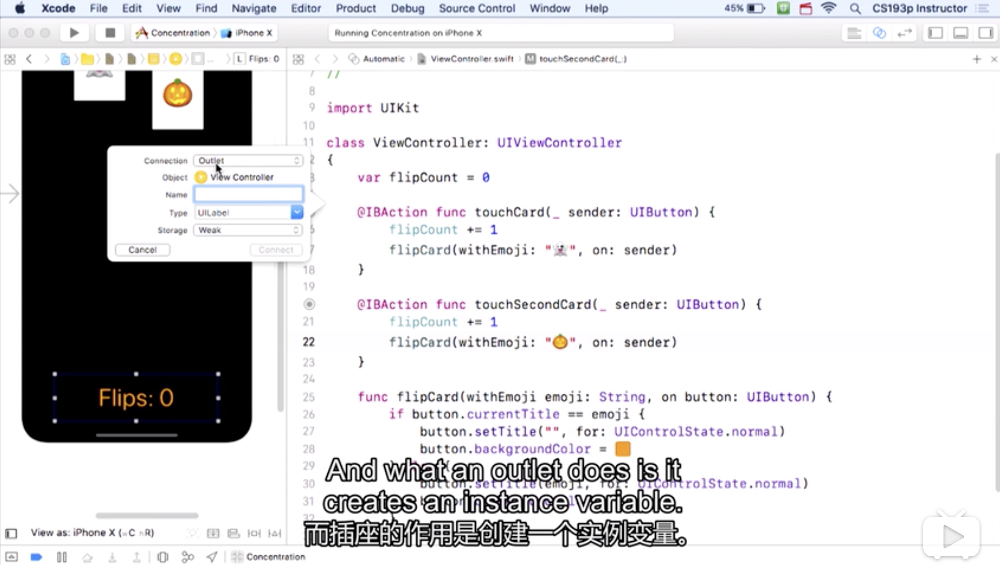
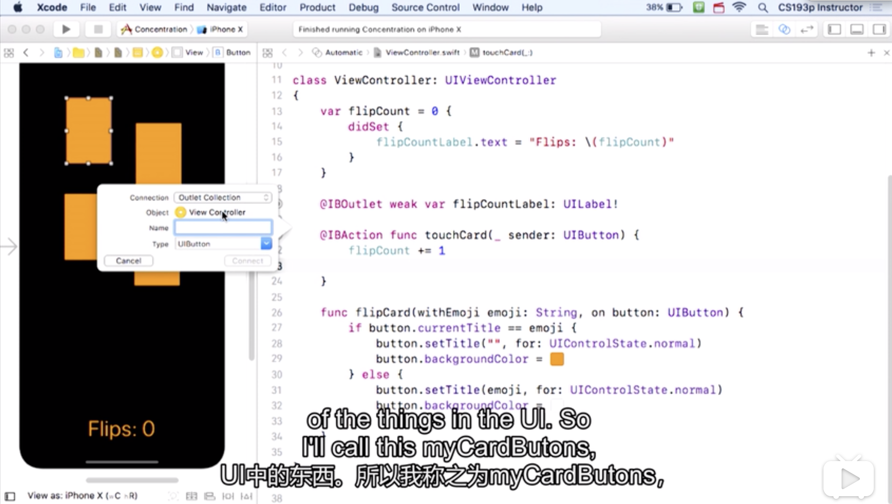

Title: Concentration Game -- Controller
Date: 2020-03-28
Category: IOS
Tags: Swift
Author: Yoga


# Controller -- ViewController.swift

hook button and controller up: 

1. 按住ctrl拖拽进controller的代码

2. 点击dashboard上黄色按钮，拖拽到UI，选择函数


函数参数（外部名称 内部名称：类型）

目的是为了调用函数，以及函数内部都能read like English

```swift
@IBAction func touchCard(_ sender: UIButton) {
  flipCard(withEmoji: '👻', on: sender)
}

func flipCard(withEmoji emoji: String, on button: UIButton) {

}
```

按住option点击函数名查看文档

鼠标放在行号上的圆点可以看到关联的UI

字符串模板: "\\()"相当于\`${}`，括号内可以放入任何可转化为string的类型

```swift
print("flipCard(withEmoji: \(emoji))")
```

ctrl c, ctrl v可以在界面上复制黏贴一个元素，关联的func也会同样复制，右键点击元素，在Touch Up Inside里看到所有关联的函数，disconnet it

## 强类型语言

All instance variable has to be intialized

1. adding an intializer to a class初始化所有变量

2. 直接给变量一个初始值

```swift
var flipCount: Int = 0
var flipCount = 0 // swift可根据初始值推断出类型
```

按住option点击变量名可查看类型

connection:

1. Action: create a method

2. Outlet: create an instance variable or property

3. Outlet Collection: create an array of the things in UI



```swift
@IBOutlet weak var flipCountLabel: UILabel! //感叹号的变量不必初始化

var flipCount = 0 {
  // didSet在每次这个变量更新时调用
  didSet {
    flipCountLabel.text = "Flips: \(flipCount)"
  }
}
```



```swift
@IBOutlet var cardButtons: [UIButton]! 
```

不能直接更改函数名，会让ui找不到关联的函数，按住command点击函数名，rename it，会改变所有引用的名字

```swift
// var emojiChoices: Array<String> = ["🎃", "👻", "🎃", "👻 "]
var emojiChoices = ["🎃", "👻", "🎃", "👻 "]

@IBAction func touchCard(_ sender: UIButton) {
  flipCount += 1;
  // let是常量const
  let cardNumber = cardButtons.index(of: sender) // warning! optional value
  print("cardNumber = \(cardNumber)") // cardNumber = optional(1)

  if let cardNumber = cardButtons.index(of: sender) {
    print("cardNumber = \(cardNumber)")
    flipCard(withEmoji: emojiChoices[cardNumber], on: sender)
  } else {
    print("Chosen card was not iin cardButtons")
  }
}

func index(of element: UIButton) -> Int? // 返回值可选，只有两种状态：int/nil
```

## Optional

返回值为optional的函数：
* index
* dictionary
* ...

定义optional变量
```swift
// 法一
if let chosenEmoji = emoji[card.identifier] {
  return chosenEmoji
}

// 法二
if emoji[card.identifier] != nil {
  return emoji[card.identifier]!
} else {
  return "?"
}

// 法三
return emoji[card.identifier] ?? "?"
```
