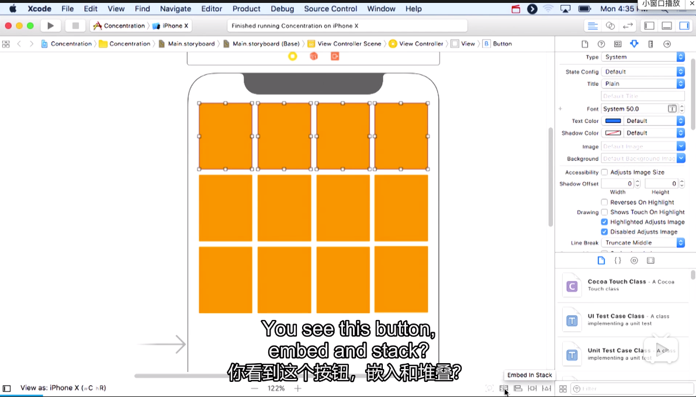
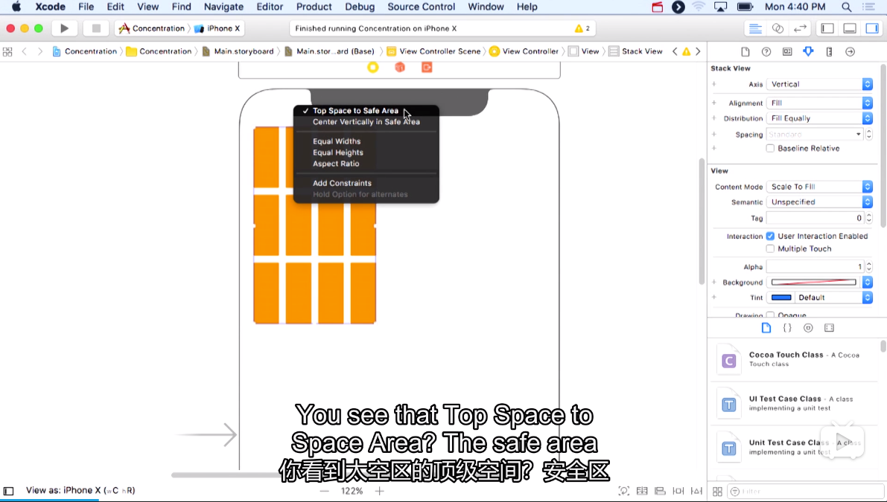

Title: Concentration Game -- View
Date: 2020-04-17
Category: IOS
Tags: Swift
Author: Yoga

# UIStackView 堆栈视图

UIStackView is class in IOS (like UI Button and UI Label). It will take other views and stack them together. It only knows how to stack horizontally or vertically.

* UIStackView 是 UIView 的子类，它不能用来呈现自身的内容，而是用来约束子控件的一个控件。

* UIStackView 提供了一个高效的接口用于平铺一行或一列的视图组合。对于嵌入到 StackView 的视图，Stack View 会管理这些子视图的布局，并帮我们自动布局约束，不用再添加自动布局的约束就能够适应不同的屏幕尺寸。

* UIStackView 支持嵌套，我们可以将一个 Stack View 嵌套到另一个 Stack View 中，从而实现更为复杂的用户界面。

参考：https://www.hangge.com/blog/cache/detail_1749.html

Axls：子视图的布局方向：
* Vertical：垂直
* Horizontal：水平

Alignment：子视图的对齐方式：
* Fill：子视图填充 StackView。
* Leading：靠左对齐。
* Center：子视图以中线为基准对齐。
* Top：靠顶部对齐。
* ...

Distributlon：子视图的分布比例（大小）：
* Fill Equally：每个子视图的高度或宽度保持一致。
* Equal Spacing：每个子视图保持同等间隔的分布方式。
* Equal Centering：每个子视图中心线之间保持一致的分布方式。
* ...

## 布局

Spacing：子试视图间的间距：
* use standard value

按住ctrl向上拖拽到空白处放手，选择top space to save area

The safe area is a safe edge around the screen where you can safely draw without overlapping some other UI

左边距：leading space to save area

右边距：trailing space to save area

底边距：bottom space to save area

居中对齐：center horizontally in save area

垂直距离：vertical spacing

relation: greater than or equal (确保卡片在文字上方)