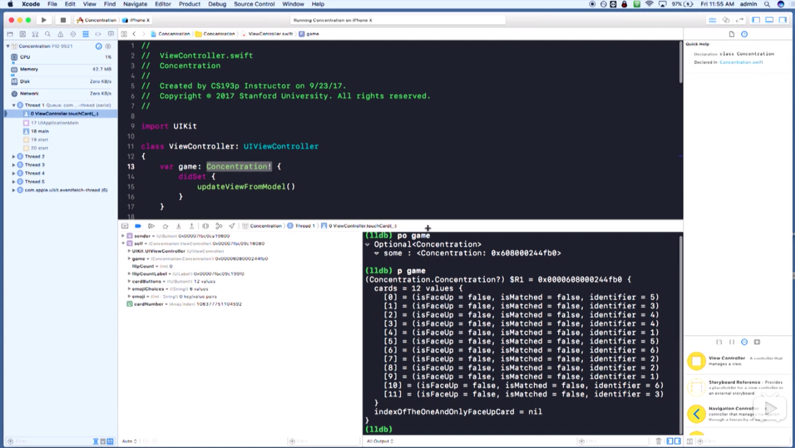
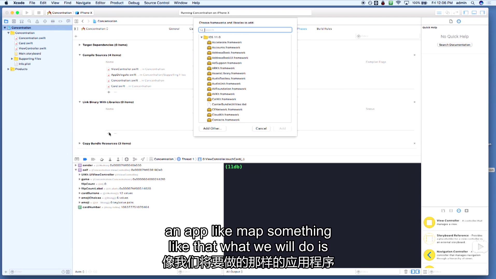

Title: XCode
Date: 2020-04-14
Category: IOS
Tags: Swift
Author: Yoga

## Key Commands

cmd+R 运行

cmd+0 打开/关闭左侧文件面板

cmd+option+0 打开/关闭右侧属性面板

cmd+shift+y 打开/关闭底部控制台面板

cmd+option+enter 打开新窗口

cmd+enter 回到一个窗口

ctrl+i 将选中的代码自动缩进

cmd+箭头 旋转模拟器

## Debugger

在行号上点出蓝色箭头

In the debugger itself we actually have a trace of everything that's stored off in memory at this point.

'Self' would refer to the view controller in this case.

在控制台内，(lldb) stands for you debugger. We can actually print out any object that we want to be able to inspect it.

```swift
// po = print object
(lldb) po game
// p = print
(lldb) p game
```


□▶️：继续运行直到下一个断点

下一个图表Step over：逐行运行

下一个图表Step into：逐方法运行

```swift
exit(0) // 正常退出 
exit(1) // 非正常退出
```

## Library

项目名 -> Build Phases -> Link Binary with Libraries -> MapKit



```swift
import MapKit
```
