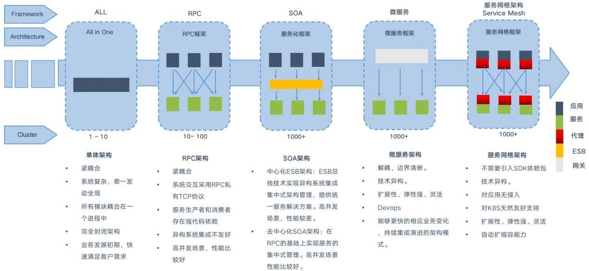
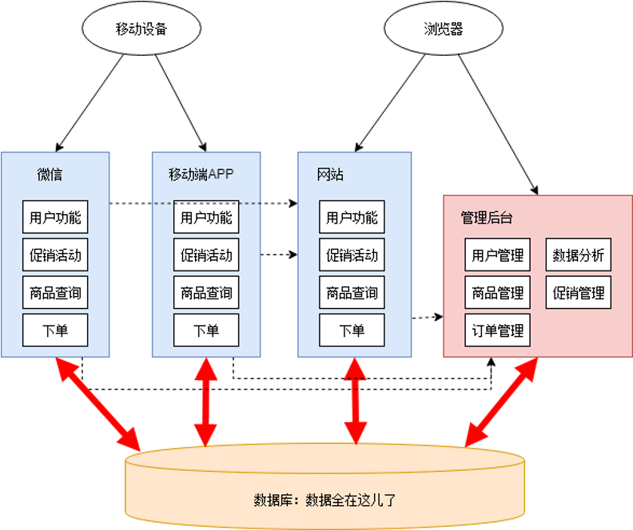

Title: System Design
Date: 2024-06-14
Category: Programming
Tags: Architecture
Author: Yoga

https://github.com/donnemartin/system-design-primer?tab=readme-ov-file#step-2-review-the-scalability-article

## High Scalability

Website scaling helps handle growing traffic and user demands while maintaining peak performance.

Website scaling is the process of improving your website’s capacity to accommodate more traffic, data, and user demands effectively. 

高可扩展性（High Scalability）是网站开发中至关重要的一个方面，它涉及设计和优化技术，以确保网站能够处理不断增长的用户数量和数据量，同时保持高性能。

* Horizontal scaling: adding more servers or nodes to a system to distribute your website’s load
* Vertical scaling: improve a single server’s resources — like processor speed, RAM, or storage

Ways to expand to high scalability:

1. Clone-able & Copy-able
  * Stateless user：
  无状态用户概念意味着服务器在处理每个客户端请求时，不保留任何关于该用户会话的信息。每个请求都包含所有必要的上下文信息，以供服务器理解并正确处理请求。这种设计方式有助于提高系统的扩展性。

  * Deployment consistent：部署一致性指的是在更新或扩展应用程序时，确保所有实例在同一时间内运行相同版本的代码和配置。这防止版本冲突和潜在的不兼容问题，提高系统的稳定性和可预测性。发布策略：灰度发布， 滚动发布，停机发布

2. Load balancing 负载均衡：负载均衡通过将请求分配给多个服务器来分散负载，从而提高网站的响应速度和可靠性。(NGINX and AWS Elastic Load Balancing)

3. Caching 缓存：缓存是提高性能的重要手段。前端可以使用浏览器缓存和CDN，后端可以采用多层次的缓存技术，比如反向代理缓存和数据库缓存。

    Caching stores data in a temporary storage location, or cache, for faster retrieval.

    CDNs (a form of horizontal scaling) store copies of your website and blog content on servers in various geographic regions. When users request content, the nearest CDN server responds, quickly delivering content while minimizing latency.

    Cache what? SQL query & result?

4. Database optimization 数据库优化

  * improve data retrieval speeds: indexing, query optimization, and strategic scaling, data partitions
  * 使用高效的数据库查询和架构：Denormalization 大宽表
  * NoSQL：考虑使用NoSQL数据库来处理大量的非结构化数据

5. 异步处理：对于长时间运行的任务，可采用异步处理机制，例如消息队列系统（如Kafka），以避免阻塞主要的应用线程。

  * Web服务器： 在处理HTTP请求时，异步I/O可以使服务器同时处理更多的请求，从而提高处理效率。
  * 后台任务处理： 使用任务队列处理后台工作（如图像处理、数据分析），使前端请求可以迅速返回，从而提升系统响应速度。
  * 消息驱动架构： 通过消息队列实现微服务之间的异步通信，从而减少服务之间的直接依赖和同步调用。

6. Microservices architecture 分布式系统：采用分布式架构，将不同的功能模块拆分并分布在多个服务器上。比如使用微服务架构，将单一应用程序拆分为多个小的、独立部署的服务。

    A microservices architecture divides your website into smaller, autonomous sections that communicate through application programming interfaces (APIs). This horizontal scaling method allows you to scale individual applications rather than the entire system to make development and updates more agile.
    Tools like Docker manage containerized site segments, while API gateways such as Amazon Web Services and Kong streamline communication between these microservices.

  * 独立扩展： 微服务架构允许独立地扩展每个服务。比如，如果某个服务的负载增加，可以单独扩展这个服务的实例数量，而不需要扩展整个系统。
  * 灵活的资源分配： 通过独立部署和扩展服务，可以实现更灵活的资源分配。各个服务可以根据实际需求动态分配计算资源，避免资源浪费。
  * 故障隔离： 微服务架构有助于隔离故障。如果某个服务出现问题，只会影响到该服务的功能，不会导致整个系统的崩溃。这种隔离性可以提高系统的可靠性，并使得问题的修复和排查更加方便。
  * 持续交付与部署： 由于微服务是独立部署的，团队可以更加频繁地进行微服务的发布和更新，从而实现持续交付和快速响应市场需求。这种敏捷性对于支持业务快速增长和扩展具有重要作用。
  * 负载均衡和容错： 微服务架构可以结合现代的容器编排平台（如Kubernetes）和服务发现机制，实现在多个实例间的负载均衡和自动容错，进一步提升系统的扩展性和可靠性。

https://webflow.com/blog/website-scaling

## Microservices 微服务

微服务就是将一个大型项目的各个业务代码, 拆分成多个互不干扰的小项目
而这些小项目专心完成自己的功能,而且可以调用别的小项目的方法,从而完成整体功能

每个被拆分的子系统需要拥有独立的设计，开发，部署，上线能力

### Microservice VS SPA

__Microservice__

优点：

* 高可用性：通过负载均衡、水平扩展等技术，确保系统在高负载和突发流量时仍能稳定运行。
* 灵活的资源管理：结合云计算和容器化技术，动态调整资源分配，优化成本和性能。
* 模块化架构：通过微服务和分布式系统，提升系统的可维护性和扩展性。

缺点：
* 复杂性增加：高扩展性的设计需要更多的架构和运维考虑，使得系统的实现和管理变得更复杂。
* 调试和监控难度提升：高扩展性的实现则需要强大的运维和分布式系统管理经验。分布式系统调试和故障排除更具挑战，需要先进的监控和日志管理工具。

适用：
* 应用需要处理大量的并发用户和数据请求（如电商平台、金融交易系统），高扩展性至关重要。
* 项目需要快速迭代和扩展，微服务架构和高扩展性设计可以更好地适应业务变化。

__SPA__: 单页应用（Single Page Application） 通过动态加载内容更新页面的Web应用，通常不需要刷新整个页面。这种架构使得用户体验更加流畅，有较快的响应速度

优点：

* 快速响应：加载一次页面后，只需更新特定部分内容，减少页面刷新时间，提升用户体验。
* 丰富的用户交互：使用前端框架（如React、Vue.js、Angular）构建复杂且互动性强的用户界面。
* 减少带宽使用：只传输必要的数据，减少带宽消耗。

缺点：
* 初次加载时间较长：由于需要加载大量的JavaScript代码，初次加载时间可能较长。
* SEO优化困难：SPA对搜索引擎优化（SEO）不友好，需要特殊处理（如使用服务器端渲染SSR）。
* 复杂的状态管理：状态管理的复杂性增加，需要额外工具（如Redux、Vuex）辅助。

适用：
* 应用需要提供丰富的用户交互体验，如在线协作工具、社交平台、或复杂的网页应用（如CRM和ERP系统）
* 团队资源有限或项目周期较短，选择简单易行的架构和技术更实际

### Microservice 特点

*	模块化和独立部署： 每个服务都是一个独立的模块，可以独立开发、测试、部署和扩展。如果某个服务需要更新或扩展，可以单独进行，而不影响整个系统。
*	按业务功能划分： 微服务通常按照业务功能划分，每个服务负责一个特定的业务域。这种划分方法使得团队可以专注于特定的业务需求，提高开发效率和质量。
*	独立的数据存储： 每个微服务通常有自己的数据库或数据存储方式，这意味着服务间的数据是隔离的，并且可以选择最适合的存储解决方案。
*	技术多样性： 由于服务是独立的，团队可以为每个服务选择最合适的技术栈和编程语言，而不需要统一整个系统的技术。
*	轻量级通信： 微服务之间通过轻量级的通信机制（如HTTP RESTful API或消息队列）进行交互，这保证了系统的松耦合性。

> 网关 = 路由器（基础） + 过滤器（可选）

API网关：
* 鉴权、限流  		 (vs 区分 hystrix 熔断限流器)
* 更细粒度的服务代理 	 (vs nginx 路径代理)
* 单个API接口注册 	 (vs 区分 nacos / eureka 注册中心)

> 去中心化 (独立的服务管理、数据管理，强终端轻管道)

注册中心：
* 子系统多，人工维护管理路由地址配置难度大；
* 依赖关系复杂的时候，记不清启动顺序，可自动画出上下游关系图；
* 根据用量、响应速度指标动态调整，方便扩容；
* 高可用，避免单点故障(每个服务可以用多个实例)。

缺点：
1. 很多相同业务逻辑的重复代码。
2. 接口调用关系杂乱。
3. 单个应用越改越大，边界模糊，功能归属混乱。
4. 数据库表结构被多个应用依赖，难以重构和优化。
5. 数据库出现性能瓶颈。数据分析跑起来的时候，性能急剧下降。
6. 开发、测试、部署、维护愈发困难。改个小功能，也需要整个应用一起发布。
7. 甩锅现象：关于一些公用的功能应该建设在哪个应用？

下一代： Service Mesh
可管理、可观测，裁剪技术栈深度，回归单体架构中基于 Spring Boot 的开发模式