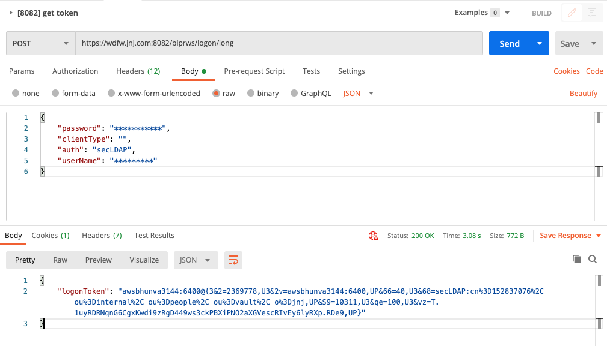
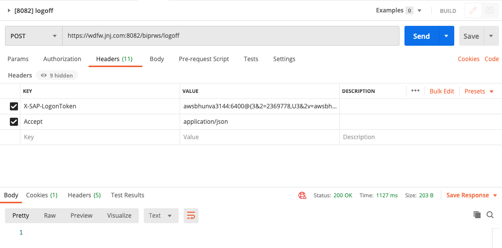
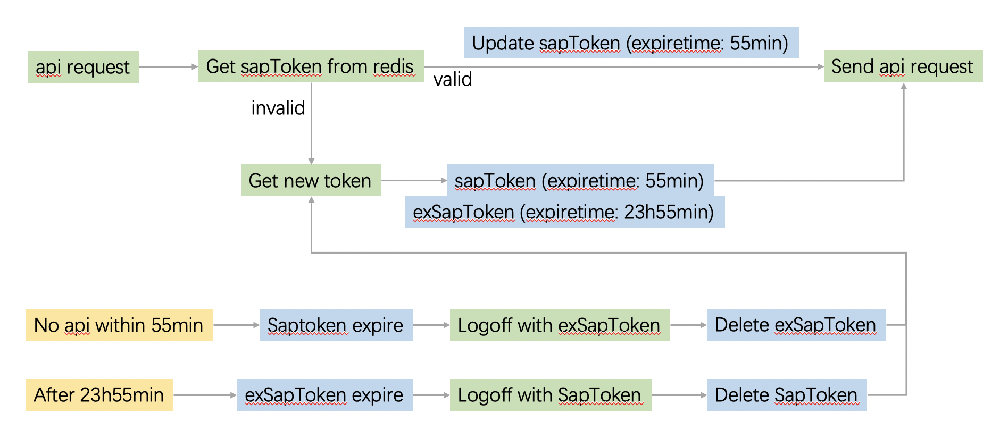

Title: Token
Date: 2021-04-13
Category: Backend
Tags: Token
Author: Yoga

## Authentication

SI. No. | Description | REST API | Http Methods
- | - | - | -
1 | Logon using username and password  | http://host:<port>/biprws/vx/logon/long | GET,POST
2 | Logoff (token must be in Header) | http://host:<port>/biprws/vx/logoff | POST

## Get LogonToken API:

Method : POST Data Format: JSON




## Session type

Session type Changed to Enterprise Session from the release 4.2 SP04 and onwards.

So that if user use any APIs mentioned in table , immediately session count will increase for the user in “CMC->Sessions” page.

Enterprise Session Token timeout default : 60 min.

Maximum timeout : 1440 min (24 Hrs).

Administrator can set this value in “CMC->Servers->WebApplicationContainerServer-> Right click on this server ->Properties->EnterpriseSession Timeout”.

http session timeout will not be applicable to Enterprise Sesison created using REST APIs.

## Get LogonToken Workflow:

### Version1:

```js
const { EventEmitter } = require('events');

let globalToken;
const emitter = new EventEmitter();

async getToken() {
  if (!globalToken) {
    globalToken = 'pending';
    process.env.NODE_TLS_REJECT_UNAUTHORIZED = 0;
    const { data } = await axios.post(
      'logon/long',
      sails.config.custom.sap.auth,
      {
        baseURL: `${sails.config.custom.sap.endpoint}/biprws`,
      },
    );
    globalToken = data.logonToken;
    emitter.emit('token', globalToken);
    setTimeout(() => {
      globalToken = undefined;
    }, 1000 * 60);
  } else if (globalToken === 'pending') {
    await new Promise((res, rej) => {
      emitter.on('token', res);
      setTimeout(() => {
        rej();
      }, 3000);
    });
  }

  return globalToken;
},
```

### Version2:

```js
// let globalToken;
const authCache = {
  token: '',
  expiresAt: 0,
  updatePromise: null,
};

async getToken() {
  if (authCache.expiresAt < Date.now()) {
    authCache.expiresAt = Date.now() + 30 * 1000; // Avoid concurrency
    authCache.updatePromise = axios
      .post(
        'logon/long',
        sails.config.custom.sap.auth,
        {
          baseURL: `${sails.config.custom.sap.endpoint}/biprws`,
        },
      )
      .then((res) => {
        authCache.expiresAt = Date.now() + 50 * 60 * 1000;
        authCache.token = res.data.logonToken;
        authCache.updatePromise = null;
        fs.writeFile(
          path.join(process.cwd(), './sap_token'),
          authCache.token,
          (err) => {
            if (err) {
              sails.log.error(err);
            }
          },
        );
      })
      .catch(() => {
        authCache.expiresAt = 0;
      });
  }
  await authCache.updatePromise;
  return authCache.token;
},
```

### Version3: Redis

多实例只会有一个 Redis



```js
const redis = require('redis');
const { promisify } = require('util');

const redisClient = redis.createClient({
  db: sails.config.session.db,
  password: sails.config.session.pass,
  port: sails.config.session.port,
  host: sails.config.session.host,
})
const getRedisAsync = promisify(redisClient.get).bind(redisClient)
const getNewToken = async () => {
  sails.log.info('>>> Get new sap token');
  const newtoken = await axios
    .post(
      'logon/long',
      sails.config.custom.sap.auth,
      {
        baseURL: `${sails.config.custom.sap.endpoint}/biprws`,
      },
    )
    .then((res) => {
      sails.log.info('new token: ', res.data.logonToken);
      // Enterprise Session Token timeout default : 60 min.
      redisClient.psetex('sapToken', 55 * 60 * 1000, res.data.logonToken);
      // Maximum timeout : 1440 min (24 Hrs).
      redisClient.psetex('exSapToken', 1435 * 60 * 1000, res.data.logonToken); 
      return res.data.logonToken;
    })
    .catch((error) => {
      sails.log.error('Fetch sap token error: ', error);
    });
  return newtoken;
};
// Redis 密钥空间通知, 在键过期被删除时得到通知
const SubscribeExpired = () => {
  sails.log.info('>>> SubscribeExpired');
  const sub = redis.createClient({
    db: sails.config.session.db,
    password: sails.config.session.pass,
    port: sails.config.session.port,
    host: sails.config.session.host,
  });
  const expiredSubKey = `__keyevent@${sails.config.session.db}__:expired`;
  // const expiredSubKey = `__keyevent@0__:expired`;
  sub.psubscribe(expiredSubKey, () => {
    sub.on('pmessage', async (pattern, channel, message) => {
      if (message === 'sapToken' || message === 'exSapToken') {
        sails.log.info('message: ', pattern, channel, message);
        try {
          let extoken = '';
          if (message === 'sapToken') {
            extoken = await getRedisAsync('exSapToken');
            redisClient.del('exSapToken');
          } else {
            extoken = await getRedisAsync('sapToken');
            redisClient.del('sapToken');
          }
          if (!extoken) {
            throw Error('No Such Key');
          }
          await axios
            .post(
              '/logoff',
              sails.config.custom.sap.auth,
              {
                headers: {
                  'X-SAP-LogonToken': extoken,
                  Accept: 'application/json',
                },
                baseURL: `${sails.config.custom.sap.endpoint}/biprws`,
              },
            )
            .then((res) => {
              sails.log.info('Sap log off status: ', res.status);
              getNewToken();
            });
        } catch (err) {
          sails.log.error('Logoff error: ', err);
        }
      }
    });
  });
};
const getToken = async (noNeedFresh) => {
  let token = '';
  try {
    const val = await getRedisAsync('sapToken');
    if (!val) {
      throw Error('No Such Key');
    }
    // 剩余过期时间
    // await redisClient.ttl('sapToken', (e, t) => {
    //   console.log('token rest time: ', e, t);
    // });
    if (!noNeedFresh) {
      redisClient.psetex('sapToken', 55 * 60 * 1000, val);
    }
    token = val;
  } catch (err) {
    token = await getNewToken();
  }
  return token;
};
// client.config("SET", "notify-keyspace-events", "Ex");
// 或者在redis.conf文件中设置notify-keyspace-events Ex
// ElasticCache中禁用了config命令, 需在AWS的ElasticCache平台创建parameter group
redisClient.send_command('config', ['set', 'notify-keyspace-events', 'Ex'], SubscribeExpired);
getToken(true);

module.exports = {
  getToken,

  async apiLoader(endpoint, forceUpdate = false) {
    try {
      const token = await this.getToken()
      const { data } = await axios.get(endpoint, {
        headers: {
          'X-SAP-LogonToken': token,
          Accept: 'application/json',
        },
        baseURL: `${sails.config.custom.sap.endpoint}/biprws`,
        forceUpdate,
      })
      return data
    } catch (error) {
      sails.log(`Api error: ${endpoint} ${error}`)
      if (error.message.includes('401')) {
        this.getNewToken()
      }
      throw error
    }
  },
}
```

promise版
```js
return new Promise((resolve) => {
  redisClient.get('sapToken', async (err, val) => {
    console.log('redisClient sapToken: ', err, val);
    if (err || !val) {
      console.log('get newtoken');
      await axios
        .post(
          'logon/long',
          sails.config.custom.sap.auth,
          {
            baseURL: `${sails.config.custom.sap.endpoint}/biprws`,
          },
        )
        .then((res) => {
          console.log('newtoken: ', res.data);
          redisClient.psetex('sapToken', 60 * 60 * 1000, res.data.logonToken);
          resolve(res.data.logonToken);
        })
        .catch((error) => {
          sails.log.error('Fetch sap token error: ', error);
        });
    } else if (typeof val === 'string') {
      await redisClient.ttl('sapToken', (e, t) => {
        console.log('token rest time: ', e, t);
      });
      redisClient.psetex('sapToken', 60 * 60 * 1000, val);
      resolve(val);
    }
  });
});
```
