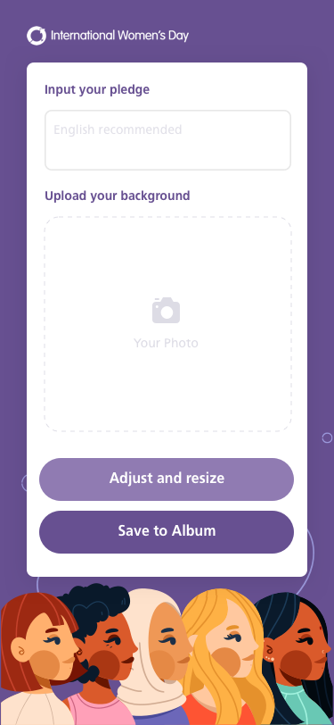

Title: WLI Photoframe
Date: 2020-05-17
Category: Project
Tags: HTML2Canvas
Author: Yoga

## 背景

H5页面上用户上传图片，自动添加相框及宣言，用户保存到本地

http://wli_photoframe.xxx.com/



## HTML2Canvas

用HTML2Canvas将叠加后的photo生成为图片，用户长按可下载

```javascript
import html2canvas from 'html2canvas';

const savePic = () => {
    setModal(true);
    window.pageYOffset = 0;
    document.documentElement.scrollTop = 0
    document.body.scrollTop = 0
    html2canvas(document.getElementById('imgContainer')).then(canvas => {
      document.getElementById('resultImg').setAttribute('src', canvas.toDataURL());
    });
  };
```

- 踩坑：字体大小与原dom不符

```css
.imgContainer {
  font-variant: normal;
}
```

- 踩坑：overflow: scroll 被隐藏的部分会黑，需要让导出的div完整渲染在页面，靠浏览器的滚动条上下滚动

## 拖拽

```javascript
import React, { useState, useRef } from 'react';
import styles from './index.less';
import { Icon } from 'antd';
import { useRebuildOption } from './service';

// initState
const stateOrigin = {
  isDragging: false,
  pointToOffset: { x: 0, y: 0 },
};

export default function({ picRef, avatarHeight }) {
  // init
  const [state, setState] = useState(stateOrigin);

  const dragRef = useRef(null);

  const { touchInstance } = useRebuildOption(dragRef, state, setState, picRef);

  const handleStart = touchInstance.start;
  const handleMove = touchInstance.move;
  const handleEnd = touchInstance.end;

  return(
    <div
      ref={dragRef}
      className={styles.adjustArea}
      onTouchStart={handleStart}
      onTouchMove={handleMove}
      onTouchEnd={handleEnd}
      style={{ height: avatarHeight }}
    >
      <Icon type="fullscreen" className={styles.moveIcon} />
    </div>
  );
}
```

```javascript
import Touch, { calPointToOffset, moveTarget } from '@/utils/touch';

const touch = new Touch();

// cal the distance between icon and right edge
export const calToRight = () => {
  return document.body.clientWidth - 55;
};

// set the long touch action and short touch action
export const useRebuildOption = (dragRef, state, setState, picRef, containerRef) => {

  const sameEndCallback = () => {
    const target = dragRef.current;
    target.style.transition = 'all 0.6s';

    setTimeout(() => {
      setState({
        ...state,
        isDragging: false,
      });
    }, 100);
  };

  touch.setOption({
    edgeSecond: 150,
    judgeOffset: true,
    startCallback: e => {
      const pointToOffset = calPointToOffset(e, dragRef.current);
      dragRef.current.style.transition = 'none';
      setState({
        isDragging: true,
        pointToOffset,
      });
    },
    //
    moveCallback: e => {
      if (state.isDragging) {
        moveTarget(e, dragRef.current, state.pointToOffset);
        moveTarget(e, picRef.current, state.pointToOffset);
        // console.log(dragRef.current.style.left, dragRef.current.style.top);
      }
    },
    longCallback: e => {
      sameEndCallback(false);
    },
    shortCallback: e => {
      //sameEndCallback(true);
    },
  });

  return {
    touchInstance: touch,
  };
};
```
