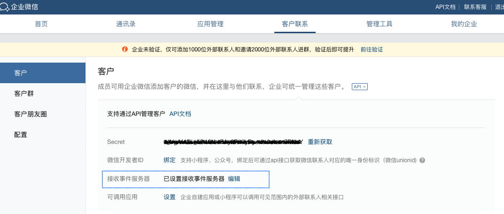
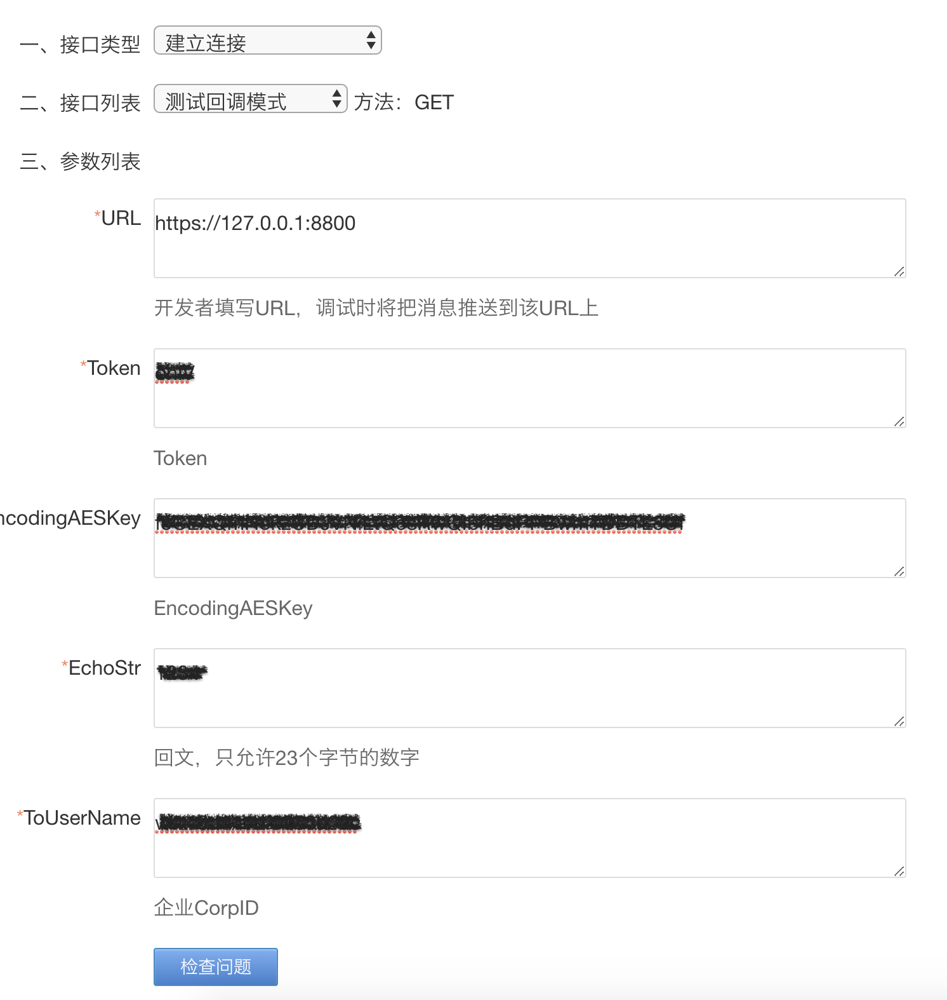
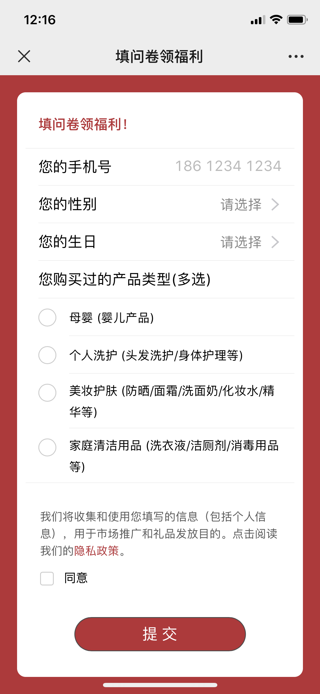
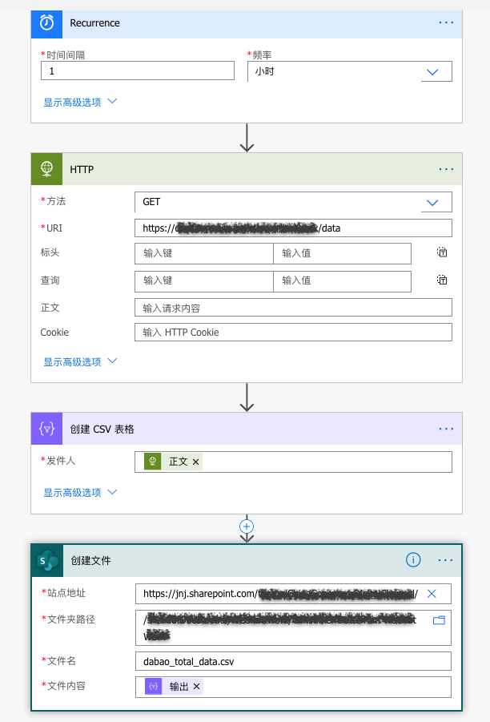
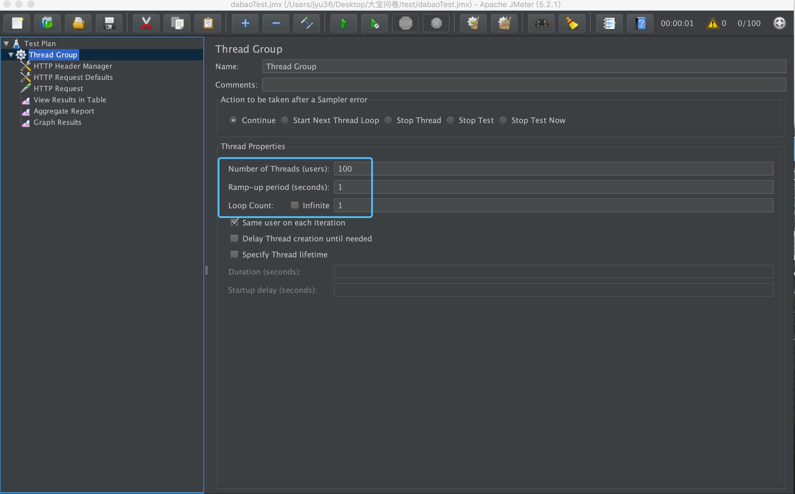
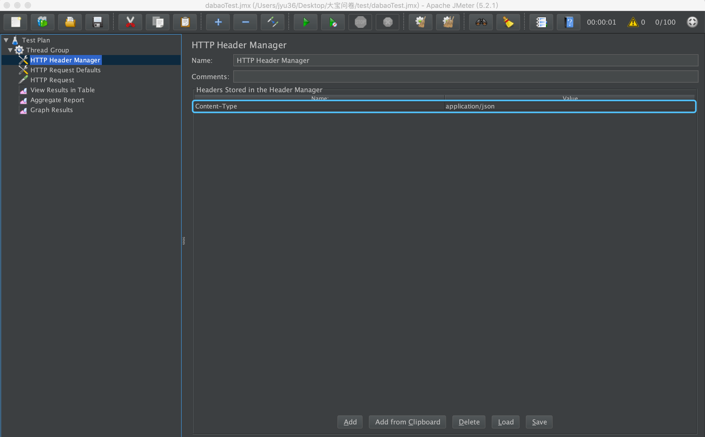
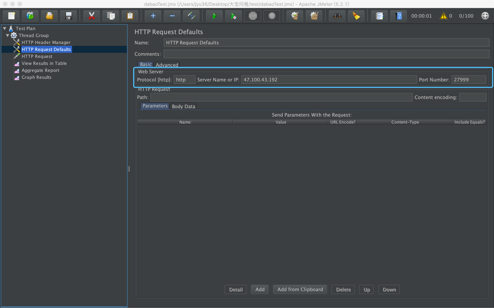
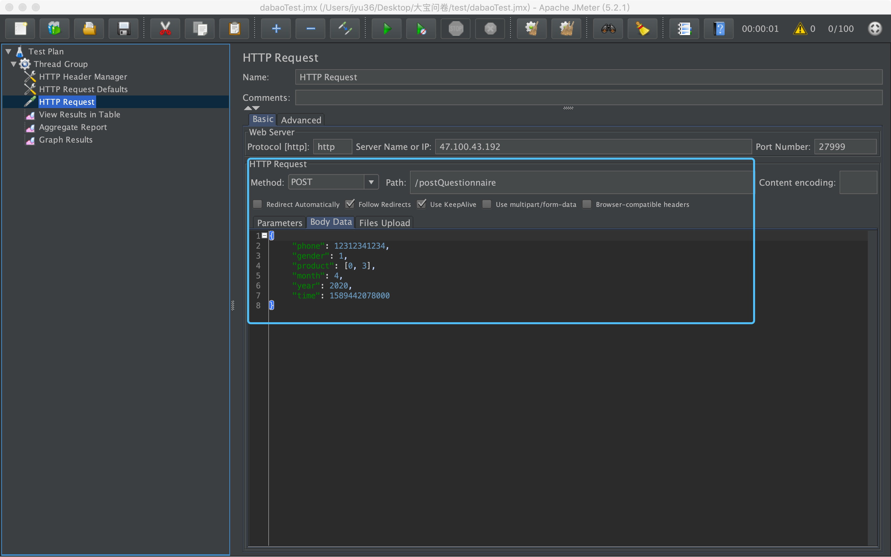
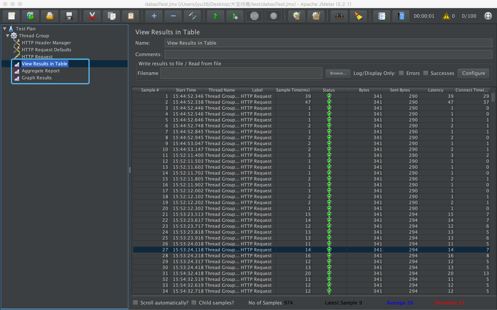

Title: 企业微信问卷项目
Date: 2020-05-17
Category: Project
Tags: wechat, nodeJS, Jmeter
Author: Yoga

## 背景

销售用企业微信添加客户后，系统自动发送问卷，客户填完问卷后将客户数据与销售人员数据一起发送给后台。

## 总体流程


# 企微接口

nodejs+express

```javascript
let express = require("express");
const https = require('https');
const path = require("path");
let app = express();
app.set('view engine','ejs');

app.listen(8800);
```

### 回调配置

https://work.weixin.qq.com/api/doc/90000/90135/90930



### 测试回调模式

https://work.weixin.qq.com/api/devtools/devtool.php



### 回调服务需要作出正确的响应才能通过URL验证

https://github.com/beary/wx-ding-aes

```javascript
const aes = require('wx-ding-aes')

app.get('/', function (req, res) {
  wxVerify(req, res)
})
async function wxVerify(req, res) {
  let EncodingAESKey = 'f5CEXQmHokzCDJVNiLtQosRwQIbnBdPPBwmTDDTL8Uf'
  let msg_encrypt = req.query.echostr
  let aes_msg = msg_encrypt && aes.decode(msg_encrypt, EncodingAESKey)
  res.send(aes_msg)
}
```

### 添加外部联系人事件

https://www.npmjs.com/package/express-xml-bodyparser

https://www.jianshu.com/p/87d5f4987abf

```javascript
const xmlparser = require('express-xml-bodyparser')
app.use(xmlparser())
```

https://work.weixin.qq.com/api/doc/90000/90135/92130

```javascript
const convert = require('xml-js')

app.post('/', function (req, res) {
  wxAddUser(req, res)
})
async function wxAddUser(req, res) {
  let msg_encrypt = req.body.xml.encrypt[0]
  let aes_msg = msg_encrypt && aes.decode(msg_encrypt, EncodingAESKey)
  const aes_msg_string = convert.xml2json(aes_msg, { compact: true, spaces: 4 })
  const aes_msg_json = JSON.parse(aes_msg_string)
  const welcomeCode = aes_msg_json.xml.WelcomeCode && aes_msg_json.xml.WelcomeCode._cdata
  const UserID = aes_msg_json.xml.UserID && aes_msg_json.xml.UserID._cdata
  const ExternalUserID = aes_msg_json.xml.ExternalUserID && aes_msg_json.xml.ExternalUserID._cdata
  console.log('>>> welcomeCode', welcomeCode)
  console.log('>>> UserID', UserID)
  console.log('>>> ExternalUserID', ExternalUserID)
  res.send(aes_msg)
}
```

### 获取ACCESS_TOKEN

https://work.weixin.qq.com/api/doc/90000/90135/91039

开发者需要缓存access_token，用于后续接口的调用（注意：不能频繁调用gettoken接口，否则会受到频率拦截）。当access_token失效或过期时，需要重新获取。

```javascript
function getAccessToken() {
  return new Promise((resolve, reject) => {
    let getAccessUrl = `https://qyapi.weixin.qq.com/cgi-bin/gettoken?corpid=${appID}&corpsecret=${appSerect}`
    //获取当前时间
    const currentTime = new Date().getTime()
    if (accessTokenJson.access_token === '' || accessTokenJson.expires_time < currentTime) {
      console.log('---- get new token ----')
      https
        .get(getAccessUrl, (res) => {
          var resText = ''
          res.on('data', (d) => {
            resText += d
          })
          res.on('end', () => {
            var resObj = JSON.parse(resText)
            accessTokenJson.access_token = resObj.access_token
            accessTokenJson.expires_time = new Date().getTime() + (parseInt(resObj.expires_in) - 200) * 1000
            //更新本地存储的
            fs.writeFile('./access_token.json', JSON.stringify(accessTokenJson), function (err) {
              if (err) {
                console.error(err)
              } else {
                console.log('---- write in new token success ----')
              }
            })
            resolve(resObj.access_token)
          })
        })
        .on('error', (e) => {
          console.error(e)
        })
    } else {
      console.log('---- read old token ----')
      resolve(accessTokenJson.access_token)
    }
  })
}
```

### 发送新客户欢迎语

https://work.weixin.qq.com/api/doc/90000/90135/92137

```javascript
app.use(express.static('img')) //定义静态文件夹

async function sendWelcomeMessage(CALLBACK_CODE, TOKEN) {
  const welcomeMsgUrl = `https://qyapi.weixin.qq.com/cgi-bin/externalcontact/send_welcome_msg?access_token=${TOKEN}`
  return new Promise((resolve, reject) => {
    const options = {
      headers: { 'Content-Type': 'application/json' },
      method: 'POST',
      body: JSON.stringify({
        welcome_code: CALLBACK_CODE,
        link: {
          title: '消费者调研问卷',
          picurl: `${host}/icon.png`,
          desc: ' ',
          url: 'http://wxquestionnaire.jujadc.com/',
        },
      }),
    }
    fetch(welcomeMsgUrl, options).then((res) => {
      res
        .json()
        .then((json) => {
          console.log(json)
          resolve(json)
        })
        .catch((error) => {
          console.error(error)
          reject(error)
        })
    })
  })
}
```

### 获取客户及用户详情

https://work.weixin.qq.com/api/doc/90000/90135/90196

https://work.weixin.qq.com/api/doc/90000/90135/92114

```javascript
function getClientInfo(client_id, TOKEN) {
  return new Promise((resolve, reject) => {
    const getClientUrl = `https://qyapi.weixin.qq.com/cgi-bin/externalcontact/get?access_token=${TOKEN}&external_userid=${client_id}`
    https
      .get(getClientUrl, (res) => {
        let resText = ''
        res.on('data', (d) => {
          resText += d
        })
        res.on('end', () => {
          resolve(JSON.parse(resText))
        })
      })
      .on('error', (e) => {
        console.error(e)
        reject(e)
      })
  })
}
```

# 问卷部分

http://wxquestionnaire.jujadc.com/



### 接收数据

解析application/json https://www.jianshu.com/p/80b502efe255

```javascript
const bodyParser = require('body-parser')
app.use(bodyParser.json({ limit: '1mb' })) //body-parser 解析json格式数据
app.use(
  bodyParser.urlencoded({
    //此项必须在 bodyParser.json 下面,为参数编码
    extended: true,
  })
)
```
设置允许跨域访问该服务 https://blog.csdn.net/qq_34545192/article/details/80177362

```javascript
app.all('*', function (req, res, next) {
  res.header('Access-Control-Allow-Origin', '*');
  res.header('Access-Control-Allow-Headers', 'Content-Type');
  res.header('Access-Control-Allow-Methods', '*');
  res.header('Content-Type', 'application/json;charset=utf-8');
  next();
});
```

缓存机制：为了避免同时读写csv导致数据覆盖，先将数据缓存在本地，每分钟定时读写csv

```javascript
app.post('/postQuestionnaire', function (req, res) {
  saveData(req, res)
})

let tempData = [];

async function saveData(req, res) {
  if (Object.keys(req.body).length) {
    res.send({ status: 'success' })
    tempData.push(req.body);
  } else {
    res.send({ status: 'failure' })
  }
}
```

### 定时写入数据

Nodejs定时任务 https://www.jianshu.com/p/8d303ff8fdeb

```javascript
const schedule = require('node-schedule')

const scheduleCronstyleSaveData = () => {
  //每分钟0秒触发:
  schedule.scheduleJob('0 * * * * *', () => {
    console.log('>>> scheduleCronstyleSaveData: ' + new Date())
    fs.readFile('data.csv', 'utf8', function (err, existData) {
      let csvContent = ''
      if (err) {
        console.error(err)
        const title = Object.keys(csvColumn)
        csvContent = '\ufeff' + title.join(',') + '\n'
        console.log('---- create new csv ----')
      } else {
        console.log('---- existData ----')
        csvContent = existData
      }
      let count = 0;
      tempData.forEach(item => {
        const newData = formatData(item, csvColumn)
        count++;
        csvContent += Object.values(newData).join(',') + '\n'
      });
      fs.writeFile('./data.csv', csvContent, function (err) {
        if (err) {
          console.error(err)
        } else {
          // tempData = [] 不能直接置空，写入csv的时差可能正有数据写入
          tempData = tempData.slice(count);
          console.log('---- write in new data success ----')
        }
      })
    })
  })
}
scheduleCronstyleSaveData();
```

### 定时发送数据

node 使用 ssh2-sftp-client 实现 FTP 的文件上传和下载功能 
https://www.npmjs.com/package/ssh2-sftp-client

```javascript
const Client = require('ssh2-sftp-client');
const sftpOption = require('./sftp_option')

const scheduleCronstylePostData = () => {
  //每小时0分30秒触发:
  schedule.scheduleJob('0 30 * * * *', () => {
    console.log('>>> scheduleCronstylePostData: ' + new Date())
    const sftp = new Client();
    sftp.connect(sftpOption).then(() => {
        return sftp.put('./data.csv', '/Dabao questionaire_UAT/data.csv');
    }).then(() =>{
        console.log("---- Upload finish ----");
        sftp.end()
        // 删除文件
        fs.unlink('data.csv',function(error){
          if (error){
              console.error(error);
              return false;
          }
          console.log('---- delete csv success ----');
        })
    }).catch((err) => {
        console.error(err);
    });
  })
}
scheduleCronstylePostData();
```

### 静态资源访问权限

https://blog.csdn.net/x746655242/article/details/53318464

中间件有很多用处，可以做权限的配置，访问前的各种参数校验，

```javascript
const path = require("path");

app.use(function(req,res,next){
  var static= /^(\/data)/g;
  if (static.test(req.path)) {
    console.log('>>> user: ', req.query.user);
    console.log('>>> password: ', req.query.password);
    if (req.query.user!=="yoga" || req.query.password!=="123") {
      console.log('---- illegal request ----');
      return res.end('请求非法');
    }
  }
  next()
});
app.use('/data',express.static(path.join(__dirname,'data')));

// http://localhost:27999/data/total_data.csv?user=yoga&password=123
```

### 发送文件

* res.sendFile (chrome在浏览器里打开，ie下载)

```javascript
app.get('/data', function (req, res, next) {
  var options = {
    root: __dirname + '/data/',
    dotfiles: 'deny',
    headers: {
      'x-timestamp': Date.now(),
      'x-sent': true
    }
  };
  var fileName = 'total_data.csv';
  res.sendFile(fileName, options, function (err) {
    if (err) {
      next(err);
    } else {
      console.log('>>> Sent:', fileName);
    }
  });
});

```
* res.download (所有浏览器都下载)

```javascript
app.get('/data', function (req, res, next) {
  const fileName = 'total_data.csv';
  res.download(`./data/${fileName}`, fileName, function (err) {
    if (err) {
      next(err);
    } else {
      console.log('>>> Sent:', fileName);
    }
  });
});
```

nodejs解析csv成json

```javascript
const parse = require('csv-parse/lib/sync')

app.get('/data', function(req, res, next) {
  fs.readFile('./data/total_data.csv', 'utf8', function (err, existData) {
    if (err) {
      console.error(err)
      res.send({});
    } else {
      const records = parse(existData, {
        columns: true,
        skip_empty_lines: true
      })
      res.send(records);
    }
  })
});
```

# Microsoft flow

创建定时任务，每小时通过接口获取数据，创建csv并存入sharepoint



# 压力测试

https://blog.csdn.net/yaorongke/article/details/82799609







Mac运行jmeter：

cd bin

sh jmeter

https://blog.csdn.net/u012972942/article/details/80392792